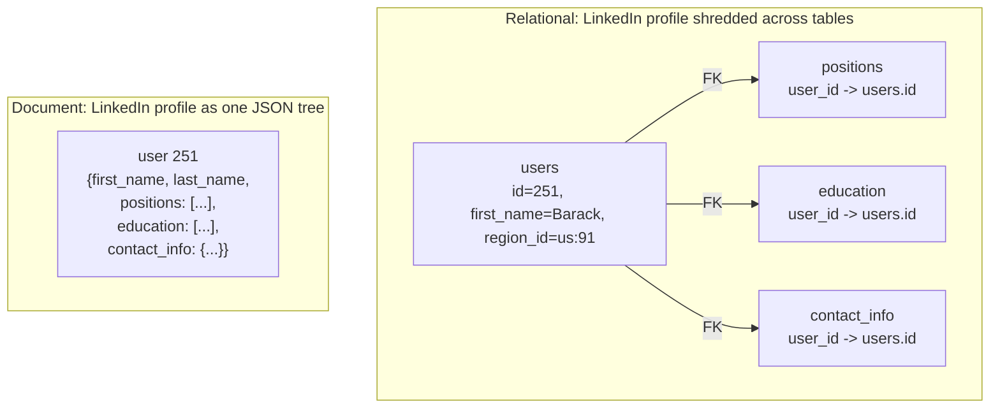

# Relational vs Document Models

> **One-sentence summary.** Relational databases shred data into typed tables joined by foreign keys under a strict schema, while document databases store each entity as a self-contained JSON tree with implicit structure, trading join power for locality and flexibility.

## How It Works

The **relational model** (Codd, 1970) organizes data into unordered collections of tuples called tables. Each row is a typed record, columns are declared up front, and the database enforces that schema at write time (`INSERT` fails if you violate a `NOT NULL` or type constraint). Relationships across entities are expressed with foreign-key references and resolved at query time via `JOIN`. Because an entity's pieces live in different tables, reading a rich object requires either multiple queries or a multiway join — conceptually elegant, but physically the data is scattered across many index lookups.

The **document model** (popularized by MongoDB and Couchbase, later absorbed into Postgres, MySQL, and SQL Server as JSON / JSONB types) stores each entity as a single JSON document. Nested arrays and objects directly encode one-to-many relationships, so there is no "shredding" of the object into tables. There is no schema enforced at write — the database accepts any well-formed JSON, and the implicit structure is interpreted only when the data is read. This is called **schema-on-read** (analogous to dynamic typing), in contrast with the relational **schema-on-write** (analogous to static typing).

Two physical properties follow from this difference. First, **locality**: a document is laid out as one continuous encoded string (JSON, BSON, etc.), so fetching the whole entity is a single read. A relational multi-table entity requires several index probes and random I/O. Second, **granularity of writes**: because the document is one blob on disk, any update typically rewrites the whole document — fine for "load and render the whole profile" workloads, wasteful when one tiny field changes frequently.

The model choice is often driven by the **object-relational impedance mismatch**: application objects are trees, but tables are flat relations, so an ORM (Hibernate, ActiveRecord) has to translate between them. Document databases reduce that friction when the entity genuinely is a tree.

## When to Use

**Reach for the document model when:**
- The data is a **tree loaded as a whole** — a LinkedIn profile, a product listing with variants, a CMS page. Shredding it into four tables buys nothing.
- The schema is **heterogeneous or externally controlled** (e.g., ingesting webhook payloads whose shape varies by sender), so schema-on-read avoids constant migrations.
- Items need **user-chosen ordering** (drag-and-drop to-do list, ordered playlist). A JSON array preserves order natively; relational tables need fractional indexing tricks.

**Reach for the relational model when:**
- **Many-to-many relationships dominate** — employees to projects, students to courses, tags to posts. Join tables + indexes beat duplicated JSON references.
- You need to **reference nested items directly** (e.g., "like" a specific comment). Documents address by "the second element in the positions array" — fragile — while relational rows have stable IDs.
- The schema is **stable and shared** across many readers (analytics, BI tools, other microservices). Enforced types catch bugs at write time rather than at midnight in production.

## Trade-offs

| Aspect | Relational | Document |
|--------|-----------|----------|
| Schema enforcement | Schema-on-write (explicit, checked) | Schema-on-read (implicit, app-enforced) |
| Join support | Native, optimized, declarative | Weak or absent; often emulated in app code |
| Read locality (whole entity) | Multiple index lookups / joins | One contiguous read |
| Write granularity | Update a single column cheaply | Rewrite entire document |
| One-to-many fit | Extra tables + FKs | Natural nested arrays |
| Many-to-many fit | Join tables + indexes | Awkward; dual-sided refs risk inconsistency |
| Migration cost | `ALTER TABLE` / `UPDATE` (can be slow, tool-assisted) | Conditional code at read time — cheap today, debt tomorrow |
| Tooling maturity | Decades of SQL, ORMs, BI tools | Per-vendor APIs, converging on SQL-like |

## Real-World Examples

- **MongoDB, Couchbase, DynamoDB**: document / key-document stores. Great for user-profile, catalog, and session workloads where each entity is self-contained.
- **PostgreSQL, MySQL, SQL Server, Oracle**: canonical relational stores; used anywhere referential integrity and ad-hoc joins matter (finance, ERP, multi-tenant SaaS).
- **Convergence**: Postgres `JSONB` columns + GIN indexes let you store flexible subtrees inside a relational row. MongoDB's `$lookup` aggregation stage performs server-side joins. The modern default is a **relational-document hybrid** — structured columns for entity identity and relationships, JSONB for the flexible tail.

## Common Pitfalls

- **The N+1 query problem with ORMs**: listing N comments and fetching each author's name one-by-one produces N+1 round trips instead of one join. Eager-load relations or write the join yourself.
- **Embedding unbounded growing arrays**: celebrity comment threads, audit logs, or chat messages inside one document balloon past the 16 MB document limit and make every update rewrite megabytes of JSON. Pull such collections into a separate collection / table.
- **Cannot reference nested items directly**: you can't foreign-key "the third position of user 251." If other entities must link into that item, it wants its own document with a stable ID.
- **Frequent small updates on large documents**: since the database rewrites the whole blob, a counter that increments once per request on a 1 MB document is an I/O disaster. Keep mutable hot fields in a separate small document.
- **Assuming "schemaless" means no schema**: there is always an implicit schema — it's just enforced by whichever application reads the data next, often years later. Document it anyway.

## See Also

- [[02-normalization-and-denormalization]] — the write-vs-read cost trade-off that cuts across both models
- [[04-property-graphs-and-cypher]] — what to reach for when many-to-many relationships dominate to the point that joins become recursive
- [[06-graphql]] — a query language that returns client-shaped JSON trees regardless of whether the backing store is relational or document
