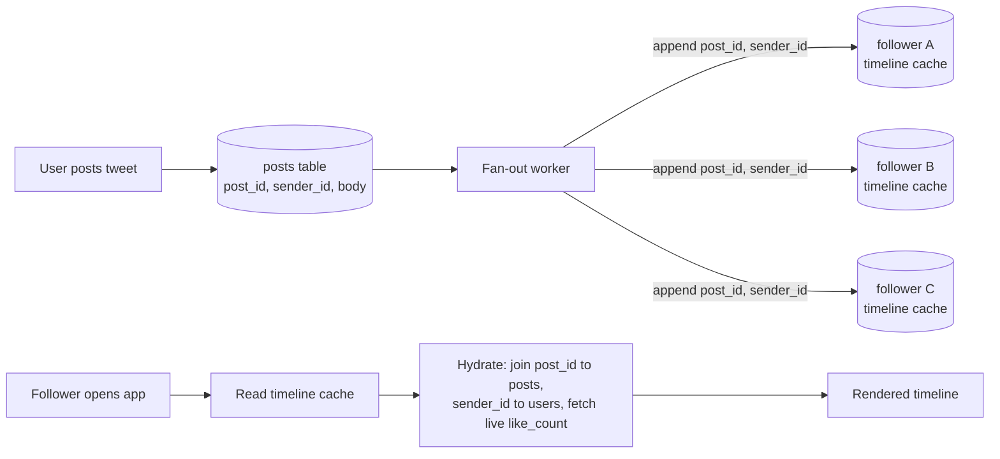

# Normalization, Denormalization, and Joins

> **Normalization stores human-readable data once and references it by ID; denormalization duplicates it for read locality, trading write cost and consistency risk for fewer joins — and most real systems pick a hybrid per field.**

## How It Works

A **normalized** record replaces any human-meaningful value (a city name, a company, a username, a post body) with an opaque **ID** that points to a single canonical row elsewhere. If you rename a company, you update exactly one row and every referencing record sees the change for free. The price is that every read has to resolve those IDs, which in SQL means a `JOIN`, in MongoDB means an `$lookup` aggregation stage, and in a document store without joins means a second round-trip from application code. That application-side resolution — looking up each ID and stitching the human-readable fields back onto the record before returning it to the client — is called **hydration**, and it is just a join implemented outside the database.

A **denormalized** record inlines the referenced values directly. Reads become one lookup, but every write has to find and update every copy, and storage balloons. The canonical rule of thumb is: normalized data is cheaper to write and more expensive to read; denormalized data is cheaper to read and more expensive to write. A denormalized copy is really a form of **derived data** — a cache of a join — so you need a process that keeps it consistent with the source of truth.

Most production systems do not pick one. X (formerly Twitter) home timelines are the canonical example of a **hybrid**: the expensive part of the join (the per-follower ordered list) is materialized on write, but the fast-changing post body, like count, and sender profile are kept normalized and hydrated on read.

The timeline cache stores only `(post_id, sender_id)` plus a tiny bit of metadata. At read time the service hydrates each entry against the live `posts` and `users` tables so that the latest profile picture and like count are always fresh.

## When to Use

- **Normalize** for OLTP workloads where writes are frequent, data changes in place, and consistency matters — classic reference data like product catalogs, user profiles, geographic regions.
- **Denormalize** when reads vastly outnumber writes, when the join is the measured bottleneck, or when the underlying data is immutable (historical events, analytics facts).
- **Hybrid** when the access pattern is read-heavy but parts of the payload change faster than the rest. Materialize the expensive ordering or fan-out, but keep volatile fields (counters, avatars, display names) normalized and hydrate them at query time. This is exactly the X/Twitter model.

## Trade-offs

| Aspect | Normalized | Denormalized |
|--------|------------|--------------|
| Write cost | Low — update one row | High — update every copy, possibly millions |
| Read cost | High — joins or hydration per request | Low — single lookup |
| Consistency risk | Low — single source of truth | High — copies drift without a sync pipeline |
| Storage cost | Low — values stored once | High — values duplicated per referencing row |
| Rebuild/backfill cost | Low — schema change touches one table | High — must re-emit the new shape for every existing record |
| Query flexibility | High — any join is expressible | Lower — you optimized for one access pattern |

## Real-World Examples

- **X/Twitter materialized home timelines**: per-follower caches of `(post_id, sender_id)` built by a fan-out-on-write worker. Post text and user profile are hydrated on read so likes, usernames, and avatars are always current. Hydration parallelizes well and its cost does not depend on how many accounts a user follows.
- **MongoDB `$lookup`**: an aggregation-pipeline stage that performs a left outer join between collections, letting document stores retain a normalized option without pushing the join into application code.
- **SQL `JOIN` for reference data**: the textbook use — a `positions` table stores `region_id`, and a join against `regions` resolves it to a display name. One update to `regions` fixes every résumé.
- **Analytics / data warehouses**: dimension attributes are frequently denormalized into fact tables (One Big Table) because the data is immutable history and read-only query speed dominates. See [[03-star-and-snowflake-schemas]].

## Common Pitfalls

- **Denormalizing fast-changing fields**: inlining a profile picture URL or a post's like count into every timeline entry produces visible staleness within seconds and multiplies write amplification. Keep volatile fields normalized.
- **Partial-write inconsistency**: if you update five denormalized copies without a transaction or idempotent pipeline, a crash between writes leaves the system in a split-brain state. Treat denormalized copies as derived data with an explicit keeper process.
- **Forgetting to backfill**: adding a denormalized column is only half the migration — existing rows still carry the old shape. Ship a backfill job alongside the schema change or readers will hit nulls.
- **ORM N+1 queries**: frameworks that lazy-load associations turn a single list query into one query per row, silently reintroducing hydration costs the database could have answered in one join. Use eager loading or explicit joins for hot paths.
- **Choosing globally instead of per-field**: the X case study shows the right question is not "should this table be normalized?" but "how often does each field change relative to how often it is read?" Decide field by field.

## See Also

- [[01-relational-vs-document-models]] — document stores lean denormalized because joins are weak; relational stores assume joins are cheap.
- [[03-star-and-snowflake-schemas]] — analytics explicitly embraces denormalization because the data is immutable history.
- [[07-event-sourcing-and-cqrs]] — treats every read view as an explicitly-rebuilt denormalized projection of an append-only event log.
