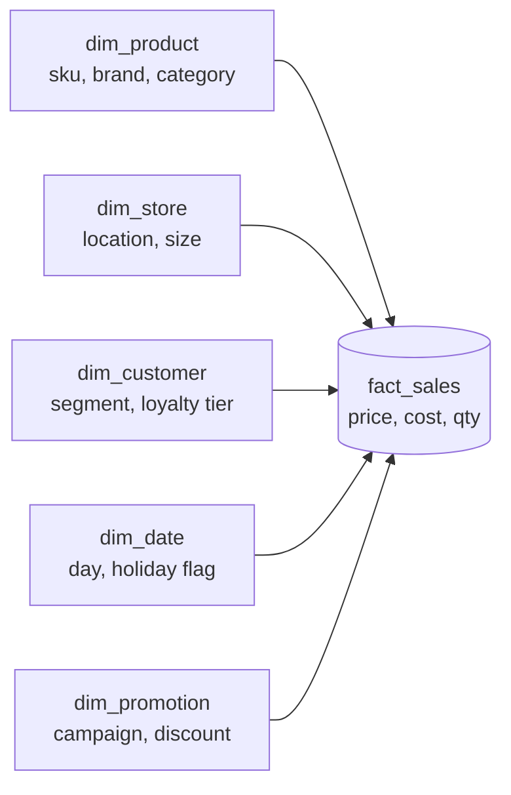

# Star and Snowflake Schemas

> **Summary.** Analytics warehouses shape data as a central **fact table** of events surrounded by **dimension tables** answering *who/what/where/when/how/why* — a pattern that trades write ergonomics for blazing-fast, analyst-friendly reads.

## How It Works

At the center of the schema sits a **fact table** — essentially an append-only log of business events. Each row is one granular fact: a sale was rung up, a page was viewed, an ad was clicked. A row carries two kinds of columns: **measurable attributes** (price, cost, quantity, latency) and **foreign keys** into **dimension tables** that describe the context of the event. In a grocery retailer's warehouse, `fact_sales` might have hundreds of millions of rows per month — one per scanned item at the checkout — and columns like `price_paid`, `cost`, plus FKs to `dim_product`, `dim_store`, `dim_customer`, and `dim_date`.

Dimension tables are the descriptive metadata. `dim_product` holds SKU, description, brand, category, package size, fat content. `dim_store` holds square footage, opening date, whether it has an in-store bakery. Even **time is a dimension**: `dim_date` lets you tag rows with public holidays, fiscal quarters, or day-of-week so queries can compare holiday vs. non-holiday sales without bespoke date logic. The resulting diagram looks like rays pointing out from the fact table — hence "star."

A **snowflake schema** normalizes one step further: dimensions themselves reference sub-dimensions. Instead of `dim_product` storing `brand_name` and `category_name` as strings, it holds `brand_id` and `category_id` pointing at separate `dim_brand` and `dim_category` tables. This saves space when brand/category strings repeat across thousands of SKUs, but each extra join is another table an analyst has to remember.

**One Big Table (OBT)** flips the trade-off the other way: the dimension tables disappear entirely and their attributes are **inlined** into a fully denormalized fact table. The join is pre-computed at ETL time. `fact_sales` becomes a wide table with `product_brand`, `product_category`, `store_city`, `customer_segment`, etc., all stamped onto every row. You pay in storage and write cost; you save in query time and cognitive load.

## When to Use

- **Star schema** — default choice when analysts write SQL by hand. Simple joins, predictable structure, and BI tools (Tableau, Looker, Power BI) have first-class support for star-modeled warehouses.
- **Snowflake schema** — pick when dimension tables are very wide and attribute values repeat heavily, so normalizing brands/categories/geographies yields real storage savings and keeps updates to shared metadata cheap.
- **OBT** — pick when the query engine is **columnar** (BigQuery, Snowflake, Redshift, DuckDB). Columnar storage compresses repeated strings efficiently, and skipping joins often beats any storage win from normalization. OBT is increasingly the default pattern in modern cloud warehouses.

## Trade-offs

| Aspect | Star | Snowflake | OBT |
|--------|------|-----------|-----|
| Analyst-friendliness | High — few tables, obvious joins | Lower — more tables to navigate | Highest — no joins at all |
| Storage cost | Medium | Lowest (most normalized) | Highest (attributes duplicated on every row) |
| Query performance | Fast (few joins) | Slower (more joins) | Fastest on columnar engines |
| Update cost for dimension attributes | Update one row in `dim_*` | Update one row in sub-dim | Must rewrite every affected fact row |
| ETL complexity | Moderate — maintain dims + facts | Highest — maintain sub-dim hierarchy | Simpler load, but heavy join work upstream |
| Best fit | Traditional BI on row/columnar stores | Very large, repetitive dimensions | Modern cloud columnar warehouses |

## Real-World Examples

- **Grocery retailer (the book's running example)** — `fact_sales` records every scanned item at every checkout, joined to `dim_product`, `dim_store`, `dim_date`, and `dim_customer` for category-over-time, store-over-time, and basket-level analysis.
- **Big-box retail warehouses (Walmart, Target)** — petabyte-scale fact tables for POS transactions, replenishment, and inventory movements, classically modeled as stars.
- **Web analytics** — `fact_page_view` with FKs into `dim_user`, `dim_campaign`, `dim_session`, `dim_device`, `dim_date`. Funnels, cohort retention, and A/B tests all fall out of this schema.
- **Snowflake/BigQuery/Redshift workloads** — increasingly modeled as OBT. dbt's "wide table" patterns and Google's own BigQuery best-practices guides both favor denormalized facts because columnar compression blunts the storage penalty.

## Common Pitfalls

- **Confused fact-table grain.** Mixing order-level rows (one per receipt) with line-item rows (one per product scanned) in the same fact table breaks every `SUM` and double-counts revenue. Pick one grain per fact table and hold the line.
- **Wide Slowly-Changing Dimensions without SCD handling.** If a customer changes address or a product is re-categorized and you just overwrite the dimension row, every historical report silently restates. Use SCD Type 2 (new row per version with effective dates) when history matters.
- **Treating dimensions as mutable ID lookups.** Business analysts assume `dim_product` tells them what the product *was at the time of sale*, not what it is today. Destroying that assumption destroys trust in the warehouse.
- **Forcing 3NF onto the warehouse.** Normalization rules from OLTP design hurt here. Analytics is read-dominated, batch-updated, and tolerant of redundancy — a strict-3NF warehouse produces 12-way joins that nobody wants to write.
- **Building dimensions before deciding the grain of the fact.** Grain is the contract; everything else (which dims, which measures) follows from it. Skipping that step leads to schemas that can't answer the questions they were built for.

## See Also

- [[02-normalization-and-denormalization]] — the write-vs-read trade-off that justifies denormalized warehouse schemas
- [[07-event-sourcing-and-cqrs]] — another "log of past events as source of truth" pattern, but ordered and with heterogeneous event shapes rather than uniform fact rows
