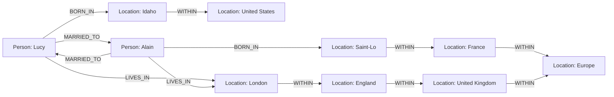

# Property Graphs and Cypher

> **One-sentence summary.** A property graph stores labeled, property-bearing vertices and edges, and Cypher's arrow-based pattern syntax expresses variable-depth traversals that would otherwise require dozens of lines of recursive SQL.

## How It Works

The **property graph** model (also called the _labeled property graph_) has two kinds of objects:

- **Vertices** have a unique ID, one or more labels (types, like `Person` or `Location`), and an open set of key-value **properties**.
- **Edges** have an ID, a single label (the relationship type, like `BORN_IN`), a tail vertex (source), a head vertex (destination), and their own property map.

You could store this in two relational tables — a `vertices` table with an `id` and a JSON `properties` column, and an `edges` table with `edge_id`, `label`, `tail_vertex` and `head_vertex` foreign keys. Native graph databases go further and **index both directions of every edge**, so walking "all people born in this city" (incoming `BORN_IN`) is as cheap as walking "where was this person born" (outgoing `BORN_IN`). That bidirectional cheapness is what makes multi-hop traversal practical.



**Cypher** (originally built for Neo4j, now the basis of the ISO GQL standard) uses ASCII-art arrows to both create and match patterns. Parentheses are vertices, square brackets are edges, and `->` points from tail to head:

```cypher
CREATE
  (lucy:Person {name: 'Lucy'}),
  (idaho:Location {name: 'Idaho'}),
  (usa:Location {name: 'United States'}),
  (idaho)-[:WITHIN]->(usa),
  (lucy)-[:BORN_IN]->(idaho)
```

Matching reuses the same shape but binds pieces to variables. The killer feature is **variable-length paths**: `-[:WITHIN*0..]->` means "follow a `WITHIN` edge zero or more times," the graph equivalent of a regex `*`. That collapses an arbitrary hierarchy traversal (city -> region -> state -> country -> continent) into one operator.

The canonical question — _find everyone born in the US who now lives in Europe_ — is four lines of Cypher:

```cypher
MATCH
  (person)-[:BORN_IN]->()-[:WITHIN*0..]->(:Location {name:'United States'}),
  (person)-[:LIVES_IN]->()-[:WITHIN*0..]->(:Location {name:'Europe'})
RETURN person.name
```

The same query in SQL using `WITH RECURSIVE` common table expressions balloons to **31 lines**, with two recursive CTEs manually materializing the transitive closure of `WITHIN` for US locations and European locations before joining them to people. The query optimizer can still plan the Cypher version flexibly — start from the two named locations, walk incoming `WITHIN` edges to materialize their location sets, then walk incoming `BORN_IN`/`LIVES_IN` edges to find candidate people.

## When to Use

- **Many-to-many dominates the schema.** Social networks, org charts, citation graphs, fraud rings — anything where "join tables" are the main event rather than an occasional connector.
- **Heterogeneous vertex types.** Knowledge graphs where `Person`, `Company`, `Article`, `Product`, and `Location` all need to interconnect without inventing a fresh join table per pair.
- **Variable-depth / unknown-depth traversals.** "Friends of friends up to 4 hops," "all ancestors," "shortest path through a road network" — queries where the number of joins isn't known until runtime.
- **Schema evolvability.** Adding a new edge label (say, `ENDORSED_BY`) needs no migration — graph storage is already schema-on-read for properties and label-based for edges.

## Trade-offs

| Aspect                  | Graph (Cypher + property graph)                        | Relational (SQL + joins)                                     |
| ----------------------- | ------------------------------------------------------ | ------------------------------------------------------------ |
| Depth flexibility       | Native `*0..` variable-length operator                 | Clunky `WITH RECURSIVE`; Oracle CONNECT BY is proprietary    |
| Query conciseness       | 4 lines for US-to-Europe query                         | 31 lines of recursive CTE for the same answer                |
| Write complexity        | Two writes per relationship (both directions indexed)  | Single row insert into a join table                          |
| Indexing requirements   | Both directions of every edge indexed by default       | You pick which FKs to index                                  |
| Ecosystem / tooling     | Smaller (Neo4j, Memgraph, Neptune, Kùzu, Apache AGE)   | Massive: decades of BI tools, ORMs, replication tooling      |
| Hardware / cost         | In-memory traversal favors RAM-heavy machines          | Scales cheaply on disk; mature tiered storage                |
| Transactional semantics | ACID in mature engines, but varies by product          | Universally strong ACID guarantees                           |

## Real-World Examples

- **Neo4j**: the reference Cypher implementation; drives fraud detection at banks and recommendation engines in retail.
- **Memgraph**: in-memory Cypher-compatible engine aimed at streaming and real-time graph analytics.
- **KùzuDB**: embeddable columnar property-graph database, analytics-focused.
- **Amazon Neptune**: managed graph DB supporting both Cypher (openCypher) and SPARQL over the same data.
- **Apache AGE**: PostgreSQL extension that layers Cypher on top of a relational store — useful when you already run Postgres.
- **Facebook's TAO**: a purpose-built social graph cache layer fronting MySQL; serves the friend/like/comment graph at Facebook scale.
- **LinkedIn's social graph**: powers "People You May Know" and degrees-of-connection queries across hundreds of millions of members.

## Common Pitfalls

- **Treating a graph DB as a general OLTP engine.** If your workload is actually row-oriented lookups by primary key, you are paying the graph tax (double-direction indexes, RAM pressure) for nothing.
- **Unconstrained traversal depth.** A stray `*0..` with no upper bound can explode combinatorially on a well-connected graph — always cap it (`*0..5`) or add selective label/property filters.
- **Stuffing high-cardinality facts into edge properties.** Edges are meant to describe _relationships_; if you need versioned events or time-series measurements on an edge, model them as their own vertices instead.
- **Forgetting edges are strictly binary.** An edge has exactly one tail and one head. Ternary relationships (e.g., "Alice recommended Bob to Carol") need an intermediate `Recommendation` vertex or a hyperedge model — you cannot jam a third vertex onto a single edge.
- **Denormalizing into the graph.** Because edges are so cheap to traverse, teams sometimes copy entire relational schemas in as vertices+edges and end up with slower reads than they started with.

## See Also

- [[01-relational-vs-document-models]] — the many-to-many pain that motivates graphs in the first place.
- [[05-triple-stores-and-datalog]] — RDF triples and SPARQL/Datalog as alternative graph query models.
- [[06-graphql]] — not a graph database; a client-driven query _API_ with deliberately restricted expressiveness.
