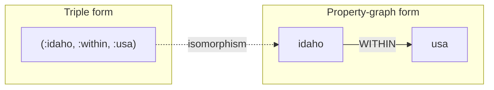

# Triple Stores, SPARQL, and Datalog

> **One-sentence summary.** Triple stores represent every fact as a `(subject, predicate, object)` 3-tuple — isomorphic to a property graph — and are queried with SPARQL's pattern matching or Datalog's composable, recursive rules.

## How It Works

A triple store flattens the world into three-part statements: the **subject** is a vertex, the **predicate** is either an edge label or a property key, and the **object** is either another vertex or a literal value. `(lucy, marriedTo, alain)` encodes an edge; `(lucy, birthYear, 1989)` encodes a property. That's the entire data model — no tables, no nested documents, no distinction between "nodes" and "attributes". Because of that uniformity, a triple store is structurally identical to a property graph; the two are different vocabularies for the same shape.

The most readable serialization is **Turtle**, a compact RDF encoding. Semicolons let you attach multiple predicates to the same subject:

```turtle
@prefix : <urn:example:>.
_:lucy  a :Person;   :name "Lucy";          :bornIn _:idaho.
_:idaho a :Location; :name "Idaho";         :within _:usa.
_:usa   a :Location; :name "United States"; :within _:namerica.
```

The `_:lucy` form is a *blank node* — an identifier local to this file. In production RDF, predicates are typically full URIs like `<http://schema.org/bornIn>` so datasets from different publishers can be merged without name collisions. Prefix declarations (`@prefix`) keep the surface syntax manageable.



**SPARQL** (*SPARQL Protocol and RDF Query Language*) queries triples with pattern matching. Cypher actually borrowed its syntax from SPARQL, so variable-length path traversal uses `/:within*` instead of `-[:WITHIN*0..]->`:

```sparql
PREFIX : <urn:example:>
SELECT ?personName WHERE {
  ?person :name ?personName.
  ?person :bornIn  / :within* / :name "United States".
  ?person :livesIn / :within* / :name "Europe".
}
```

**Datalog** takes a very different approach: you declare **facts** (each fact is a row in a virtual relational table) and then **rules** that derive new virtual tables from existing ones. Rules can call other rules — and themselves — which is how you express recursion. The same US-to-Europe query:

```prolog
within_recursive(Loc, Name) :- location(Loc, Name, _).             /* base  */
within_recursive(Loc, Name) :- within(Loc, Via),
                               within_recursive(Via, Name).        /* step  */
migrated(P, BornIn, LivingIn) :- person(PID, P),
                                 born_in(PID, BID),
                                 within_recursive(BID, BornIn),
                                 lives_in(PID, LID),
                                 within_recursive(LID, LivingIn).
us_to_europe(P) :- migrated(P, "United States", "Europe").
```

Each rule reads "the left side is true whenever all patterns on the right side match." The engine builds `within_recursive` by fixed-point iteration — start with every location, then keep adding `(child, ancestorName)` pairs until nothing new appears.

## When to Use

- **SPARQL / RDF** when you need to integrate with the Semantic Web or Linked Data ecosystem — Wikidata dumps, Schema.org annotations, JSON-LD payloads, or biomedical ontologies. RDF shines when datasets from multiple publishers must interoperate and URI-qualified predicates prevent semantic collisions.
- **Datalog** when queries get complex enough that you want to decompose them into a library of reusable, named rules — each rule is independently testable and explainable, which is valuable for auditable decisions (access control, policy engines, program analysis).
- **Property graphs with Cypher** (not this article's topic) remain the pragmatic default for most graph workloads; reach for triples or Datalog when the ecosystem or recursion story justifies the learning curve.
- **Avoid either** as a general-purpose OLTP backend unless you have committed to the ecosystem — tooling, hiring, and operational maturity lag behind SQL and document stores.

## Trade-offs

| Aspect | Property Graphs (Cypher) | Triple Stores (SPARQL) | Datalog |
|---|---|---|---|
| Data-model richness | Typed properties on vertices + edges | Uniform triples; properties and edges indistinguishable | Facts as relational rows |
| Query ergonomics | Visual ASCII-art patterns | Triple patterns; verbose URIs without prefixes | Step-by-step rule composition |
| Recursion | Variable-length paths `*0..` | `:pred*` path operator | First-class — rules call themselves |
| Cross-dataset interop | Weak (vendor-specific) | Strong (URIs, RDF standards) | Weak |
| Ecosystem depth | Mature (Neo4j dominates) | Mature niche (Jena, Blazegraph, Neptune) | Sparse (Datomic, CozoDB, LIquid) |
| Learning curve | Moderate | Moderate (plus RDF concepts) | Steep (logic-programming mindset) |

## Real-World Examples

- **Datomic, AllegroGraph, Blazegraph, OpenLink Virtuoso, Apache Jena, Amazon Neptune** — triple stores that speak SPARQL. Neptune uses quads (triple + graph ID); Datomic uses 5-tuples (adding transaction ID and retraction flag) but keeps the subject-predicate-object core.
- **Datomic, LogicBlox, CozoDB, LinkedIn LIquid** — databases that expose Datalog as the primary query language. LinkedIn built LIquid to power its economic-graph queries over hundreds of billions of edges.
- **Wikidata, Schema.org, Facebook Open Graph protocol, JSON-LD, biomedical ontologies** — the Semantic Web's surviving legacy. Link unfurling in Slack and Discord reads Open Graph metadata; search engines parse Schema.org microdata for rich snippets; Wikidata exposes a public SPARQL endpoint serving the world's largest open knowledge graph.

## Common Pitfalls

- **RDF/XML verbosity**: the original XML serialization is painful to read or write by hand — Turtle exists precisely because RDF/XML was a PR problem for the format.
- **Runaway predicate URIs**: without disciplined `@prefix` declarations at the top of each file, triples become `<http://my-company.com/namespace#within>` walls of noise.
- **Datalog's mindshare gap**: few engineers have written it, mainstream IDEs and ORMs don't support it, and debugging an inefficient recursive rule can require understanding the evaluation strategy (semi-naive, magic sets) of your specific engine.
- **Conflating triples with OLTP**: triple stores optimize for flexible traversal, not high-throughput row updates. Mixing transactional workloads with graph analytics on the same engine usually disappoints on both axes.
- **Assuming SPARQL equals graph queries**: SPARQL speaks RDF; if your graph lives in Neo4j or TigerGraph, you need Cypher or GQL, not SPARQL.

## See Also

- [[04-property-graphs-and-cypher]] — the isomorphic sibling model with a property-centric vocabulary
- [[06-graphql]] — a deliberately non-recursive query language for untrusted clients, contrasting with the unrestricted power of SPARQL and Datalog
