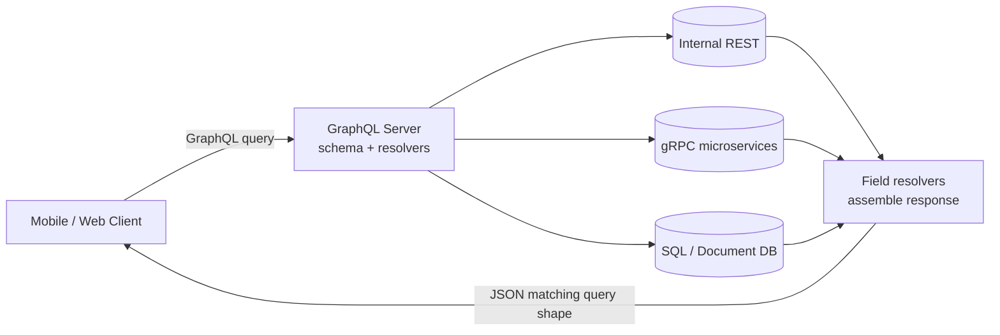

# GraphQL

> **One-sentence summary.** GraphQL is a client-driven, deliberately restricted OLTP query language where the client declares the exact JSON shape it wants and the server assembles it from any backend — trading expressiveness (no recursion, no arbitrary search) for safety against untrusted callers.

## How It Works

Every other query language in this chapter — SQL, Cypher, SPARQL, Datalog — is run by trusted operators against a specific engine. GraphQL flips that: queries are written by **untrusted clients** (a mobile app, a browser JS bundle) and shipped over the wire to a server that translates them into reads against whatever storage you actually use. The point is UI ergonomics: the UI changes weekly, the client knows what fields it needs to render, so let the client ask for precisely those fields.

A GraphQL server exposes a **schema** of types and their fields. Each field has a **resolver** — a small function that knows how to fetch that piece. When a query arrives, the server walks the requested tree, invokes the resolver for each selected field, and assembles a JSON response that mirrors the query structure exactly — nothing more, nothing less.



Two design choices matter. **Field selection** means the client lists only the fields it wants, and **nested selection** lets it follow declared joins (e.g. `message { sender { fullName } }`) — but only joins the schema exposes. **Alias duplication** means the server happily embeds the same entity twice rather than forcing a second round-trip: if a message and its `replyTo` share a sender, the sender is written inline in both places. Bigger payload, simpler client code.

A chat-app example (Slack/Discord-style):

```graphql
query ChatApp {
  channels {
    name
    recentMessages(latest: 50) {
      timestamp
      content
      sender { fullName imageUrl }
      replyTo {
        content
        sender { fullName }
      }
    }
  }
}
```

The response is a JSON document with exactly those fields:

```json
{
  "data": {
    "channels": [{
      "name": "#general",
      "recentMessages": [{
        "timestamp": 1693143024,
        "content": "Great! And you?",
        "sender": { "fullName": "Caleb", "imageUrl": "https://..." },
        "replyTo": {
          "content": "Hey! How are y'all doing?",
          "sender": { "fullName": "Aaliyah" }
        }
      }]
    }]
  }
}
```

The deliberate restrictions: **no recursive queries** (unlike Cypher, SPARQL, SQL, or Datalog), and **no arbitrary search conditions** unless the schema explicitly exposes a search field. The reason is denial-of-service: if untrusted clients could write `WITH RECURSIVE` or unbounded filters, any user could accidentally (or maliciously) saturate the server. GraphQL trades expressiveness for a bounded cost envelope.

## When to Use

- **Backend-for-frontend (BFF)** for mobile and web UIs whose data needs change faster than server releases — clients evolve queries without shipping new server code.
- **Public APIs** where you want a strongly-typed schema, introspection, and over-fetching protection (one endpoint, self-documenting types).
- **Aggregation layer** over several internal microservices — the GraphQL server fans out to gRPC/REST and stitches results into one response.
- **Not ideal for internal service-to-service RPC** — plain gRPC or REST is simpler and faster when both ends are trusted and the schema is stable.

## Trade-offs

| Aspect | GraphQL | REST | SQL |
|---|---|---|---|
| Who controls response shape | Client (per request) | Server (per endpoint) | Client (full expressiveness) |
| Recursion / expressiveness | None — bounded by schema | None | Full (CTEs, joins, window fns) |
| Caching | Hard — POST + per-query shape defeats HTTP caches; needs app-level cache (Apollo, Relay) | Easy — URL + verb + headers | DB-layer cache only |
| N+1 resolver problem | Common pitfall; needs DataLoader batching | Rare (endpoint returns bulk) | Planner handles it |
| Authorization | Cross-cutting, per-field, spans domains | Per-endpoint, simple | Per-table / row-level |
| Tooling maturity | Strong (Apollo, Relay, codegen) | Universal | Universal |
| Rate limiting / cost analysis | Hard — must analyze query shape and depth | Easy — count requests | Easy inside DB |

## Real-World Examples

- **Meta/Facebook** — invented GraphQL (2012, open-sourced 2015) to decouple mobile app releases from backend changes.
- **GitHub API v4** — full GraphQL API alongside the REST v3; clients fetch exactly the issue/PR fields they render.
- **Shopify Storefront API** — GraphQL-first, so storefront themes request only the product fields their templates use.
- **Netflix Studio APIs** — GraphQL federation across many microservices backing internal studio tooling.
- **Apollo and Relay** — client frameworks that handle caching, optimistic updates, and query batching on top of GraphQL.

## Common Pitfalls

- **N+1 resolver queries.** A naive `channels → messages → sender` resolver fires one DB query per message to load the sender. Fix with **DataLoader** batching that collects sender IDs across the tick and issues a single `WHERE id IN (...)`.
- **No depth or complexity limits.** Without a static-analysis gate, a client can submit `user { friends { friends { friends { ... } } } }` and melt the server. Always configure depth limits, query cost analysis, and per-client rate limits.
- **Authorization sprawl.** A single query can span users, billing, and content domains. Field-level auth easily drifts — centralize it in resolver middleware rather than scattering `if (user.canSee(...))` checks.
- **Breaking-change evolution.** GraphQL has no versioned URLs; schemas evolve via deprecation. Skipping the `@deprecated` workflow breaks clients silently — invest in schema registries and client usage telemetry before renaming or removing fields.
- **Trying to use GraphQL for graph traversal.** The name misleads — GraphQL does **not** support recursive queries. If you need variable-depth traversal ("all ancestors", "reachability"), use [[04-property-graphs-and-cypher]] or [[05-triple-stores-and-datalog]] behind a bespoke resolver, not GraphQL itself.

## See Also

- [[01-relational-vs-document-models]] — GraphQL responses look document-shaped but can be backed by any model; servers typically join normalized tables and return a tree
- [[04-property-graphs-and-cypher]] — when you actually need recursive traversal, Cypher gives you what GraphQL deliberately withholds
- [[05-triple-stores-and-datalog]] — another recursive alternative; same "GraphQL can't do this" boundary applies
