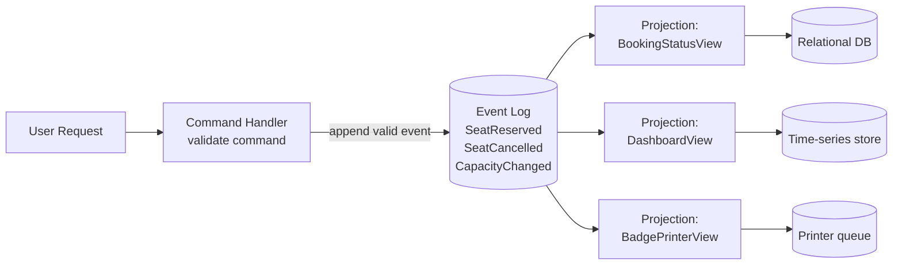

# Event Sourcing and CQRS

> **One-sentence summary.** Treat an append-only log of immutable past-tense events as the system of record, and derive any number of read-optimized materialized views from it — separating the write model (commands) from the read model (queries).

## How It Works

In a traditional CRUD system, the database row **is** the state: you overwrite it, and history is lost. Event sourcing inverts this. Every state change is captured as a **past-tense event** (`SeatReserved`, `BookingCancelled`, `CapacityChanged`), validated, and appended to an **immutable event log**. The log is the source of truth; the current state of the world is a *function* of the log.

The read side is then decoupled from the write side — this is **CQRS (Command Query Responsibility Segregation)**. Each **materialized view** (also called a **projection** or **read model**) subscribes to the log and derives a query-optimized representation. Different consumers can use different data models: a relational table for booking status, a search index for full-text search, an in-memory cache for a live dashboard, a file for the badge printer. Because views are *derived deterministically* by replaying events in order, you can delete any view and rebuild it from scratch with new code.

A command (`ReserveSeat`) is only validated once, at the boundary — was there enough capacity? Once accepted, it becomes a fact (`SeatReserved`) that no downstream consumer is allowed to reject. Events are **never mutated or deleted**; a cancellation is a *new* event, not an erasure. This ordering matters: a reservation followed by a cancellation is not the same as the reverse.

Note the contrast with a [[03-star-and-snowflake-schemas]] fact table. Both are collections of historical events, but star-schema fact rows are **unordered** and **homogeneous** (every row has the same columns), while event-sourced logs are **strictly ordered** and **heterogeneous** (many event types, each with its own shape).

## When to Use

- **Complex business domains** — conference bookings, banking ledgers, order fulfillment, inventory management. When the *why* of a change matters as much as the current state.
- **Audit-required systems** — regulated industries (finance, healthcare) where "who did what when" is a compliance requirement. The log *is* the audit trail.
- **Evolving read models** — when you know you'll want to slice the data in new ways that you can't predict up front. Replay the log into a new projection, no backfill migration needed.
- **High write throughput** — sequential append-only writes scale far better than scattered in-place updates; bursts can be absorbed by the log while projections catch up asynchronously.
- **Debugging and time-travel** — reproduce any past state by replaying up to a timestamp.

## Trade-offs

| Aspect | Advantage | Disadvantage |
|---|---|---|
| Write throughput | Sequential appends, log absorbs bursts | — |
| Auditability | Full causal history for free | Log grows unboundedly; storage cost |
| Replayability | Rebuild any view with new code | Replay of millions of events can take hours |
| Intent clarity | "BookingCancelled" tells you *why* | — |
| GDPR / right-to-erasure | — | Immutable events clash with deletion requests; requires **crypto-shredding** |
| External data | — | Non-deterministic lookups (exchange rates, weather) break replay |
| Side effects on replay | — | Resending emails/webhooks during rebuild is dangerous |
| Consistency model | Reads scale independently of writes | **Eventual consistency** between write and read models — projections lag |
| Cognitive load | — | Two models, async wiring, debugging spans the whole pipeline |

## Real-World Examples

- **EventStoreDB** — a database built explicitly around event streams and projections.
- **MartenDB** — event-sourcing and document storage library layered over PostgreSQL's JSONB.
- **Axon Framework** — a JVM framework bundling CQRS, event sourcing, and saga orchestration.
- **Apache Kafka** — widely used as a durable event log; stream processors (Kafka Streams, Flink) maintain materialized views.
- **LMAX trading engine** — a canonical high-throughput event-sourced system; the Disruptor pattern came from this work.
- **Git** — effectively event-sourced: commits are immutable events, the working tree is a materialized view derivable by replaying history.

## Common Pitfalls

- **Non-deterministic external lookups.** Fetching the live USD/EUR exchange rate while processing a `PaymentReceived` event will yield different results on replay. Fix: snapshot the input *into* the event at write time, or query a time-addressable historical source keyed by the event timestamp.
- **Ignoring GDPR / right-to-erasure.** Events are immutable, but users have the legal right to have their personal data deleted. **Crypto-shredding** is the standard answer: encrypt each user's PII with a per-user key, store the ciphertext in events, and on an erasure request, destroy the key. The events remain, but the PII is now irrecoverable.
- **Resending side effects on rebuild.** Replaying the log to refresh a view must not re-trigger confirmation emails, webhooks, or charges. Record outbound side effects in their own "already sent" ledger keyed by event ID, and check it before emitting.
- **Treating the log as a queue.** An event log is a **system of record**, not a throwaway buffer. Retention should be indefinite (or governed by crypto-shredding), not "7 days then drop."
- **Wrong event granularity.** Events that describe *intent* (`BookingCancelled`) are the sweet spot. Too coarse ("UserDidSomething") loses meaning; too fine ("BookingRowActiveSetToFalse") leaks storage structure into the domain and makes projections brittle when the storage changes.

## See Also

- [[02-normalization-and-denormalization]] — materialized views here are the denormalized, read-optimized side of the same write-vs-read trade-off
- [[03-star-and-snowflake-schemas]] — fact tables are also historical events, but unordered and uniform; event logs are ordered and heterogeneous
