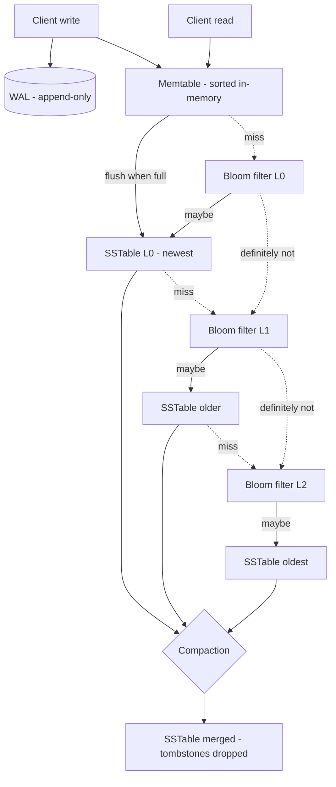

# Log-Structured Storage and LSM-Trees

> **One-sentence summary.** An LSM-tree turns every write into a cheap sequential append by buffering updates in an in-memory sorted *memtable*, flushing it to immutable sorted *SSTable* segments on disk, and merging those segments in the background — trading extra read work (and Bloom-filter tricks to reclaim it) for very high write throughput.

## How It Works

Start with the world's simplest database: an append-only file where every write tacks `key,value` onto the end. Appends are the fastest thing a disk can do, so writes fly; but reads are O(n) scans, and old versions of a key are never reclaimed. Adding an **in-memory hash index** keyed by byte offset fixes reads for point lookups, but the hash table must fit in RAM, must be rebuilt after a crash, and cannot answer range queries.

The LSM-tree replaces that hash index with **sorted segment files** called **SSTables** (Sorted String Tables). Within an SSTable, keys are strictly increasing and each key appears at most once. A **sparse index** stores only the first key of each few-kilobyte block, so a lookup finds the right block via the sparse index and then scans the block; blocks can be compressed to trade a little CPU for less I/O and disk. Because the file is sorted, range scans are fast.

Writes cannot hit a sorted file directly, so the storage engine keeps the *in-memory* structure mutable and the *on-disk* structures immutable. Every write goes into the **memtable** — a red-black tree, skip list, or trie that keeps keys sorted in memory — and is simultaneously appended to a **write-ahead log (WAL)** on disk so the memtable survives a crash. When the memtable grows past a threshold (typically a few megabytes), it is flushed as a new SSTable segment; the WAL segment backing it can then be discarded. To delete a key, the engine writes a **tombstone** that suppresses older values during merging and is itself dropped only once it has propagated to the oldest segment.

Background **compaction** merges SSTables with a mergesort-style pass: read input files in parallel, emit the smallest key, and where the same key appears in more than one input keep only the newest. The merged output is a new sorted segment; once written, reads switch to it and the inputs are deleted. Because segments are immutable, compaction can run concurrently with reads, and a crash mid-merge is recovered by simply discarding the unfinished output.

Reads consult the memtable first, then each on-disk segment from newest to oldest. That can be expensive when a key does not exist (every segment must be checked), so each SSTable ships with a **Bloom filter** — a bitmap populated by hashing each key several times. A query hashes the same way: if any bit is zero, the key is definitely absent and the segment is skipped; if all are set, the key is *probably* present and the block is read. Around 10 bits per key yields a ~1% false-positive rate, shrinking tenfold per 5 extra bits.

## When to Use

- **Write-heavy OLTP workloads** such as time-series ingestion, event logging, metrics, or messaging queues where sustained insert rates dwarf read rates.
- **Large datasets on SSDs or object storage** where sequential I/O is cheap and random in-place writes amplify wear; storing segments on S3 (as SlateDB and Delta Lake do) is a natural fit because segments are immutable once written.
- **Range-scan workloads over sorted keys** — wide-column stores like Cassandra or HBase use the SSTable sort order to answer `WHERE partition_key = ? AND clustering_key BETWEEN ...` efficiently.

## Trade-offs: Size-Tiered vs Leveled Compaction

| Aspect | Size-Tiered | Leveled |
|---|---|---|
| Strategy | Merge several same-size SSTables into one larger tier | Keep fixed-size SSTables partitioned by key range across levels L0, L1, L2... |
| Write amplification | Lower — data is rewritten only a few times across tiers | Higher — keys move through every level |
| Read amplification | Higher — many overlapping tiers may contain the key | Lower — at most one SSTable per key range per level ≥ 1 |
| Space amplification | Higher — temporary doubling during big merges | Lower — ~10% overhead because each level is bounded |
| Best for | Write-dominated workloads, bulk ingest | Read-dominated or mixed workloads, point lookups |
| Temporary disk need | Large — merging a tier requires space for the output alongside inputs | Small — merges are incremental between adjacent levels |
| Default in | Cassandra (STCS), ScyllaDB | RocksDB, LevelDB, HBase (modern) |

## Real-World Examples

- **RocksDB / LevelDB**: The canonical embedded LSM engine; RocksDB powers MyRocks, CockroachDB, TiKV, and Kafka Streams state stores.
- **Cassandra and ScyllaDB**: Wide-column distributed stores built directly on SSTables with configurable compaction (STCS, LCS, TWCS for time-series).
- **HBase** and **Google Bigtable**: Bigtable's 2006 paper introduced the terms *memtable* and *SSTable*; HBase is its open-source lineage.
- **Lucene / Elasticsearch**: Full-text search engines whose segment-per-flush-plus-background-merge architecture is an LSM applied to postings lists rather than key-value pairs.
- **SlateDB** and **Delta Lake**: Modern engines that place immutable segments in object storage (S3/GCS), exploiting the fact that LSM writes are append-only and thus perfectly compatible with write-once blob stores.

## Common Pitfalls

- **Compaction cannot keep up with ingest.** If writes outpace the merge thread, L0 grows, read amplification explodes, and the engine eventually applies **backpressure** — client writes stall until compaction catches up. Provision compaction bandwidth (threads, I/O, throttles) as part of capacity planning, not as an afterthought.
- **Write stalls from WAL fsync or flush pauses.** The memtable flush competes with live writes for disk bandwidth; tune memtable size and flush concurrency so the next memtable is never full while the previous one is still being persisted.
- **Tombstones that never die.** A deleted key's tombstone must propagate all the way to the oldest segment containing that key before it can be dropped; sparse updates to cold data can leave millions of tombstones that slow range scans (Cassandra's "tombstone hell"). Watch tombstone-per-read metrics and use TTL or explicit full compaction to drain them.
- **Read amplification on deep LSMs.** A point lookup for a missing key touches every level. Without correctly sized Bloom filters (10+ bits per key) each miss pays the I/O cost of every SSTable — death for cache-miss-heavy workloads.
- **Range-query blind spots for Bloom filters.** Bloom filters only help equality lookups; range scans must still open every overlapping SSTable, which is why leveled compaction (with non-overlapping key ranges per level) matters so much for read-heavy workloads.

## See Also

- [[02-b-trees-and-page-oriented-storage]] — the update-in-place alternative that LSMs are usually compared against
- [[03-comparing-btrees-and-lsm-trees]] — head-to-head on read latency, write amplification, and operational predictability
- [[04-secondary-and-clustered-indexes]] — how these index shapes are built on top of either storage family
- [[07-multidimensional-and-vector-indexes]] — Lucene-style inverted indexes reuse the LSM segment-and-merge pattern for search
