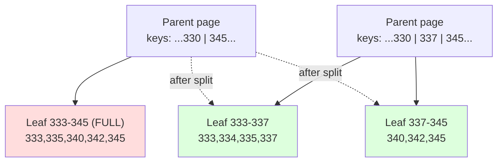

# B-Trees and Page-Oriented Storage

> **One-sentence summary.** The B-tree slices the database into fixed-size pages arranged as a balanced tree, overwrites those pages in place on update, and leans on a write-ahead log (or copy-on-write) to stay crash-consistent — which is why it has been the default index in almost every relational database since 1970.

## How It Works

A B-tree carves the file into **fixed-size pages** — traditionally 4 KiB, but 8 KiB in PostgreSQL and 16 KiB in MySQL. Each page has a *page number* that doubles as its on-disk address: multiplying page number by page size gives the byte offset inside the file, so one page can reference another exactly like a pointer, but persisted to disk. These references are how a B-tree builds a tree out of pages.

One page is the **root**. Every lookup starts there. An interior page holds a handful of keys that act as range boundaries, plus a child reference per range. You descend by finding the range your key falls into and following that pointer, until you reach a **leaf page** that holds the value inline (or a pointer to wherever the row actually lives). The number of children per page is the **branching factor**, and in practice it is *several hundred* — high enough that real databases fit in a tree three or four levels deep. A four-level tree with branching 500 and 4 KiB pages can address **~250 TB** of data, so at most four page reads stand between you and any row.

Writes are update-in-place. To update an existing key, the engine locates its leaf, rewrites the page on disk with the new value, and is done. To insert a new key, it finds the page whose range covers the key and adds it. If the page is full, it **splits** into two half-full pages and the parent page is edited to record the new boundary. If the parent overflows, the split propagates up — possibly all the way to the root, at which point a new root is created above. This is what keeps the tree balanced: depth stays at *O(log n)* no matter the insert order.

### Making it crash-safe

Overwriting a page is a dangerous operation. A split rewrites *two* leaves plus the parent; if the machine crashes partway through, you can get an **orphan page** (written but never linked in) or, worse, a **torn page** — the hardware wrote half the page and then lost power, corrupting even the bytes that were there before. The standard defense is a **write-ahead log (WAL)**: every B-tree modification is appended to a sequential log *and fsynced* before the tree pages themselves are touched. On restart, the WAL is replayed to bring the tree back to a consistent state. Filesystems call the same idea *journaling*. Pages can now be buffered in memory and flushed lazily, because durability lives in the log, not in the tree pages.

### Copy-on-write variants

Some engines (notably **LMDB**) skip the WAL entirely and use **copy-on-write**. A modified leaf is written to a *new* page location, and every ancestor up to the root is rewritten to point at the new child. Publishing the change is a single atomic root swap. This makes snapshots almost free (old roots still form a valid immutable tree) and simplifies concurrency control for readers — they latch a root and see a consistent view for as long as they hold it.

### Common variants

- **Abbreviated interior keys.** Interior pages only need enough of the key to separate ranges, so keys are truncated. That packs more entries per page and raises the branching factor.
- **Leaf sibling pointers.** Each leaf has a next/prev pointer, letting range scans walk the leaves without bouncing back up to parents.
- **Key prefix compression.** Common prefixes within a page are stored once, saving space in text-heavy indexes.

## When to Use

- **Default choice for OLTP relational workloads.** Predictable read latency, in-place updates, efficient range scans — most CRUD apps fit this profile naturally.
- **Read-heavy indexes where queries do point lookups or short range scans.** A B-tree touches *one page per level*, so reads are bounded and predictable; no merging across segments like an LSM.
- **Embedded or read-mostly stores where snapshot semantics matter.** A copy-on-write B-tree (LMDB) gives you cheap consistent snapshots for long-running readers or backups.

## Trade-offs

| Aspect | In-place overwrite + WAL | Copy-on-write (LMDB-style) |
|---|---|---|
| Crash recovery | Replay WAL on startup | Atomic root swap; no recovery needed |
| Write amplification | Page write + WAL write (often full-page writes to guard torn pages) | Rewrites every ancestor up to the root on each change |
| Concurrency / snapshots | Needs locks or MVCC; snapshots are extra machinery | Readers see a stable root for free; snapshots are near-zero cost |
| Disk usage over time | Pages stable; may fragment, needs vacuum/rebuild | Old page versions pile up until reclaimed |
| Hot-page contention | Writers serialize on the page latch | Writers serialize on the root swap (single-writer in LMDB) |
| Typical adopters | PostgreSQL, InnoDB, SQL Server, Oracle, SQLite | LMDB, BoltDB |

## Real-World Examples

- **PostgreSQL**: 8 KiB pages, WAL-based recovery, full-page writes on first post-checkpoint modification to survive torn pages. Vacuum reclaims space from deleted/updated tuples.
- **MySQL (InnoDB)**: 16 KiB pages, doublewrite buffer to defend against torn pages, clustered B-tree where the primary key *is* the table.
- **SQLite**: Single-file B-tree with a rollback journal (or optional WAL mode); powers countless mobile apps and embedded systems.
- **LMDB**: Copy-on-write B-tree, memory-mapped, single-writer. Used inside OpenLDAP and as the default key-value store in several embedded systems.
- **SQL Server and Oracle**: Classic update-in-place B-trees with transaction logs; Oracle exposes *index-organized tables*, its name for a clustered B-tree.

## Common Pitfalls

- **Torn pages from non-atomic hardware writes.** If the disk tears a page mid-write, even unrelated bytes can be corrupted. Defenses (full-page WAL writes, InnoDB's doublewrite buffer) cost real I/O — budget for it.
- **Fragmentation requiring vacuum/rebuild.** Update-in-place plus MVCC leaves dead tuples and half-full pages. PostgreSQL's autovacuum, MySQL's `OPTIMIZE TABLE`, and index rebuilds exist specifically to reclaim this space; on write-heavy tables they are part of ops, not an afterthought.
- **Write amplification from full-page WAL writes.** PostgreSQL writes the entire 8 KiB page into the WAL the first time it is touched after a checkpoint; a one-byte update can cost a full page on disk. Tune checkpoint frequency and consider `wal_compression`.
- **Lock contention on hot pages.** A page holding a monotonically increasing key (e.g., the right edge of a timestamped index) becomes a write bottleneck. Randomize the key, hash-partition the index, or switch to an LSM for that workload.
- **Believing `fsync` is honored.** Durability claims are only as strong as the stack below: misbehaving drives, virtualized disks, or misconfigured filesystems can lie about flushes. Test with power-loss simulators before trusting it.

## See Also

- [[01-log-structured-storage-lsm-trees]] — the append-only, compaction-based alternative that avoids in-place overwrites entirely
- [[03-comparing-btrees-and-lsm-trees]] — side-by-side on read latency, write amplification, and operational predictability
- [[04-secondary-and-clustered-indexes]] — how B-trees are layered to build non-primary-key indexes and clustered tables
