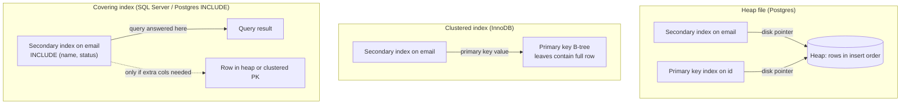

# Secondary, Clustered, and Covering Indexes

> **One-sentence summary.** A primary index locates a row by its unique key; *secondary*, *clustered*, and *covering* indexes are three different answers to the follow-up question — where does the actual row data live relative to the index leaf, and how many hops does a query need to reach it?

## How It Works

A **primary-key index** is the key-value structure we have been assuming all along: given a key, find its one row. A **secondary index** lets you look up rows by a column that is *not* the primary key — for example, finding every order belonging to a given `user_id`. The structural twist is that indexed values no longer have to be unique: many rows can share the same `user_id`. Engines handle this in one of two ways: store a *postings list* of row identifiers at each key (like a full-text index), or *uniquify* the key by appending a row identifier so every entry is still unique. Both B-tree and LSM engines can host secondary indexes; the trade-offs (in-place writes vs. tombstones-and-compaction) inherit directly from the underlying structure.

The more interesting question is *what the index leaf actually stores* — the key always, but what about the row itself? There are three answers, and most relational databases pick one as a default and let you opt into the others:

- **Heap file** — rows live in an unordered append-mostly file. Every index (primary or secondary) stores a pointer (file + page + slot) to the heap location. All indexes are, in a sense, "secondary" — none owns the row.
- **Clustered index** — the full row is stored *inside the leaf page of the primary-key B-tree*. Secondary indexes don't point at a disk location; they store the *primary key* of the matching row, and a lookup therefore walks the secondary tree, then walks the primary tree.
- **Covering index (a.k.a. index with included columns)** — a middle ground. The index leaf carries a few extra non-key columns alongside the key so a query that only needs those columns can be answered from the index alone, with no heap or clustered-tree hop. The row itself still lives elsewhere (heap or clustered PK).

A nasty wrinkle specific to heap files: if you **update a row and the new value is bigger than the old**, it may not fit in its current slot. The engine either moves the row and updates every index to point at the new location (expensive — indexes may be many) or leaves a **forwarding pointer** in the old slot redirecting to the new one (cheap write, but every future read pays an extra hop, and forwarders accumulate as bloat). Clustered-index engines sidestep this for secondary indexes specifically: since secondaries store the primary key, moving a row inside the PK tree doesn't invalidate any secondary index.

## When to Use

- **Heap file** is the sensible default when you have many secondary indexes or when rows vary a lot in size. Postgres uses it for everything.
- **Clustered primary key** pays off when most queries hit by primary key and you want those to be a single B-tree walk with zero extra I/O. InnoDB picks this as the default precisely because PK lookups dominate OLTP.
- **Covering index** is the tool for a specific hot query: add the two or three columns that query reads as `INCLUDE` columns on an existing secondary index and the query drops from "secondary walk + PK walk + row fetch" to a single secondary walk.

## Trade-offs

| Aspect | Heap file + pointer indexes | Clustered primary index | Covering index |
|---|---|---|---|
| Read hops (secondary lookup) | Secondary B-tree → heap (2 I/O classes) | Secondary B-tree → primary B-tree (2 tree walks) | Secondary B-tree only (1 walk, if covered) |
| Read hops (primary lookup) | Primary B-tree → heap | Primary B-tree (row is in the leaf) | N/A (primary unchanged) |
| In-place update | Fine if new row fits; else move or forwarding pointer | Row moves within PK tree; secondaries unaffected (they store PK) | Must maintain extra included columns on every update |
| Space overhead | Low; one copy of each row in heap | Low; one copy, in the PK tree | High; included columns are duplicated |
| Effect of many secondary indexes | Each write updates all index pointers | PK value stored in each secondary — stable across row moves | Every update touches any index that includes a changed column |
| Example systems | Postgres, Oracle (default) | MySQL InnoDB, SQL Server (opt-in per table) | SQL Server `INCLUDE`, Postgres `INCLUDE`, Oracle IOT-with-overflow |

## Real-World Examples

- **PostgreSQL** — every table is a heap; even the primary-key index is just another B-tree pointing at heap tuples. Updates create new tuple versions (MVCC) and HOT updates try to avoid touching indexes when no indexed column changed.
- **MySQL / InnoDB** — the primary key is *always* a clustered index, with full rows in the PK leaves. Secondary indexes store the primary key value as the row reference, so a secondary lookup costs two B-tree walks. This is why InnoDB loves short primary keys and punishes long UUID PKs.
- **Microsoft SQL Server** — allows one clustered index per table (typically the PK, but you can designate any column) and first-class covering indexes via `CREATE INDEX ... INCLUDE (col1, col2)`.
- **Oracle** — heap tables by default, with optional *Index-Organized Tables* (IOTs) that cluster the row in the PK B-tree in the InnoDB style.

## Common Pitfalls

- **Too many secondary indexes silently kill write throughput.** Every `INSERT`/`UPDATE`/`DELETE` must maintain every index. On heap storage that means N pointer updates per row change; on LSM storage it means N separate writes merged through compaction.
- **Assuming a secondary index is always fast.** In a clustered-index engine, a secondary lookup is *two* B-tree walks (secondary → PK) before you even see the row. If the query needs only a few columns, reach for a covering index instead of praying the buffer pool is warm.
- **Covering indexes that duplicate half the table.** Every included column is a copy. Ten big included columns across three secondary indexes can double your storage and quadruple write cost. Cover *specific* queries, not "just in case."
- **Heap bloat from forwarding pointers.** A workload that grows rows on update (appending to a JSON column, for example) leaves a trail of forwarders that permanently add a hop per read until a `VACUUM FULL` / `OPTIMIZE TABLE` rewrites the heap.
- **Choosing a huge primary key in InnoDB.** Because every secondary index stores the full PK value, a 64-byte composite PK inflates every secondary index by 64 bytes per row. Short surrogate keys pay dividends here.

## See Also

- [[02-b-trees-and-page-oriented-storage]] — the tree structure every index variant above is built on
- [[01-log-structured-storage-lsm-trees]] — alternative engine; secondary indexes still apply but writes go through memtable + compaction instead of in-place updates
- [[05-column-oriented-storage]] — analytical storage abandons row-level indexing entirely and relies on column-wise scans with compression
- [[07-multidimensional-and-vector-indexes]] — where a single-key B-tree isn't enough (geospatial ranges, full-text search, nearest-neighbor)
