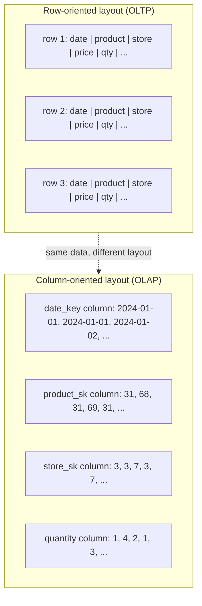

# Column-Oriented Storage for Analytics

> **One-sentence summary.** Store each column of a wide fact table contiguously so analytical queries only read the few columns they actually touch, then lean on bitmap/run-length compression and sort order to shrink I/O by another order of magnitude.

## How It Works

Analytical fact tables are absurdly wide — often 100+ columns — but a real query typically touches only four or five of them (`SELECT *` is vanishingly rare in analytics). A row-oriented engine, even with indexes on the filtered columns, still has to pull entire 100-column rows off disk, parse them, and throw away 95% of what it read. That is a massive waste of disk throughput when the query already wants to scan billions of rows.

**Column-oriented storage** flips the layout: instead of packing all values from one row together, it packs all values from one *column* together. A query that needs `date_key`, `product_sk`, and `quantity` only reads those three column files and ignores the other 97. The layout relies on one invariant — every column stores its rows in the *same* order — so the kth entry of one column and the kth entry of another always belong to the same logical row. In practice, columnar engines don't store trillions of rows as one giant per-column blob; they chop the table into row-range blocks (typically keyed by timestamp), and within each block they store each column separately. A query then loads only the columns it needs from only the blocks that overlap its filter range.

**Column compression** is where columnar storage really earns its keep. Columns have low cardinality and lots of repetition: a retailer might have *billions* of sales transactions but only 100,000 distinct products. Take a column with *n* distinct values and turn it into *n* bitmaps — one bitmap per value, one bit per row, 1 if that row has the value, 0 otherwise. Most bitmaps are sparse (mostly 0s), so they get **run-length encoded** on top: store counts of consecutive 0s and 1s instead of the raw bits. Techniques like **roaring bitmaps** pick whichever representation (raw or RLE) is smaller per chunk, so one column's encoding can mix both.

Bitmaps compose naturally with analytical predicates. `WHERE product_sk IN (31, 68, 69)` loads the three bitmaps and ORs them together. `WHERE product_sk = 30 AND store_sk = 3` loads one bitmap from each column and ANDs them. Both work precisely because the kth bit of *every* column's bitmap refers to the same row — so bitwise operations across columns are meaningful.

> **Don't confuse this with wide-column / column-family databases.** Bigtable, HBase, and Accumulo are called "wide-column" because a row can hold thousands of sparse columns, but they store all values of a row together. They are **row-oriented**, not columnar.

**Sort order as an index.** The insertion order of rows doesn't have to be arbitrary. If you sort whole rows (never each column independently — that would destroy the kth-bit invariant) by a column admins know queries filter on, that column becomes a pseudo-index: a query on `date_key BETWEEN ...` can skip whole blocks. Sorting also supercharges compression on the *first* sort key because long runs of repeated values RLE down to kilobytes even on billion-row tables. The second sort key compresses less; the third barely at all; later columns look essentially random. So pick the first sort key by the dominant query filter — usually a timestamp.

**Writing.** Column-oriented storage makes individual in-place row inserts nightmarish (you'd have to rewrite every compressed column from the insertion point onward). The standard fix is log-structured: writes land first in a small row-oriented, sorted, in-memory store. When enough accumulate, a background job merges them with the existing immutable column files on disk and writes fresh column files in bulk. Queries transparently union the on-disk columns with the in-memory recent writes — analysts see their inserts immediately without paying per-row rewrite costs.

## When to Use

- **Warehouse fact tables** with hundreds of columns where queries aggregate over billions of rows but touch only a handful of columns.
- **Time-series and event data** where blocks are naturally keyed by timestamp and most queries filter on a time range.
- **Embedded analytics inside an application** (DuckDB, ClickHouse) when you need columnar scan speed without standing up a distributed warehouse.

## Trade-offs

| Aspect | Row store (OLTP) | Column store (OLAP) |
|---|---|---|
| Read pattern | Fetch whole row by key | Scan a few columns across many rows |
| Write pattern | Row-level insert / update / delete | Bulk batched append, log-structured merge |
| Compression ratio | Modest (mixed types per page) | Very high (repetition + bitmap/RLE per column) |
| Update cost | Cheap (overwrite one row in place) | Expensive — must rewrite compressed columns, so batched via in-memory buffer |
| Sort-order use | Primary-key B-tree | First sort key doubles as skip index and compression booster |
| Example systems | PostgreSQL, MySQL, InnoDB, DynamoDB | Snowflake, BigQuery, Redshift, DuckDB, ClickHouse |

## Real-World Examples

- **Cloud warehouses — Snowflake, BigQuery, Amazon Redshift.** Columnar storage over object storage, decoupled compute, sort/cluster keys exposed as a design knob.
- **Embedded columnar — DuckDB.** Single-node process that runs analytical SQL on Parquet files with columnar vectorized execution — the "SQLite of analytics."
- **Real-time analytics — ClickHouse, Apache Pinot, Apache Druid.** Columnar with aggressive compression plus low-latency ingest, used behind product dashboards and ad-targeting APIs.
- **Open storage formats — Parquet, ORC, Apache Arrow.** Parquet and ORC are on-disk columnar file formats used across Spark, Trino, Presto, Iceberg, Delta. Arrow is the in-memory columnar representation most of those engines share.
- **Time-series columnar — InfluxDB IOx, TimescaleDB.** Column-oriented storage tuned for timestamped event streams.

## Common Pitfalls

- **Treating "wide-column" databases as columnar.** Bigtable/HBase/Cassandra store rows together — they are row-oriented despite the name. They will not give you OLAP scan performance on a 100-column fact table.
- **Sorting on the wrong column.** The first sort key carries almost all the compression and skip-index benefit. If your dominant filter is `date_key` but you sort by `customer_id` first, your date-range scans will read almost everything and compress poorly.
- **Trying to serve row-level updates.** Updating a single row means rewriting compressed column chunks — painful. Either batch updates via the in-memory write buffer (log-structured style) or push mutable workloads into an OLTP store and ETL into the warehouse.
- **Mixing OLTP-style writes directly into a columnar store.** Streaming one-row-per-call inserts bypasses batching and destroys the compression/bulk-write assumption. Always buffer writes (in memory, or in a row-oriented staging table) and flush in bulk.
- **Sorting each column independently.** This is an easy logical error that breaks the "kth entry corresponds to the same row" invariant — rows become unreconstructible. Always sort whole rows; store by column.

## See Also

- [[06-query-execution-and-materialized-views]] — how columnar engines turn these layouts into fast queries via JIT-compiled code or vectorized batch operators
- [[01-log-structured-storage-lsm-trees]] — columnar stores use the same "in-memory buffer + immutable segments + background merge" pattern that LSM-trees pioneered for OLTP writes
