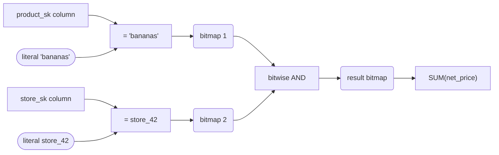

# Query Execution: Compilation, Vectorization, and Materialized Views

> **One-sentence summary.** Analytical engines avoid per-row interpreter overhead by either JIT-compiling each SQL query into tight machine code or running a fixed library of batched column operators — and for workloads that repeat the same aggregates, they also pre-compute results as materialized views or OLAP data cubes.

## How It Works

A SQL query is first turned into a **query plan**: a tree of *operators* (scan, filter, join, aggregate) that a planner has reordered and parallelized. The naive way to execute that tree is a *row-at-a-time interpreter* — walk each row, dispatch through the operator tree, check the plan structure to decide which comparison to run on which column, write output if predicates match. That works fine for a point query that touches a handful of rows. For a warehouse query scanning millions or billions of rows it is ruinous: almost all CPU time goes to traversing the plan data structure, virtual calls, and branch mispredictions rather than doing useful arithmetic on your data. Once data lives in memory, the interpreter itself is the bottleneck.

Two approaches make this fast, and both exploit the same hardware tricks — sequential memory access, tight inner loops, SIMD, and reading directly off compressed column data without materializing full rows.

**Query compilation** (JIT codegen): the engine inspects the plan and emits a bespoke program for *this* query — typically through LLVM — that contains a hardcoded inner loop over the relevant columns with the predicates inlined. The generated machine code has no interpreter dispatch at all; it's as if someone hand-wrote a C function for your specific `WHERE` clause and ran it over the column data in RAM.

**Vectorized processing**: stay interpreted, but change the unit of work. Instead of pushing one row through the whole plan, each operator consumes a *vector* — a batch of (typically 1K–10K) values from a single column — and returns another vector (often a bitmap). An equality operator takes the `product_sk` column plus the literal for "bananas" and returns a bitmap; a second equality against `store_sk` returns another bitmap; a bitwise-AND operator combines them. The operator library is fixed and hand-tuned, which means the hot loops can be SIMD-vectorized by the compiler once, and every query benefits.

Both approaches also pair naturally with **materialized views** — a saved query result, physically written to disk. A *virtual* view is only a macro: reading from it re-runs the underlying SQL. A *materialized* view is an actual table-like object that the engine can scan cheaply, at the cost of being updated (or rebuilt) when the underlying data changes. Specialized systems like Materialize focus exclusively on keeping such views incrementally correct as new events arrive.

A **data cube** (OLAP cube) is a materialized view with a particular shape: a precomputed grid of aggregates (`SUM`, `COUNT`, `AVG`, ...) across several dimensions — date × product × store × promotion × customer. A cell holds the aggregate for that dimension combination; marginal totals (sales per date ignoring product, etc.) are precomputed along each axis. Queries that match the cube's dimensions become near-O(1) lookups; queries that don't match still have to hit the raw facts.

## When to Use

- **Vectorized processing** when you want a modern OLAP engine without a C++/LLVM toolchain complication: predictable performance, easier to debug, great default for embedded analytics (DuckDB) and high-QPS clusters (ClickHouse).
- **Query compilation** when per-query overhead is amortized over very large scans or very complex expressions, or when you want to squeeze out the last bit of latency (Spark SQL Tungsten, Hyper/Umbra, Impala).
- **Materialized views** when a handful of known queries run constantly and the source data changes slowly relative to read traffic (BI dashboards, regulatory reports).
- **Data cubes** when dashboards slice the same fact table along a *fixed* set of dimensions and you are willing to trade flexibility for sub-second roll-ups.

## Trade-offs

| Aspect | Row-at-a-time interpreter | Query compilation (LLVM codegen) | Vectorized processing |
|---|---|---|---|
| Dispatch overhead | Once per row — dominates | None after compile | Once per vector (thousands of rows) |
| First-query latency | Low | High (compile time, 10s–100s ms) | Low |
| Steady-state throughput | Poor on large scans | Excellent | Excellent |
| SIMD exploitation | Incidental | Via LLVM autovectorization | Designed-in, per operator |
| Engine complexity | Simple | High (codegen, JIT cache, debugging) | Moderate (fixed operator library) |
| Works on compressed columns | Usually decompresses first | Yes (generated loop reads encoded data) | Yes (operators accept RLE/dictionary inputs) |
| Example systems | Textbook Volcano model, older OLTP planners | Spark SQL Tungsten, Hyper/Umbra, Impala, Redshift | DuckDB, ClickHouse, Apache Arrow DataFusion, MonetDB/X100, Velox |

## Real-World Examples

- **Vectorized engines**: DuckDB, ClickHouse, Apache Arrow DataFusion, MonetDB/X100 (the original), Meta's Velox. Operator library is hand-written; batches flow between stages as Arrow-style column chunks.
- **Compiling engines**: Spark SQL with Tungsten whole-stage codegen, Hyper/Umbra (research lineage behind Tableau and CedarDB), Cloudera Impala, Amazon Redshift. A compiled fragment replaces a whole pipeline of operators.
- **Materialized views**: PostgreSQL `CREATE MATERIALIZED VIEW` (manual `REFRESH`); Snowflake and BigQuery materialized views (automatic partial refresh); Materialize — a streaming database whose entire premise is *incremental* maintenance of SQL views under event input.
- **Data cubes**: SAP BW, Microsoft SQL Server Analysis Services (SSAS), Oracle Essbase, Apache Kylin (cubes on top of Hadoop/Parquet). BI tools like Tableau and Power BI layer their own in-memory cubes on top.

## Common Pitfalls

- **Assuming a materialized view is free.** Every upstream write now has to propagate through the view. If the underlying table is write-heavy relative to read traffic, the maintenance cost can exceed the query cost you saved.
- **Cubing the wrong dimensions.** A cube cannot answer questions about a dimension it doesn't contain. If you later need to filter by, say, `price > $100` and `price` isn't a cube dimension, you fall back to scanning raw facts — keep the raw data around.
- **Dimension blow-up.** Cube storage grows combinatorially with the number and cardinality of dimensions; a five-dimensional cube over high-cardinality columns can be larger than the fact table itself.
- **Benchmarking interpreted mode.** Some engines ship an interpreter for compatibility and only codegen in production; a microbenchmark that disables codegen can be 10–100× slower than reality.
- **"Vectorized" terminology clash.** *Vectorized processing* here means batched column operators — pure OLAP execution strategy. It has nothing to do with *vector embeddings* used in semantic search, even though the words collide. When someone says "our engine is vectorized," ask whether they mean SIMD batches over columns or nearest-neighbor search over embedding vectors; see [[07-multidimensional-and-vector-indexes]] for the other meaning.

## See Also

- [[05-column-oriented-storage]] — the storage layout that makes both compilation and vectorization viable in the first place; operators read compressed columns directly
- [[07-multidimensional-and-vector-indexes]] — disambiguates "vector" — R-trees, inverted indexes, and embedding-based similarity search, none of which are what "vectorized execution" refers to
