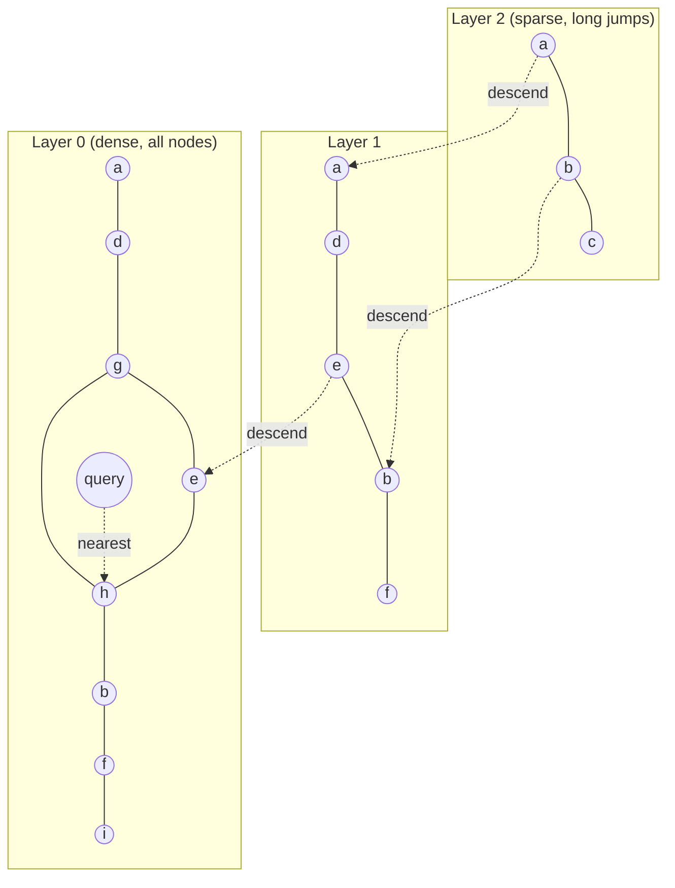

# Multidimensional, Full-Text, and Vector Indexes

> **One-sentence summary.** When queries can't be served by sorting on one key — bounding-box geo searches, keyword searches across many terms, semantic similarity over embeddings — specialized index families (R-trees, inverted indexes, IVF/HNSW) replace the 1-D B-tree, each trading exactness and cost for a different query shape.

## How It Works

A B-tree or LSM-tree sorts records by a single key, so range scans work beautifully in one dimension. The obvious extension — a **concatenated index** like `(lastname, firstname)` — still only sorts one dimension at a time: it helps you find everyone named "Smith," but it cannot simultaneously narrow both columns. That breaks badly for a geo query like `WHERE lat BETWEEN x1 AND x2 AND lon BETWEEN y1 AND y2`: a `(lat, lon)` index returns every restaurant in the latitude slice regardless of longitude, or vice versa. You need an index that divides space by region, not by sort order.

**Multidimensional indexes** solve this. One option is a *space-filling curve* (Hilbert, Z-order) that interleaves bits of the coordinates into a single scalar, which can then ride a regular B-tree. More common are purpose-built structures like **R-trees** and **Bkd-trees** that recursively partition space so that nearby points live in the same subtree. PostGIS exposes this via PostgreSQL's Generalized Search Tree (GiST) infrastructure. Grid schemes based on squares, triangles, or hexagons (Uber's H3) play the same role for bucketed lookups. The technique generalizes far past geography: a 2-D index on `(date, temperature)` answers "all hot days in 2024" in one narrowing, and a 3-D index on `(R, G, B)` lets you find products within a color range.

**Full-text search** is also, secretly, a multidimensional problem. Treat every distinct term in the vocabulary as its own dimension: a document that contains "red" has a 1 in the `red` dimension and 0 elsewhere. A query for "red apples" is a conjunction across two dimensions, just like the vectorized warehouse query from earlier in the chapter. The canonical data structure is an **inverted index**: a map from each term to its *postings list* — the IDs of every document that contains it. When doc IDs are dense integers, each postings list compresses nicely into a sparse **bitmap**, and an AND query becomes a run-length-encoded bitwise AND of two bitmaps. Lucene (the engine behind Elasticsearch and Solr) stores term→postings maps in SSTable-like sorted files merged in the background — the same log-structured approach used for key-value LSM storage. PostgreSQL's GIN index does the same for text columns and JSON documents.

Two extensions matter in practice. **Trigram indexes** index every 3-character substring, which lets you search arbitrary substrings and even regular expressions at the cost of a much larger index. **Levenshtein automata** let Lucene find every term within an edit distance of `k` by representing the vocabulary as a trie-like finite state machine, giving fast typo tolerance.

**Vector indexes** handle *semantic* similarity. An embedding model (Word2Vec, BERT, modern LLMs, or multimodal models for images/audio) maps each document to a vector of ~1000 floats. Semantically similar documents land near each other in that space, measured by cosine similarity or Euclidean distance. This is the workhorse of retrieval-augmented generation: "how do I close my account?" finds the "canceling your subscription" page even though no words overlap. R-trees collapse in such high dimensions, so three alternatives dominate:

- **Flat index** — brute-force exact scan of every vector. Accurate but linear in corpus size.
- **IVF (Inverted File)** — cluster vectors into centroids; at query time, probe only the top-k nearest centroids. The `nprobe` knob trades recall for latency.
- **HNSW (Hierarchical Navigable Small World)** — a multi-layer proximity graph where sparse top layers let you long-jump toward the query vector, and denser lower layers refine it. Greedy-route top-down, terminate at the bottom layer.

> **Terminology clash.** *Vectorized processing* in analytical query engines means batching column values through SIMD-friendly operators — a pile of bits processed together. *Vector embeddings* are arrays of floats encoding meaning. Same word, unrelated concepts; see [[06-query-execution-and-materialized-views]].

## When to Use

- **Multidimensional index** — geospatial `WHERE` clauses, range queries over two or more continuous attributes (date × temperature, price × rating), color-range product search.
- **Inverted index** — exact keyword search, tag filters, boolean query over textual attributes, faceted search in e-commerce.
- **Trigram index** — substring search, regex, autocomplete, fuzzy matching where wildcards appear inside terms.
- **Vector index** — semantic search, RAG over private docs, "find similar images/songs," recommendation by embedding, zero-shot retrieval across modalities.

## Trade-offs

| Aspect | Inverted index (exact keyword) | Trigram (substring / regex) | Vector embedding (semantic) |
|---|---|---|---|
| Query type | Boolean over exact terms | Arbitrary substring, regex | Similarity / nearest-neighbor |
| Accuracy | Exact; misses synonyms | Exact substrings; no meaning | Approximate; captures meaning |
| Latency | Very low (bitmap AND) | Medium (many trigrams per query) | Low with IVF/HNSW; high for flat |
| Index size | Moderate | Large (3-grams of everything) | Large (float vectors × dims) |
| Language / media | Tokenization per language | Language-agnostic text | Any modality the model supports |
| Tunability | Few knobs | Few knobs | Many: `nprobe`, `M`, `efSearch` |

## Real-World Examples

- **Multidimensional**: PostGIS builds R-trees on top of PostgreSQL GiST for spatial queries; Elasticsearch's `geo_point` uses a Bkd-tree; Uber's H3 library indexes the globe as a hierarchy of hexagons for ride dispatch.
- **Full-text**: Lucene (Elasticsearch, Solr) stores term→postings in SSTable-like segments merged in the background — literally an LSM-tree for text. PostgreSQL's GIN index supports `tsvector` search and JSONB key lookups. Trigram search is exposed via the `pg_trgm` extension.
- **Vector**: Facebook's **Faiss** is the reference library for flat, IVF, and HNSW variants; **pgvector** adds both to PostgreSQL; **Pinecone**, **Weaviate**, **Qdrant**, and **Milvus** are managed vector databases that wrap similar algorithms and layer filtering and replication on top.

## Common Pitfalls

- **Reaching for a concatenated B-tree on `(lat, lon)`** — it returns a stripe, not a rectangle, and forces a post-filter over a massive range. Use an R-tree, geohash+B-tree, or H3 bucket.
- **Treating full-text and vector search as substitutes.** They are complementary. Keyword search nails exact identifiers (SKUs, error codes, rare names); semantic search handles paraphrase. Production RAG systems run **hybrid search** — BM25 + vector — and fuse the rankings.
- **Leaving IVF/HNSW on defaults.** `nprobe` for IVF and `M`/`efSearch` for HNSW control recall vs latency by orders of magnitude. Benchmark against labeled queries; low recall silently shows wrong answers.
- **Assuming R-trees scale to embedding dimensionality.** Spatial trees degenerate past ~10 dimensions (the "curse of dimensionality") — every partition overlaps every query. That's precisely why IVF and HNSW exist.
- **Skipping typo tolerance for user-typed search boxes.** Exact-match inverted indexes miss "teh" → "the." Pair with Lucene's Levenshtein automaton or trigrams.

## See Also

- [[01-log-structured-storage-lsm-trees]] — Lucene's merged segment files reuse the same log-structured merge pattern as LSM key-value stores
- [[04-secondary-and-clustered-indexes]] — the 1-D index baseline these structures extend past one attribute
- [[06-query-execution-and-materialized-views]] — disambiguates *vectorized processing* (SIMD column batches) from *vector embeddings* (semantic floats)
