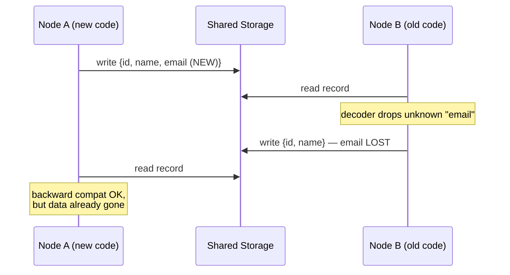

# Backward & Forward Compatibility for Rolling Upgrades

> **One-sentence summary.** During rolling upgrades old and new code coexist with old and new data, so encodings must support both backward compatibility (new code reads old data) *and* forward compatibility (old code reads new data) at the same time.

## How It Works

Applications change, and changes to features usually demand changes to stored data. But code updates are never instantaneous. Server fleets use *rolling upgrades* (staged rollouts): new binaries land on a few nodes at a time while the rest keep running the old version. Mobile and desktop clients are even worse — users may skip updates for weeks. The unavoidable consequence is that old and new versions of the code, and old and new data formats, coexist in the same system at the same time.

To survive that coexistence, data encodings must be compatible in both directions. **Backward compatibility** means newer code can read data written by older code — this is usually easy, because the new author knows the old shape and can handle it explicitly. **Forward compatibility** means older code can read data written by newer code — this is harder, because the old code has to *gracefully ignore* additions it was never taught about. The canonical hazard is Figure 5-1 in the chapter: new code writes a record with a new field, old code reads it, updates an unrelated field, and writes it back — silently dropping the field it did not recognize. Unless the decoder explicitly preserves unknown fields on round-trip, data is lost.

RPC introduces an asymmetry worth remembering. For an **old client calling a new server**, the request needs backward compatibility (new server reads old request) and the response needs forward compatibility (old client tolerates new response fields). For a **new client calling an old server**, the polarity flips. Both directions must hold during any rolling window.

## When to Use

- **Server-side rolling deploys.** Any zero-downtime deployment strategy (Kubernetes rolling updates, blue/green, canary) runs mixed versions for minutes to hours; every payload format crossing that boundary — stored rows, queue messages, RPC envelopes — must be evolvable.
- **Long-lived storage.** Data written years ago by retired code will still be read by tomorrow's code. See [[05-dataflow-through-databases]] for how databases become the hardest compatibility surface.
- **Client apps you do not control.** Mobile, desktop, browser extensions, embedded devices. You will never get everyone to upgrade, so the server must speak to old clients forever, and old clients must tolerate new server responses.

## Trade-offs

| Aspect | Advantage | Disadvantage |
|--------|-----------|--------------|
| Tolerate unknowns vs reject them | Preserves forward compatibility, enables independent deploys | Bugs in new fields go undetected longer; harder to enforce invariants |
| Code complexity vs evolvability | Two-way compatibility lets teams ship independently | Every decoder must preserve-and-pass-through unknown fields, adding code paths and tests |
| Frequent small releases vs rare big releases | Small rolling releases reduce blast radius and encourage safer schema changes | Each release widens the compatibility matrix you must maintain |
| Prevention (strict schemas) vs tolerance (permissive parsing) | Strict schemas catch errors early | Strict rejection breaks mixed-version fleets; tolerance is what actually keeps the site up |

## Real-World Examples

- **Kubernetes rolling deployments.** The default `RollingUpdate` strategy replaces pods gradually; during the window, old and new pods serve traffic from the same load balancer and talk to the same databases — exactly the coexistence model this pattern addresses.
- **Mobile apps.** Users ignore update prompts. An iOS app from two years ago still hits the same API. Servers must accept old request shapes (backward) and old clients must ignore new response fields (forward).
- **Kafka + Confluent Schema Registry.** Avro/Protobuf schemas are registered with compatibility modes (`BACKWARD`, `FORWARD`, `FULL`) so producers and consumers can evolve independently while the registry rejects breaking changes (see [[03-protocol-buffers-field-tags-and-schema-evolution]] and [[04-avro-writer-and-reader-schemas]]).
- **Database rolling migrations.** The "expand/contract" pattern — add new column, dual-write, backfill, switch reads, drop old column — is a deliberate sequence that never forces a single moment where old code meets data it cannot read.

## Common Pitfalls

- **Losing unknown fields on round-trip.** If your object model materialises records into typed structs that silently discard fields they don't know, any old-code write-path will corrupt new-code data. Use encodings and ORMs that preserve unknown fields, or store writes through code that re-fetches only the fields it owns.
- **Breaking changes in RPC responses.** Developers remember to keep request schemas backward compatible but add required fields or re-type existing ones on the response side. Old clients crash. Response evolution is forward-compat and must be as disciplined as request evolution.
- **Forgetting client-side versions exist.** Server teams assume "we rolled out last Tuesday" means everyone is on the new version. Unpatched mobile builds, cached web bundles, and third-party integrations say otherwise. Plan for multi-year client tails.
- **Removing fields without a deprecation period.** Deleting a field the same release you stop writing it guarantees the old readers mid-rollout will produce nulls or errors. Deprecate, wait a full release cycle (or longer for clients), then remove.
- **Assuming JSON is "schemaless enough" to skip this.** Additive JSON changes are forward-compatible by convention, but renaming, retyping, or removing a key breaks old consumers just as hard as a binary schema change. See [[02-textual-encodings-and-json-schema]].

## See Also

- [[02-textual-encodings-and-json-schema]] — how JSON/XML handle (or fail to handle) evolution
- [[03-protocol-buffers-field-tags-and-schema-evolution]] — field tags as the mechanism that makes both compatibility directions cheap
- [[04-avro-writer-and-reader-schemas]] — writer/reader split that formalises this pattern
- [[05-dataflow-through-databases]] — why stored data is the longest-lived compatibility surface
