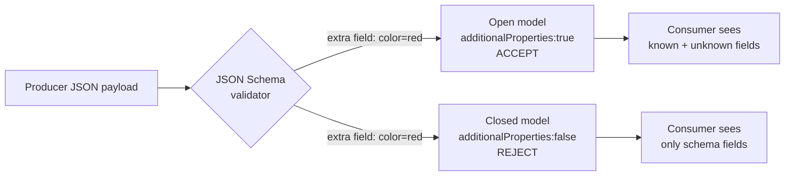

# Textual Encodings: JSON, XML, CSV, and JSON Schema

> **One-sentence summary.** Human-readable textual encodings are universally supported but ambiguous about types and binary data, while language-specific formats like `pickle` are insecure, and validators like JSON Schema are powerful but hard to evolve.

## How It Works

Encoding is the act of turning in-memory objects into bytes that can cross a process boundary. The spectrum starts at **language-specific formats** (Java's `Serializable`, Python's `pickle`, Ruby's `Marshal`) that dump object graphs directly from memory. These are trivially convenient but carry serious baggage: they lock you to one runtime, make schema evolution an afterthought, and allow a deserializer to instantiate arbitrary classes — which is how a byte blob turns into remote code execution. Moving up the stack, **textual encodings** (JSON, XML, CSV) are language-independent and widely readable, but they are famously vague about datatypes. JSON distinguishes strings from numbers but not integers from floats, XML and CSV conflate digit-strings with numbers, and none support binary blobs without Base64 smuggling (a 33% size tax). For anything stricter, a schema layer like **JSON Schema** or **XML Schema** sits on top, validating payloads and supplying the type information the wire format lost.

JSON Schema adopts an **open content model by default** (`additionalProperties: true`): unknown fields are allowed through, which is great for rolling upgrades but means the schema describes what is *not* permitted rather than what is. Setting `additionalProperties: false` flips it to a **closed content model** — stricter, but rejects anything new a producer might add.



A small but famous JSON Schema (Example 5-1 in the chapter) uses `patternProperties` to simulate an integer-keyed map — something JSON itself cannot express, since object keys are always strings:

```json
{
  "$schema": "http://json-schema.org/draft-07/schema#",
  "type": "object",
  "patternProperties": {
    "^[0-9]+$": { "type": "string" }
  },
  "additionalProperties": false
}
```

## When to Use

- **Cross-organization interchange**: REST APIs, webhooks, public data dumps. "Good enough" beats "elegant" when the bottleneck is getting two orgs to agree on anything.
- **Human-facing pipelines**: config files, debugging, ad-hoc exploration. Being able to `cat` a file and read it is worth real runtime overhead.
- **Schema-validated APIs**: OpenAPI-described services, Kafka topics with JSON Schema in a registry, or databases that validate documents on write.
- **Avoid language-specific formats** for anything persisted beyond a single process-lifetime or sent across a trust boundary.

## Trade-offs

| Aspect | Advantage | Disadvantage |
|--------|-----------|--------------|
| Textual (JSON/XML/CSV) | Human-readable, language-independent, universally supported | Verbose, ambiguous numbers, no binary type, parse cost |
| Binary (Protobuf/Avro) | Compact, fast, strong typing | Opaque without tooling, schema required to decode |
| Open content model | Permissive, forward-compatible with new fields | Validator allows typos and accidental garbage |
| Closed content model | Catches unknown fields early, stricter contracts | Breaks rolling upgrades when producers add fields |
| With schema (JSON/XML Schema) | Disambiguates types, enables validators and codegen | Complex spec; hard to evolve forward/backward compatibly |
| Schemaless (raw JSON/CSV) | Zero ceremony, easy to start | Every consumer hardcodes its own encoding assumptions |
| Language-specific (pickle) | Zero-config round-trip of native objects | RCE on untrusted input, language lock-in, poor versioning |

## Real-World Examples

- **OpenAPI / Swagger**: describes REST endpoints using JSON Schema fragments for request and response bodies.
- **Kafka Schema Registry (Confluent, Apicurio)**: stores JSON Schema alongside Avro and Protobuf, enabling topic-level compatibility checks.
- **PostgreSQL `pg_jsonschema`** and **MongoDB `$jsonSchema`**: validate documents at write time so a misbehaving client cannot poison the collection.
- **X (Twitter) post IDs**: 64-bit snowflake IDs exceed 2^53, so the API returns each ID *twice* — once as a JSON number and once as a decimal string — because JavaScript's floating-point parser silently corrupts the numeric form.
- **SOAP and legacy enterprise systems**: XML Schema (XSD) remains in heavy use for contract-first service definitions.

## Common Pitfalls

- **Integers greater than 2^53 in JavaScript**: they become inexact IEEE 754 doubles. Always serialize 64-bit IDs, timestamps, and bigints as strings on the wire.
- **Base64 bloat**: embedding images or signatures as Base64 in JSON inflates payloads by ~33% and hides them from compression heuristics. Prefer a binary format or a side-channel URL.
- **CSV escaping chaos**: RFC 4180 exists but many parsers ignore it. A single unescaped comma or newline in a free-text field silently shifts every column downstream.
- **Hardcoding encoding logic**: without a schema, every consumer independently guesses whether `"42"` is a string or a number, whether a field is optional, and whether a date is ISO-8601 or epoch millis. Drift is inevitable.
- **`pickle` / `Serializable` on untrusted input**: deserializing an attacker-controlled blob can execute arbitrary code. Treat these formats as a same-process cache only.
- **Evolving JSON Schema**: `additionalProperties: false` combined with `required` makes every optional new field a breaking change; conditional `if/else` rules and `$ref` chains to remote schemas make compatibility analysis genuinely hard.

## See Also

- [[01-backward-forward-compatibility-and-rolling-upgrades]] — why "accept unknown fields" matters during deploys
- [[03-protocol-buffers-field-tags-and-schema-evolution]] — a compact binary alternative with simpler, tag-based evolution
- [[04-avro-writer-and-reader-schemas]] — schema-resolution model that sidesteps JSON Schema's evolution pain
