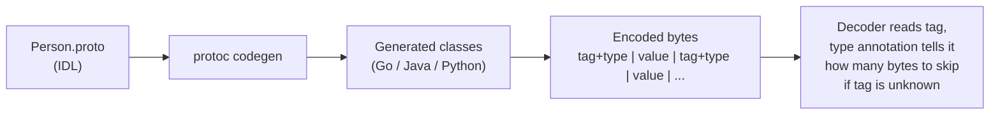

# Protocol Buffers: Field Tags and Schema Evolution

> **One-sentence summary.** Protocol Buffers encode records as concatenated `(tag, type, value)` triples; the tag number — not the field name — is the contract, enabling compact encoding and clear rules for adding, removing, and renaming fields without breaking old or new readers.

## How It Works

Protocol Buffers (protobuf) is a schema-driven binary encoding developed at Google. You describe your record once in an Interface Definition Language (IDL) file, then a code generator emits encode/decode classes for your target language. The schema is the single source of truth: at runtime the wire bytes carry no field names, only compact numeric *tag* identifiers that the schema maps back to named fields.

```proto
syntax = "proto3";
message Person {
  string user_name = 1;
  int64  favorite_number = 2;
  repeated string interests = 3;
}
```

The encoded record is simply the concatenation of its non-empty fields. Each field on the wire is a `(tag, type, value)` triple. Protobuf cleverly packs the field type and tag number into a *single byte* for small tags, then uses variable-length integers for values — the number `1337`, for example, fits in two bytes (numbers from -64..63 take one byte, -8192..8191 take two, and so on). There is no explicit list datatype; the `repeated` modifier just means the same field tag may appear multiple times within a record.



Because the wire format refers to fields only by tag, schema evolution rules fall out naturally. Old readers seeing a tag they do not recognise use the type annotation to determine the field's length and *skip* it, preserving **forward compatibility**. New readers seeing old data find the new field absent and substitute a default value (empty string, `0`, etc.), preserving **backward compatibility**. Renaming a field in the IDL is free — the wire never mentioned the name — but changing a tag is catastrophic, because every previously written byte stream suddenly means something else.

## When to Use

- **Cross-service RPC with polyglot clients.** A Java service and a Go service need a shared, versioned contract that survives independent deploys — protobuf over gRPC is the canonical fit.
- **High-volume persistent messages.** Event streams on Kafka or records stored in a columnar sink benefit from protobuf's compactness (33 bytes vs. 81 for the equivalent JSON in the canonical DDIA example) and from enforced schemas.
- **Long-lived storage where the schema will drift.** If you will add fields for years but cannot coordinate a flag-day upgrade across producers and consumers, protobuf's tag-based rules make rolling upgrades safe (see [[01-backward-forward-compatibility-and-rolling-upgrades]]).

## Trade-offs

| Operation | Compatibility outcome |
|---|---|
| **Add field** (new tag, with default) | Safe both ways — old readers skip, new readers read old data with default filled in. |
| **Remove field** | Safe if you *reserve* the tag number so it cannot be recycled. Old writers' data remains parseable (new readers ignore it). |
| **Rename field** (same tag) | Free — wire format never carried the name. |
| **Change tag number** | Catastrophic — all existing encoded data silently misinterprets that field. |
| **Widen type** (e.g. int32 → int64) | New→old truncates high bits; old→new works because missing bits fill with zero. |
| **Reuse an old tag** for a new field | Silent data corruption — old payloads will be decoded with the new type annotation. |

## Real-World Examples

- **gRPC**: Google's open-source RPC framework uses protobuf over HTTP/2 by default — service methods and messages are both defined in `.proto` files and codegen produces both client stubs and server skeletons (see [[06-rest-rpc-and-service-discovery]]).
- **Google's internal systems**: Protobuf originated at Google and remains the lingua franca across BigTable, Spanner, and almost all internal RPC; the format was designed for exactly the rolling-upgrade discipline a fleet-scale operation demands.
- **Kafka topics with protobuf messages**: Teams pair a Confluent Schema Registry with protobuf schemas so producers and consumers can evolve independently, each checking tag-level compatibility on publish.
- **Apache Thrift**: Facebook's near-sibling design predates protobuf's open-source release and shares the tag-number-plus-type-annotation idea almost identically.
- **ASN.1 (1984)**: The same field-tag-plus-type-length-value discipline was standardised decades earlier for telecoms and cryptography; protobuf is a modern repackaging of ideas that are older than most working programmers.

## Common Pitfalls

- **Reusing an old tag number for a different field.** Historic payloads still encode the old field at that tag; the new schema will happily decode those bytes as the new type, producing garbage data with no error. Always `reserved 7;` (or whatever tag) in the IDL when retiring a field.
- **Adding a required field without a default.** In proto2's `required` semantics, old data lacking the field cannot be parsed by new code — an otherwise safe additive change becomes a breaking one. Proto3 dropped `required` for this reason; add fields as optional with sensible defaults.
- **Changing `int32` to `int64` unidirectionally.** New writers can emit values that overflow the old readers' 32-bit variable; the decode truncates silently. Widen types only when you have retired all 32-bit readers.
- **Treating field names as the contract.** New team members sometimes assume renaming a field is dangerous and changing a tag is cosmetic — it is exactly the opposite. The tag is the contract; the name is a label for humans.
- **Forgetting that unknown fields must round-trip.** If a service reads, mutates, and re-writes a record while dropping unknown fields, a new field added downstream will be erased as data flows through old middleware. Preserve unknown fields explicitly.

## See Also

- [[01-backward-forward-compatibility-and-rolling-upgrades]] — why these evolution rules matter in production deploys.
- [[04-avro-writer-and-reader-schemas]] — the contrasting approach that drops tag numbers in favour of paired writer/reader schemas.
- [[06-rest-rpc-and-service-discovery]] — how protobuf underpins gRPC as the dominant binary RPC stack.
