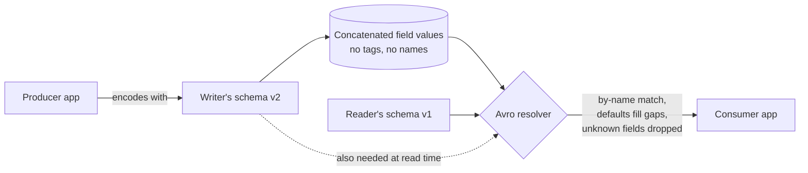

# Avro: Writer's and Reader's Schemas

> **One-sentence summary.** Avro omits field tags and instead records a writer's schema at encode time and a reader's schema at decode time, resolving differences by field name — making it ideal for dynamically generated schemas where Protocol Buffers' manual tag assignment is impractical.

## How It Works

Apache Avro is a binary encoding that, unlike Protocol Buffers, embeds **no tag numbers** and **no field identifiers** in the wire format. An encoded record is just the concatenation of its field values in schema order — a string is a length prefix plus UTF-8 bytes, an integer is varint-encoded, and nothing in the bytes tells you which is which. For the example record, Avro produces only 32 bytes, the most compact encoding in the chapter.

Because the bytes carry no self-description, you cannot decode them without the exact schema that was used to write them. Avro's trick is to treat encoding and decoding asymmetrically: the **writer's schema** is whatever version the producer used, and the **reader's schema** is whatever version the consumer expects. At read time, Avro's resolution algorithm walks both schemas side by side and translates:

- Fields are matched **by name**, so the order in each schema can differ.
- A field in the writer's schema that the reader doesn't know about is **ignored**.
- A field the reader expects but the writer didn't produce is **filled in from the reader's default**.



The Avro JSON schema for our running `Person` record looks like this:

```json
{"type":"record","name":"Person","fields":[
  {"name":"userName","type":"string"},
  {"name":"favoriteNumber","type":["null","long"],"default":null},
  {"name":"interests","type":{"type":"array","items":"string"}}
]}
```

Since bytes contain no tags, evolution rules are phrased around **defaults**. You may add or remove a field only if it has a default value. Adding such a field is backward-compatible (new readers supply the default when reading old data) and forward-compatible (old readers just ignore it). Nullability is explicit: to permit `null`, use a union like `union { null, long }`, and you can only use `null` as the default when `null` is the **first branch** of the union. Renaming a field is possible but only **backward-compatible** — the reader's schema declares `aliases` so it can match an old writer field name; old readers have no such alias for a new writer's renamed field.

Since the reader must have the writer's schema, Avro defines three ways to ship it:

1. **Object container files.** Embed the schema once in a file header, then pack millions of records underneath — the header cost amortizes to zero.
2. **Per-record version number + schema registry.** Each record carries a small version ID; readers look up the matching writer's schema in a registry. Confluent Schema Registry for Kafka and LinkedIn's Espresso work this way.
3. **Network handshake.** Two RPC peers negotiate a schema version at connection setup and reuse it for the lifetime of the connection — the approach of the Avro RPC protocol.

## When to Use

- **Dumping a relational database to a binary archive.** Generate an Avro record per table and a field per column; no human ever has to assign tag numbers. When the DB schema changes, regenerate and re-export — readers with an old schema still decode by name.
- **Analytics on Hadoop/data lake workloads.** Millions of homogeneous records per file make the object-container format essentially free, while the tight binary encoding shrinks storage and shuffle costs.
- **Kafka pipelines with many evolving producers.** A central schema registry plus per-record version IDs lets producers and consumers evolve independently as long as compatibility rules are respected.

## Trade-offs

| Aspect | Avro | Protocol Buffers |
|---|---|---|
| Field identity | By **name** (schema-resolved) | By **tag number** (in wire format) |
| Tag management | None — no tags to assign | Manual; every field needs a stable tag |
| Encoding size | Tightest (32 bytes for the sample record) | Slightly larger due to tag bytes |
| Dynamic schemas | Excellent (generate from DB schema) | Awkward (auto-assigning tags is error-prone) |
| Self-description | None — reader must obtain writer's schema | Partial — tag + type annotation on the wire |
| Field reordering in source | Free (match by name) | Free (match by tag) |
| Renaming a field | Backward-compatible via reader `aliases` | Free — names aren't on the wire anyway |
| What's required at read | **Both** writer's and reader's schemas | Only the reader's `.proto` |

## Real-World Examples

- **Hadoop** — Avro's original home; object container files sit on HDFS and survive years of schema churn.
- **Apache Kafka + Confluent Schema Registry** — producers write a 4-byte schema ID; consumers fetch the matching writer's schema on demand.
- **LinkedIn Espresso** — uses per-record version numbers backed by a schema store, the same pattern as Confluent's registry.
- **Avro object container files** — the canonical "big file, one schema in the header, millions of records" layout.
- **Relational-to-lake archival exports** — nightly jobs that rebuild the Avro schema from the live DB and emit a fresh data file, without any manual mapping step.

## Common Pitfalls

- **Adding a new field with no default.** Breaks backward compatibility: new readers can't supply a value when reading old data.
- **Forgetting that nullable means union.** In Avro `null` is a type, not a universal default; you must declare `union { null, long }` and only then can the field be absent.
- **Putting `null` as the default on a non-first union branch.** Avro requires `null` to be the *first* type in the union for `"default": null` to be legal — a silent spec-compliance trap.
- **Renaming a field without an alias.** Old writers produce the old name; the new reader must list it under `aliases` or resolution fails.
- **Losing the writer's schema.** Without it, the bytes are undecodable — there are no tags or field names to fall back on. Always version and persist schemas (a registry, a file header, or a handshake).
- **Assuming `aliases` are bidirectional.** They make renames backward-compatible only; old readers encountering the new name have nothing to match against.

## See Also

- [[03-protocol-buffers-field-tags-and-schema-evolution]] — the contrasting approach that puts tag numbers in the wire format.
- [[05-dataflow-through-databases]] — where writer/reader schema skew naturally appears across long-lived stored data.
- [[07-async-dataflow-brokers-actors-durable-execution]] — how message brokers like Kafka rely on schema registries to let producers and consumers evolve independently.
