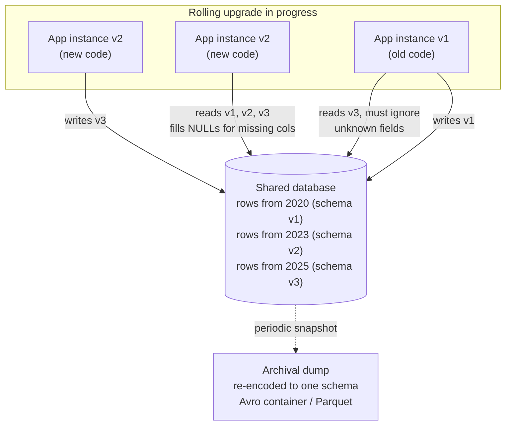

# Dataflow Through Databases: Data Outlives Code

> **One-sentence summary.** When a database is the medium of dataflow, the reader may be a future version of the writer, so records written years ago in old schemas must still decode cleanly today — and new code must tolerate records written by old code, too.

## How It Works

In any database, the writing process encodes data and the reading process decodes it. If only one process ever touches the database, the reader is just a later incarnation of the writer — storing a row is effectively "sending a message to your future self." That future self must be able to decode the past, which is why **backward compatibility** is the minimum bar.

The real world is messier. Multiple services — or multiple instances of the same service mid-rolling-upgrade — hit the same database concurrently. Some instances run new code, others still run old code. A row written by a newer instance may be read seconds later by an older one, so **forward compatibility** is required as well: old code must gracefully ignore fields it doesn't understand and round-trip them back intact.

Most importantly, **data outlives code**. You can redeploy your app in minutes; you cannot redeploy every row. A record written five years ago still sits on disk in its original encoding unless something has explicitly rewritten it. Rewriting (migrating) terabytes is expensive, so databases defer it: LSM-tree engines rewrite during compaction, and relational engines treat `ADD COLUMN ... DEFAULT NULL` as a pure metadata change, synthesizing nulls at read time. More intrusive changes — splitting a single-valued field into multiple values, or moving data between tables — still require an application-level rewrite.

## When to Use

- **Any long-lived OLTP system** where schema evolves and you can't afford to rewrite history on every deploy — assume schemas will coexist and design accordingly.
- **Rolling upgrades** of stateless services against a shared database: forward compatibility is not optional, it's a correctness requirement during the minutes (or hours) when mixed versions run together.
- **Archival snapshots and data lake exports**: since you're copying everything anyway, this is your one chance to normalize mixed historical encodings into a single latest schema.

## Trade-offs

| Approach | Advantage | Disadvantage |
|----------|-----------|--------------|
| In-place evolution (additive changes + default nulls) | Cheap, no downtime, old and new records coexist, unknown fields preserved on round-trip | Multiple schema versions live on disk; complex changes still need rewrites; easy to lose track of which version wrote what |
| Full online migration (rewrite every row) | Simplifies reads afterward, enables cleanup and consolidation, removes dead columns | Expensive, risky, requires dual-writes and backfill jobs, usually custom app-level code |
| Archival re-encoding (dump + rewrite to one schema) | One-shot consistency; enables column-oriented analytics formats; immutable files are easy to reason about | Doesn't fix the live database; snapshot drifts from source; storage duplication |

## Real-World Examples

- **PostgreSQL `ALTER TABLE ADD COLUMN ... DEFAULT NULL`** — a metadata-only operation since Postgres 11 for nullable defaults; existing rows are never touched, and nulls are synthesized at read time.
- **LSM-tree compaction (RocksDB, Cassandra, ScyllaDB)** — storage engines opportunistically rewrite data into the latest SSTable format during background compaction, so migration happens for free alongside normal write amplification.
- **Stripe's online migration pattern** — dual-write new schema, backfill historical rows in chunks, flip reads, then drop the old column; this is the canonical playbook for complex migrations that metadata tricks can't cover.
- **Parquet in data lakes (S3, GCS)** — analytics teams export OLTP snapshots into column-oriented Parquet files with a single unified schema, enabling efficient scans in Spark, Presto, DuckDB, and BigQuery.
- **Avro object container files** — used for backup dumps and Kafka Connect sinks: each file embeds its writer schema once in the header, so the entire file decodes unambiguously even years later.

## Common Pitfalls

- **Model objects that drop unknown fields**: if your ORM or hand-rolled mapper doesn't preserve fields it doesn't recognize, an old-code read-modify-write cycle will silently delete data written by new code. Round-trip preservation is the whole ballgame.
- **Assuming `ALTER TABLE` rewrites rows**: most modern engines don't — which is great for speed, but means you can't rely on the DDL to "normalize" existing data. Old rows keep their old encoding until something else rewrites them.
- **Forgetting the default for old rows**: adding a non-nullable column without a default breaks reads of historical records. Always think about what the encoded bytes from 2019 will look like under the 2025 schema.
- **Treating multi-valued or restructuring changes as free**: splitting an `address` string into `street`/`city`/`zip` needs a real backfill, not just a schema edit. The database won't do it for you.
- **Losing the writer-schema trail**: if you use Avro or Protobuf and throw away which schema version wrote each record, forward/backward compatibility collapses. Keep a schema registry or embed the writer schema in the container.

## See Also

- [[01-backward-forward-compatibility-and-rolling-upgrades]] — the compatibility discipline that databases force you to adopt whether you want to or not
- [[04-avro-writer-and-reader-schemas]] — the mechanism that makes archival dumps (and long-lived rows) decodable decades later
- [[06-rest-rpc-and-service-discovery]] — the other major dataflow mode, where both sides are active processes rather than one side being stored bytes
