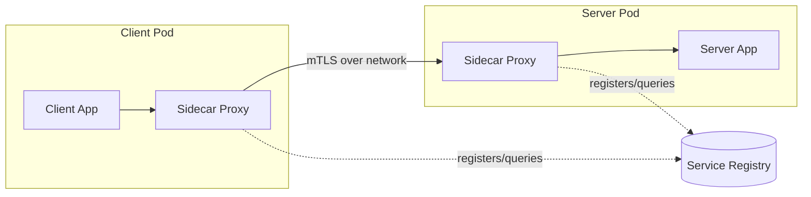

# REST, RPC, and Service Discovery

> **One-sentence summary.** Services expose an application-specific API over the network — REST and RPC are two styles for shaping those calls, but neither hides the fact that the network is unpredictable and clients must somehow locate servers.

## How It Works

A **service** is a server process that exposes an API (not arbitrary queries like a database) and accepts client requests over the network. When HTTP is the transport, the service is called a **web service** — used by browsers, mobile apps, backend-to-backend calls inside a private network, and cross-organization public APIs (Stripe, OAuth, credit card processors).

Two dominant design philosophies exist. **REST** is resource-oriented: URLs identify resources, HTTP verbs (`GET`/`POST`/`PUT`/`DELETE`) express operations, and the style leans on HTTP features — content negotiation, caching, authentication. Its IDL is typically **OpenAPI** (Swagger), with JSON/YAML specs. **RPC** models a remote call as a local function call (`location transparency`), using IDLs like **Protocol Buffers** with **gRPC**. Service frameworks — FastAPI, Spring Boot, gRPC — handle routing, metrics, auth, and codegen so developers write only business logic.

Before a client can call anything, it must find a server. In production there are many server instances (for availability and scale), so clients talk to a **load balancer** or a **service discovery** layer. The most advanced form is a **service mesh**, where sidecar proxies next to every app handle discovery, TLS, retries, and observability.

## When to Use

- **REST + OpenAPI**: external APIs, cross-team or cross-organization services, cases where HTTP caching and browser-native clients matter (public APIs, SaaS platforms, mobile backends).
- **gRPC + Protobuf**: high-throughput internal microservices where schema evolution, compact binary framing, and polyglot codegen are more valuable than browser friendliness.
- **Service mesh**: Kubernetes-scale deployments where service instances churn constantly and you want mTLS + observability without baking it into every app.

## Trade-offs

### REST vs RPC

| Aspect | REST | RPC (gRPC) |
|--------|------|------------|
| Model | Resources + HTTP verbs | Functions / methods |
| Wire format | JSON over HTTP/1.1 or HTTP/2 | Protobuf over HTTP/2 |
| IDL | OpenAPI (often generated from code) | `.proto` (drives codegen) |
| Caching / auth | Uses HTTP machinery directly | Must reinvent |
| Browser friendly | Yes | No (needs gRPC-Web proxy) |
| Best for | External + cross-org APIs | Internal high-volume microservices |

### RPC vs a local function call

| Dimension | Local call | RPC |
|-----------|-----------|-----|
| Predictability | Deterministic | Network-dependent |
| Failure modes | Return / throw / loop | Also: **timeout with unknown outcome** |
| Retries | Not needed | Needed, but require **idempotence** |
| Latency | Fixed, ~ns–µs | Variable: ms to multi-second |
| Arguments | Pointers to memory | Must be encoded to bytes |
| Types | Single language | Cross-language translation (lossy) |

### Service discovery options

| Option | Dynamism | Rich metadata | TLS handling | Observability |
|--------|---------|--------------|--------------|---------------|
| Hardware LB | Low | No | Terminates at LB | Basic counters |
| Software LB (NGINX, HAProxy) | Medium | Limited | Terminates at LB | Logs + metrics |
| DNS | Low (TTL caching lags) | No | App-handled | None |
| Registry (etcd, ZooKeeper) | High (heartbeats) | Yes (shard, DC, version) | App-handled | Registry views |
| Service mesh (Istio, Linkerd) | Very high | Yes | Automatic mTLS between sidecars | Full traces + traffic maps |

## Real-World Examples

- **Google-style internal services**: gRPC + Protobuf for tight schema evolution across thousands of services in many languages.
- **Stripe API**: REST + JSON with a **date-based API versioning** scheme — old clients keep working for years; new clients opt into newer versions via an `Stripe-Version` header.
- **Public SaaS platforms**: OpenAPI-first design so external integrators get auto-generated SDKs and docs.
- **Kubernetes + Istio**: sidecar service mesh where every pod gets an Envoy proxy managing discovery, retries, mTLS, and tracing.
- **Simpler startups**: NGINX or HAProxy in front of a handful of app servers — boring, cheap, sufficient.

## Common Pitfalls

- **Treating RPC as a local call**: a timeout does *not* mean the request failed. Blindly retrying a non-idempotent call (`ChargeCard`) produces duplicate charges. Design idempotency keys into the protocol — see [[07-async-dataflow-brokers-actors-durable-execution]].
- **Relying on DNS for dynamic fleets**: TTLs and resolver caches mean clients hit dead IPs after a redeploy. Use a real registry or mesh for high-churn environments.
- **Forgetting forward compatibility on responses**: adding a new required field to a response breaks old clients that cannot ignore unknown fields. Because **servers typically deploy before clients**, responses need forward compatibility while requests need backward compatibility — the compat rules of the underlying encoding (see [[03-protocol-buffers-field-tags-and-schema-evolution]]) decide what is safe.
- **Tight coupling via shared types**: importing the server's domain objects into the client turns every model change into a coordinated redeploy — defeating the microservices goal of independent evolution.
- **Inconsistent API versioning**: URL path (`/v2/...`), `Accept` header, per-client stored versions, or query params — pick one strategy and stick to it. Mixing them makes deprecation a nightmare, especially across organizational boundaries where you cannot force clients to upgrade and may maintain old versions indefinitely.

## See Also

- [[01-backward-forward-compatibility-and-rolling-upgrades]] — the compatibility directions RPC inherits from its encoding
- [[03-protocol-buffers-field-tags-and-schema-evolution]] — how gRPC safely evolves request/response schemas via field tags
- [[07-async-dataflow-brokers-actors-durable-execution]] — message brokers and durable workflows as alternatives when synchronous RPC is too fragile
