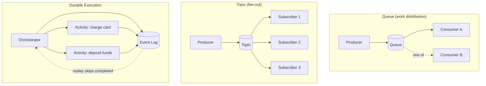

# Asynchronous Dataflow: Message Brokers, Actors, and Durable Execution

> **One-sentence summary.** When a sender doesn't wait for the receiver, dataflow moves through message brokers, distributed actor frameworks, or durable-execution engines — each trading coupling and failure semantics differently.

## How It Works

In synchronous RPC the caller blocks until the callee responds. Async dataflow breaks that coupling: the sender hands a message to an intermediary and moves on. That intermediary takes three common shapes.

**Message brokers** (queues and topics) store messages temporarily between producer and consumer. They buffer bursts when a consumer is slow, redeliver to a new instance if a consumer crashes, fan out the same message to many subscribers, and remove the need for service discovery — the producer never needs the consumer's IP. Two delivery patterns dominate: a *queue* delivers each message to exactly one of its competing consumers (work distribution), and a *topic* broadcasts each message to all subscribers (pub/sub). Brokers don't enforce a data model — a message is just bytes — so teams deploy a **schema registry** (Protobuf, Avro, or JSON Schema) alongside the broker to store and compatibility-check schema versions. **AsyncAPI** plays the role OpenAPI plays for REST. Durability varies: many brokers delete messages after acknowledgment, but some can be configured to retain them indefinitely for event sourcing.

**Distributed actor frameworks** (Akka, Orleans, Erlang/OTP) fuse a broker and a programming model. Each actor owns private state and communicates only via asynchronous messages. Location transparency works here — actors on the same node and across the network use the same send primitive — because the actor model already treats message loss as normal, so the local and remote cases aren't fundamentally different.

**Durable execution engines** (Temporal, Restate) model a workflow as a graph of *tasks* (also called activities or durable functions). An *orchestrator* schedules steps; *executors* run them. To deliver exactly-once semantics, the engine logs every RPC and state change to durable storage. On crash, it replays the workflow code — but instead of re-invoking already-completed activities, it returns the logged result. Replay requires **deterministic code**: no `random`, no `time.now()`; use the framework's deterministic substitutes.



A Temporal-style workflow sketch:

```text
@workflow.defn
class PaymentWorkflow:
    async def run(self, payment):
        if await execute_activity(check_fraud, payment, timeout=15s):
            return Fraudulent
        charge = await execute_activity(
            debit_card, payment,
            idempotency_key=payment.id,   # MUST be stable across retries
            timeout=15s,
        )
        await execute_activity(deposit_funds, charge, timeout=15s)
        return Success
```

If the worker crashes between `debit_card` and `deposit_funds`, replay re-enters `run`, sees the logged fraud-check and charge results, and jumps straight to `deposit_funds` — the card is not charged twice.

## When to Use

- **Message broker**: producer and consumer evolve independently, traffic is bursty, or you need fan-out (analytics, notifications, cache invalidation).
- **Actor framework**: stateful per-entity concurrency (per-user session, per-device controller, per-game-room) where message loss is acceptable and you want the same code local and distributed.
- **Durable execution**: multi-step business workflows that cross service boundaries and must complete exactly once (payments, order fulfillment, provisioning) where a database transaction can't span all the hops.

## Trade-offs

| Style | Delivery semantics | Coupling | Failure handling | Idempotence required? | Replay cost |
|---|---|---|---|---|---|
| Synchronous RPC | At-most-once (caller retries) | Tight (needs discovery, both live) | Caller handles | Yes, on retry | N/A |
| Message broker | At-least-once typical | Logical decoupling via topic name | Broker redelivers on crash | Yes, consumers see duplicates | None (replay = redeliver) |
| Distributed actors | Best-effort, may drop | Name-based, location-transparent | App-level supervision trees | Application's responsibility | None |
| Durable execution | Exactly-once workflow | Orchestrator owns graph | Engine replays from log | Yes, for external RPCs | Re-runs code deterministically |

## Real-World Examples

- **Apache Kafka**: topic-centric broker with a companion Schema Registry; dominant for event streams and event sourcing.
- **RabbitMQ**: classic queue broker with rich routing (exchanges, bindings).
- **NATS**: lightweight pub/sub and request/reply for microservices.
- **Akka / Orleans / Erlang OTP**: distributed actors powering telecoms, games, and chat backends.
- **Temporal / Restate**: durable execution behind payment and provisioning flows (Stripe-style multi-step charges).
- **Airflow / Dagster / Prefect**: workflow engines for ETL orchestration.
- **Camunda / Orkes**: BPMN-based workflows for business-analyst-authored processes.

## Common Pitfalls

- **No idempotency key on external RPCs inside a workflow**: a retried activity double-charges the card. The framework protects its own log, not the third-party gateway.
- **Nondeterministic workflow code**: calling `random.random()`, `datetime.now()`, or iterating an unordered set means replay produces a different branch than the original — the log and the code disagree and the workflow wedges.
- **Editing workflow code in place**: in-flight workflows mid-replay crash on the new code path. Deploy a new version side by side and let old invocations finish on the old version (see [[01-backward-forward-compatibility-and-rolling-upgrades]]).
- **Republishing messages without preserving unknown fields**: a consumer that decodes, re-encodes, and re-publishes will silently drop fields the original producer added — the same forward-compatibility trap as the database round-trip problem.
- **Assuming queue == topic**: wiring three consumers to a queue gives you load-balanced work; wiring them to a topic gives you three copies of every message. Quite different bills.
- **Forgetting actors can lose messages even locally**: the actor model never promised in-process reliability; supervision and timeouts aren't optional.

## See Also

- [[06-rest-rpc-and-service-discovery]] — the synchronous counterpart; async dataflow is what you reach for when RPC's tight coupling hurts.
- [[04-avro-writer-and-reader-schemas]] — the schema-registry pattern that makes broker payloads evolvable.
- [[01-backward-forward-compatibility-and-rolling-upgrades]] — why workflow versioning and message schema evolution matter during rollouts.
