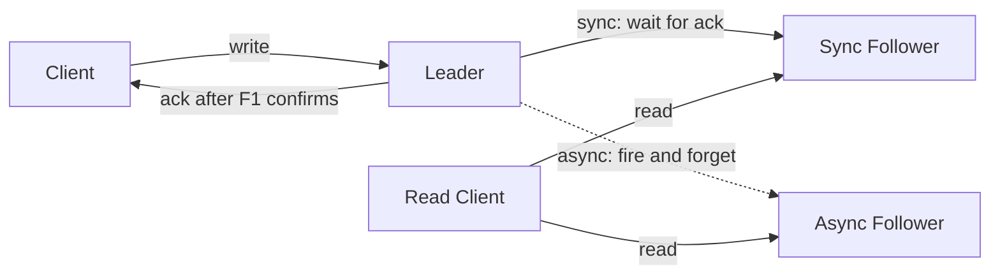

# Single-Leader Replication and Replication Logs

> **One-sentence summary.** One replica is designated the leader and accepts every write, then streams an ordered log of changes to followers that replay it; the log's format and how synchronously it is acknowledged determine the system's durability, failover behavior, and operational flexibility.

## How It Works

In **leader-based replication** (a.k.a. primary-backup or active/passive), one replica is the **leader** and every write goes to it. The leader writes to local storage and appends the change to a **replication log**. Each **follower** pulls this log and applies the changes **in the same order**. Clients may read from any replica, but writes land only on the leader. In a sharded database, each shard has its own leader.

The leader's acknowledgment policy decides what "committed" means. In **synchronous replication**, the leader blocks on a follower's confirmation before reporting success: the write is guaranteed on at least two nodes, but any slow or crashed synchronous follower stalls every write. Making *all* followers synchronous is impractical. In **asynchronous replication**, the leader returns immediately and ships changes in the background — fast and outage-tolerant, but a write acknowledged to the client can vanish if the leader dies before propagation. **Semisynchronous** replication is the usual compromise: one follower is synchronous (with an async follower promoted if it falls behind), guaranteeing a durable second copy without waiting on everyone.

When the leader dies, the system performs **failover**: (1) detect the failure via timeout — no foolproof test exists, so a missed heartbeat window (say 30 seconds) is declared death; (2) elect a new leader, preferring the follower with the highest log position to minimize lost writes; (3) reconfigure clients and remaining followers to talk to the new leader, and demote the old leader if it returns. Consensus algorithms like Raft automate all three steps.

The client's write is durable on `L` + `F1` before the ack returns; `F2` catches up later. If `L` crashes after the ack, `F1` has every committed write and is the safe promotion target; `F2` may be behind by seconds or minutes.

## When to Use

- **Classic OLTP** where one authoritative writer simplifies everything: PostgreSQL, MySQL, Oracle, SQL Server Always On, MongoDB, DynamoDB, and Kafka all default to single-leader.
- **Read-heavy workloads**: add followers to scale reads linearly (a "read replica" topology). Writes still bottleneck on one node, but reads can saturate many.
- **Systems that need automatic, correct failover**: Raft-backed stores — CockroachDB, TiDB, etcd, RabbitMQ quorum queues — use a single leader per shard with consensus-driven election so no human has to decide when a node is dead.
- **When you need at least one durable copy without blocking on every replica**: semisynchronous replication gives you RPO ≈ 0 against single-node failure while keeping write latency bounded.

## Trade-offs

The three log formats differ on what they record:

| Aspect | Statement-based | WAL shipping (physical) | Logical / row-based |
|---|---|---|---|
| Log content | SQL text (`INSERT`, `UPDATE`, ...) | Byte-level disk block changes | Per-row before/after images |
| Compactness | Very compact | Verbose (block-level) | Medium (row-level) |
| Determinism hazards | `NOW()`, `RAND()`, autoincrement + concurrent txns, side-effecting procedures can diverge | None — replays bytes verbatim | None — replays row deltas verbatim |
| Storage-engine coupling | None (re-executes SQL) | Tight — log reflects internal page layout | Decoupled from engine internals |
| Zero-downtime upgrades | Possible | Blocked — leader and follower must match versions | Supported — upgrade followers first, then fail over |
| CDC / external consumers | Hard — need a SQL parser | Essentially impossible | First-class — easy to feed warehouses, indexes, caches |
| Used by | MySQL pre-5.1, VoltDB | PostgreSQL, Oracle | MySQL binlog (default), Postgres logical decoding |

## Real-World Examples

- **PostgreSQL & Oracle**: ship the WAL itself. Tight storage-engine coupling — a major version upgrade usually needs a brief outage unless you switch to logical replication.
- **MySQL**: writes a separate logical log (the **binlog**). Defaulted to statement-based historically, now auto-switches to **row-based** whenever a statement is non-deterministic.
- **CockroachDB, TiDB, etcd, RabbitMQ quorum queues**: Raft under the hood — single leader per range/partition, consensus-based election, strong consistency for writes.
- **GitHub's 2018 MySQL incident**: an out-of-date async follower was promoted during failover. Its autoincrement counter lagged behind the old leader's, so newly minted primary keys **collided with keys already in a Redis store**. Redis returned the wrong user's session data. This is the canonical horror story for asynchronous failover: "lost" writes are not just missing rows — they can corrupt any system that keyed off the original IDs.

## Common Pitfalls

- **Split brain**: a network partition or a delayed-death detection lets two nodes both believe they are leader. Both accept conflicting writes; reconciliation is typically impossible. Fencing tokens (see Ch. 9, Distributed Locks and Leases) are the standard defense; naive "shut down the other leader" logic sometimes shuts down both.
- **Timeout tuning is a no-win knob**: too short and a GC pause or load spike triggers a spurious failover — which piles more load on the struggling cluster and makes things worse. Too long and you sit with an unavailable leader for a minute when users want seconds.
- **Statement-based replication with non-determinism**: `NOW()`, `RAND()`, triggers with side effects, autoincrements under concurrent transactions — any of these silently diverge replicas. MySQL flipped the default to row-based specifically because "just be careful" doesn't scale.
- **WAL shipping locks you into lockstep versions**: you cannot run a newer follower against an older leader, so you cannot do the standard "upgrade followers, then fail over" dance. Logical replication exists partly to unblock zero-downtime upgrades.
- **Fully async replication silently weakens durability**: the client is told "committed" for writes that exist on exactly one disk. A leader crash before propagation loses them. If you advertise "committed," use at least semisynchronous replication.
- **Discarding unreplicated writes on old-leader rejoin**: the default behavior — throw away whatever the old leader had that the new one doesn't — is dangerous when external systems (Redis, search indexes, queues) already acted on those writes.

## See Also

- [[02-replication-lag-and-consistency-guarantees]] — what asynchronous replication feels like from the client: stale reads, monotonic-read and read-your-writes violations, and the guarantees that paper over them.
- [[03-multi-leader-replication-and-topologies]] — what you reach for when a single leader becomes a write bottleneck or you need geo-local writes in multiple regions.
- [[06-leaderless-replication-and-quorums]] — the opposite extreme: no leader at all, every replica accepts writes, and quorums + anti-entropy replace the replication log.
