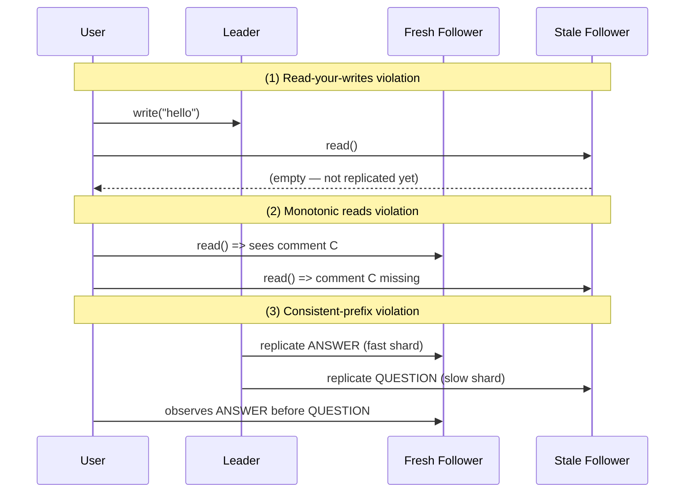

# Replication Lag and Per-User Consistency Guarantees

> **One-sentence summary.** Asynchronous followers are eventually consistent but expose three user-visible anomalies — missing your own write, time going backward, and effects before causes — which motivate cheaper per-user guarantees (read-your-writes, monotonic reads, consistent prefix reads) before you pay for full linearizability.

## How It Works

**Replication lag** is the interval between a write committing on the leader and that change being visible on a follower. Under healthy load it is a fraction of a second and invisible to users; under catch-up after a node restart, a long GC pause, or a congested inter-region link, it can stretch to seconds or even minutes. Because read-scaling architectures route read traffic across many asynchronous followers (synchronous replication to every follower would make a single slow node halt all writes), any read may observe a stale snapshot. The database is said to be **eventually consistent**: stop writing, wait, and every replica will converge — but the word "eventually" is deliberately unbounded. There is no contractual upper limit, only a statistical one.

Eventual consistency is harmless on paper and painful in practice, because it surfaces as three distinct anomalies that users actually notice:

1. **Read-your-writes violation.** A user posts a comment (routed to the leader) and immediately refreshes. The refresh happens to hit a follower that has not yet replayed the write, so the user's own comment appears to be missing. Users interpret this as "my data was lost."
2. **Monotonic reads violation.** A user reads once from a fresh follower (sees a new comment) and reads again from a stale one (comment vanishes). Time appears to flow backward — a particularly disorienting failure mode since the page just "flickers" state.
3. **Consistent-prefix violation.** Causally related writes live on different shards that replicate at different speeds, so an observer sees the effect before the cause. The classic illustration is Mr. Poons asking Mrs. Cake a question and a third party hearing her answer first, because the reply's shard had lower lag than the question's shard.

## When to Use

You pick these guarantees precisely because full linearizability and cross-replica ACID are too expensive to pay for on every read. Apply **read-your-writes** whenever a user reads something they themselves just wrote — profile edits, posted comments, saved settings. Apply **monotonic reads** whenever a user makes a sequence of reads that should not appear to move backward — timelines, feeds, inboxes. Apply **consistent prefix reads** whenever causality spans shards — chat threads, reply/comment ordering, time-series events.

Common mitigation techniques, in increasing order of cost:

- **Route selected reads to the leader.** "Always read the user's own profile from the leader, everybody else's from a follower" works because only the owner edits their profile.
- **Recent-write window.** For one minute after a user's last write, send all their reads to the leader; afterwards, assume followers have caught up. You can also refuse to serve from followers whose monitored lag exceeds a threshold.
- **Timestamp-tracking client.** The client remembers the log sequence number (LSN) of its last write. Each read carries that LSN, and the router either picks a follower that has caught up past it or waits.
- **Sticky replica.** Hash the user ID to a replica so the same user always reads from the same follower — cheap monotonic reads as long as that replica stays healthy.
- **Co-locate causal writes.** Keep writes that depend on each other on the same shard; consistent-prefix follows for free from per-shard ordering.
- **Cross-device complication.** A user's laptop and phone may hit different regions over different network paths; the "remember last write LSN" trick must be centralized server-side, and sometimes you must route both devices to the same region.

## Trade-offs

| Level | Guarantee | Implementation cost | User experience | Example |
|-------|-----------|---------------------|-----------------|---------|
| Eventual consistency | Replicas converge — eventually | Free (default for async followers) | Random stale reads, three anomalies possible | DNS; async MySQL replica pool |
| Monotonic reads | A single user never sees time reverse | Sticky routing by `hash(user_id)` | Page no longer flickers between states | Twitter-style timeline refresh |
| Read-your-writes | User always sees their own submitted data | Leader reads for own data, or LSN tracking | "I edited my profile and the edit is there" | LinkedIn / Facebook profile edits |
| Consistent prefix reads | Causally ordered writes are read in the same order | Co-locate causal writes, or track causality | Chat messages never appear out of order | Slack / iMessage threads |
| Linearizability | System behaves as if there were one copy | Consensus on every write (Paxos/Raft) + cross-shard coordination | Indistinguishable from a single-node DB | Spanner, CockroachDB, etcd |

## Real-World Examples

- **Twitter-like timelines** care most about monotonic reads; it is acceptable for a new tweet to take a moment to appear, but unacceptable for a tweet you already saw to disappear on refresh.
- **LinkedIn and Facebook profile edits** rely on read-your-writes — commonly implemented by routing reads of your own profile to the leader while other people's profiles still read from followers.
- **Sharded chat systems** (Slack, iMessage) attach causality metadata (Lamport clocks, per-thread sequence numbers) to keep reply ordering consistent even when shards replicate at different rates.
- **NewSQL databases** (Spanner, CockroachDB, YugabyteDB) offer true linearizability so applications can ignore per-user guarantees entirely — paying instead with higher write latency from cross-region consensus.

## Common Pitfalls

- **Pretending replication is synchronous when it is async.** Code that works on a single-node dev box fails only under production load when lag grows; regression tests never catch it.
- **Random follower routing silently breaks monotonic reads.** Users describe the bug as "the page keeps flickering." Fix by pinning users to replicas via hash routing.
- **Unbounded last-write timestamps.** A naive read-your-writes cookie grows with every shard the user writes to; you eventually need a compact **version vector** (see [[07-detecting-concurrent-writes-version-vectors]]) instead of a per-row LSN list.
- **Cross-device read-your-writes is much harder.** A phone on cellular and a laptop on home Wi-Fi may hit different regions; you must centralize the tracking timestamp and sometimes force same-region routing.
- **Integrity constraints need linearizability.** "No negative balance," "unique username," and similar invariants cannot be enforced with read-your-writes alone — you need a linearizable write path, typically a single leader plus synchronous quorum commit.

## See Also

- [[01-single-leader-replication-and-logs]] — asynchronous replication is the root cause of replication lag and the three anomalies.
- [[06-leaderless-replication-and-quorums]] — leaderless systems add quorum-dependent staleness on top of the anomalies discussed here.
- [[07-detecting-concurrent-writes-version-vectors]] — version vectors are the mechanism that tracks causality across replicas, and the basis for a compact read-your-writes token.
