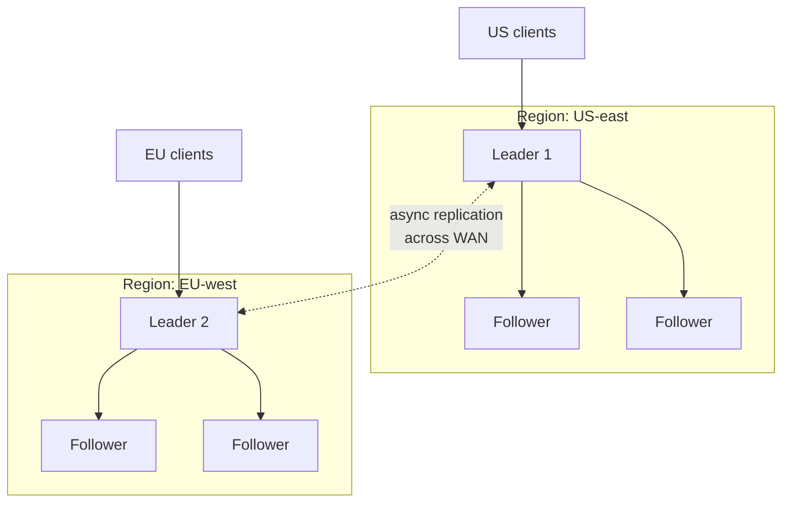
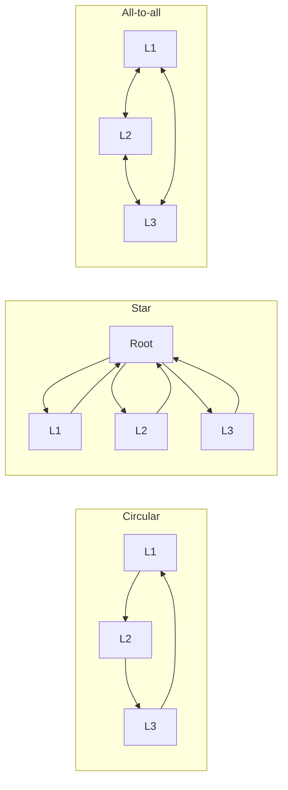

# Multi-Leader Replication and Geo-Distributed Topologies

> **One-sentence summary.** Allowing several nodes to accept writes and asynchronously replicate to each other lets every region absorb its own traffic and survive inter-region partitions, at the cost of write conflicts, lost global constraints, and topology-specific ordering hazards.

## How It Works

A **multi-leader** (a.k.a. *active/active* or *bidirectional*) configuration is a natural extension of [[01-single-leader-replication-and-logs]]: instead of one node being the sole write endpoint, several nodes accept writes and each forwards its changes to every other leader. Each leader also acts as a follower of the others, applying their replication log entries the same way a follower applies its leader's log.

The synchronous flavor is uninteresting — if leaders must ack each other before committing, a partition between them blocks writes on both sides, which is functionally just single-leader with extra hops. The model earns its keep only in the **asynchronous** variant, where each leader commits locally and propagates in the background, so a broken inter-region link doesn't stop any region from accepting traffic. Within each region, an ordinary leader/follower cluster handles local reads and zonal failover; the cross-region edges carry leader-to-leader streams.

## Topologies

With two leaders there's only one possible wiring. With three or more, the **replication topology** — the graph along which writes flow — becomes a design choice. The three canonical shapes:

In **circular** and **star** topologies a write hops through intermediate nodes to reach everyone, so each node must forward writes it didn't originate. To stop a write from circulating forever, each node has a unique ID, and every replicated write is tagged with the IDs of nodes it has already traversed; a node that sees its own ID in the tag drops the message. **All-to-all** avoids forwarding — every leader sends directly to every other — so it tolerates node failures without reconfiguration, but it introduces a subtler problem: links have different speeds, so an `UPDATE` can overtake its preceding `INSERT` and arrive at a third node before the row it depends on exists. That's a **causality** bug, and timestamps are insufficient because cross-region clocks aren't tight enough; the book's answer is **version vectors** (a later chapter topic).

## When to Use

- **Geo-distributed databases** where each region should absorb local writes at local-network latency instead of round-tripping to a single primary region. The inter-region delay moves off the user's critical path.
- **Surviving regional outages and flaky WAN links** — each region keeps accepting writes during a partition, and changes reconcile when connectivity returns.
- **Sync engines and per-device leaders** — laptops, phones, and browser tabs that must keep editing while offline are, architecturally, multi-leader taken to the extreme ([[04-sync-engines-and-local-first-software]]).

## Trade-offs

| Aspect | Single-leader across regions | Multi-leader across regions |
|--------|------------------------------|-----------------------------|
| Write latency for remote users | WAN round-trip per write | Local region write, async propagation |
| Tolerance of regional outage | Writes stop if the leader's region is down | Surviving regions keep writing |
| Tolerance of WAN partition | Writes blocked until link returns | Each side continues; conflicts resolved later |
| Consistency | Strong (linearizable, serializable) | Eventual; reads can see stale/conflicting state |
| Global constraints (unique username, `balance >= 0`) | Enforceable at the leader | Broken — two leaders can each accept a valid-looking write that violates the invariant when merged |
| Autoincrement IDs | Single counter, no collisions | Need partitioned ID spaces or UUIDs |
| Triggers / stored procedures | Fire once | May fire on every leader during propagation |
| Operational complexity | Low | High — conflict handling, topology tuning, constraint redesign |

## Real-World Examples

- **MySQL Group Replication, Oracle GoldenGate, SQL Server peer-to-peer replication** — multi-leader features bolted onto engines that were born single-leader; rich, mature, and full of retrofit landmines around triggers and autoincrement.
- **EDB Postgres Distributed (BDR) and pglogical** — multi-leader retrofitted to PostgreSQL for geo-replicated OLTP.
- **YugabyteDB** — multi-region deployments with per-region leaders, giving local-write latency in each geography.
- **Redis Enterprise active-active** — CRDT-backed multi-master replication across regions, so each datacenter can write locally and merge automatically.
- **Cassandra / DynamoDB global tables** — technically *leaderless* per key, but the same multi-master-across-regions shape with conflict resolution at its core.

## Common Pitfalls

- **No global constraints.** "Username must be unique" and "account balance cannot go negative" are unenforceable when two leaders accept individually-valid writes that conflict upon merge. If you need these invariants, route those writes through a single-leader path or a consensus protocol like Paxos/Raft.
- **Autoincrement collisions.** The classic fix — odd IDs on leader A, even IDs on leader B — breaks down under leader reassignment or rebalancing. UUIDs, ULIDs, or a central ticket server are more durable.
- **Triggers and integrity constraints run on every leader.** A side-effecting trigger may fire again as a write propagates, sending duplicate emails or double-writing to external systems. Most retrofit databases expose a "replication role" flag for triggers — getting this wrong is a common outage.
- **All-to-all message reordering.** An `UPDATE` that arrives before its originating `INSERT` leaves a third leader with a "row not found" error or silent data loss. Wall-clock timestamps don't solve it; version vectors do.
- **Circular and star choke points.** If the root of a star or any link in a circle goes down, replication halts for everyone downstream until a human reconfigures the graph. This is the flip side of all-to-all's fault tolerance.
- **"Multi-leader in one datacenter" is almost always a mistake.** Inside a region, network latency is low enough that single-leader works fine; the added conflict-resolution complexity rarely pays off and frequently hides bugs for months.

## See Also

- [[01-single-leader-replication-and-logs]] — the baseline you're relaxing; multi-leader is single-leader plus cross-leader forwarding and conflicts.
- [[04-sync-engines-and-local-first-software]] — multi-leader where every device is a leader and the WAN is "whenever the user has wifi."
- [[05-conflict-resolution-lww-crdts-ot]] — the unavoidable price of accepting writes on multiple leaders: strategies (LWW, CRDTs, OT, manual merge) for converging divergent histories.
