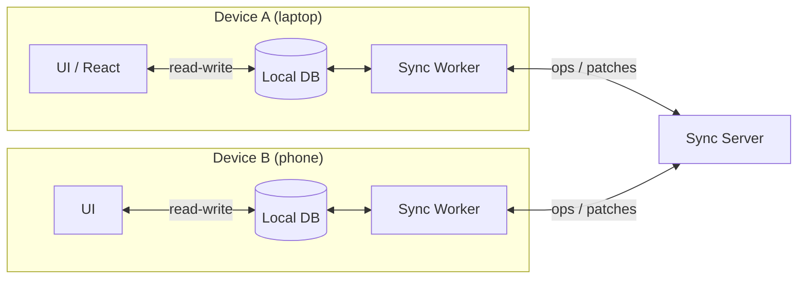

# Sync Engines and Local-First Software

> **One-sentence summary.** Treat each client device as its own leader replica that stays fully operational offline and gossips changes through the network when it can — and multi-leader replication, pushed to the extreme, becomes the engine behind Google Docs, Figma, and every offline-capable app you've ever loved.

## How It Works

A **sync engine** is a client-side library that owns a persistent local replica of the user's working set — on a phone's flash, a laptop's disk, or even IndexedDB inside a browser tab. The UI reads and writes that local replica directly, so every keystroke or tap lands in under a frame (~16 ms) with no network on the critical path. A background worker streams those local writes to a sync server (or peers) and pulls remote writes down, applying them to the same local store. When the network vanishes — subway, airplane, coffee-shop Wi-Fi — nothing visibly breaks: writes queue up, reads keep working, and the queue drains on reconnect.

Architecturally this is [[03-multi-leader-replication-and-topologies]] taken to its limit: **every device is a leader, and the link between leaders is extremely unreliable** (partitioned for hours, lossy, asymmetric). Because two offline devices can edit the same field concurrently, some automatic merge strategy — typically a CRDT or OT algorithm, see [[05-conflict-resolution-lww-crdts-ot]] — has to reconcile divergent histories without human intervention. That merge logic is the hard part; the replication plumbing is almost a consequence of it.

The UI never talks to the server directly; the sync worker is the only boundary where network failure is even visible.

## Three Adjacent Terms

- **Real-time collaborative app** — multiple users see each other's edits within a few hundred milliseconds. Google Docs, Figma, and Linear are the canonical examples; the point is liveness, not offline.
- **Offline-first app** — continues to work with no network and reconciles later. A sync engine under the hood makes "offline" indistinguishable from "slow network" for the rest of the code.
- **Local-first software** — offline-first *plus* a guarantee that the app keeps working if the vendor shuts down. Achieved by using an open sync protocol with multiple interchangeable providers, so your data isn't hostage to a single SaaS company. Git is the prototypical example: works offline, collaborates across any hosting provider, and your repo survives GitHub going away.

## When to Use

- **Collaborative editors** — documents, spreadsheets, whiteboards, design canvases, kanban boards. Shared state is small per file and interaction latency is felt viscerally.
- **Mobile apps on flaky connectivity** — calendars, note-taking, task managers, transit apps. A subway ride shouldn't break the product.
- **Games with sub-frame input response** — the games industry solves the same problem under the name *netcode*; techniques differ in detail but the shape (local simulation + async reconciliation) is the same.
- **Bounded per-user datasets** — one person's notes (good), one Figma file (good), the entire Amazon catalog (bad — it won't fit on the device and the user doesn't need it all).

## Trade-offs

| Aspect | Request/Response (server-centric) | Sync Engine (local-first) |
|--------|-----------------------------------|---------------------------|
| Client state | Minimal cache, mostly ephemeral | Full persistent replica of working set |
| UI responsiveness | Bound by network RTT (50–500 ms) | Bound by frame time (~16 ms) |
| Error handling | Every call can fail; UI must reflect it | Local ops almost never fail; sync errors are background |
| Programming model | Imperative RPCs scattered through UI code | Reactive: UI derives from local DB; sync is invisible |
| Offline support | Needs a separate "offline mode" codepath | Offline is just a slow network |
| Data volume | Unbounded; server paginates on demand | Must fit on the device |
| Conflict complexity | Server arbitrates; last write wins is easy | CRDT or OT is effectively mandatory |
| Schema changes | One database, migrate once | Many long-lived client replicas at different versions |

## Real-World Examples

- **Google Docs, Figma, Linear** — real-time collaboration via OT (Docs) or CRDT-flavored custom protocols (Figma, Linear). Linear publicly describes its architecture as a sync engine.
- **Automerge and Yjs** — open-source CRDT libraries that power a generation of local-first apps.
- **PouchDB / CouchDB** — pioneered offline-first on the web with an open replication protocol; any compatible server will do.
- **Google Firestore, Realm, Ditto** — proprietary sync engines for mobile apps; convenient, but not local-first in the strict sense because you can't swap the backend.
- **Git** — the original local-first collaboration system. Every clone is a full replica, you sync to GitHub, GitLab, or your own box, and no vendor can take your history away. No real-time co-editing, but every other property fits.
- **Lotus Notes (1980s)** — the grandparent of sync engines, decades before the term existed.

## Common Pitfalls

- **Data-volume blind spot** — sync engines assume the working set fits locally. Don't try to mirror the full product catalog or a multi-terabyte data warehouse; pick what a single user actually touches.
- **No automatic merge, so users resolve conflicts manually** — a user who comes back online after a week to a pile of "please pick A or B" prompts will churn. Design around CRDTs/OT from day one rather than falling back to human reconciliation.
- **"Local-first" without an open protocol** — if your vendor can revoke auth or shut down the sync server and the data becomes unreadable, it isn't local-first. Real local-first needs open encoding and swappable providers.
- **"We'll add offline mode later"** — retrofitting a sync engine onto a server-centric app means rewriting the data layer, the UI state layer, and the error-handling model. Offline-first is an architectural decision, not a feature flag.
- **Schema skew across long-offline clients** — a device that opens the app after six months holds last-year's schema. Use forward-and-backward-compatible encodings (Avro, Protobuf with optional fields, JSON with additive changes) and never assume all replicas are on the same version.

## See Also

- [[03-multi-leader-replication-and-topologies]] — sync engines are multi-leader replication where every device is a leader and the WAN is the user's actual Wi-Fi.
- [[05-conflict-resolution-lww-crdts-ot]] — CRDTs and OT are the merge algorithms that make any usable sync engine possible; without them you're asking users to resolve diffs by hand.
