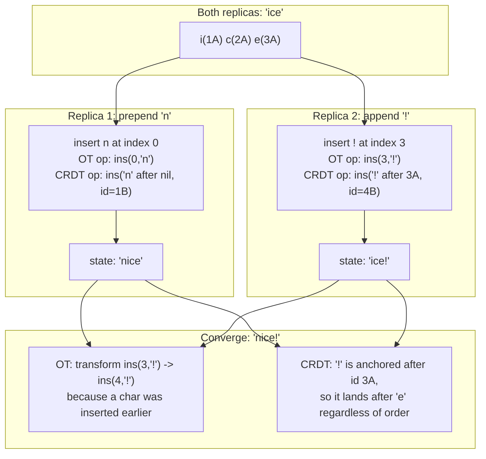

# Conflict Resolution: LWW, CRDTs, and Operational Transformation

> **One-sentence summary.** When two replicas accept writes that neither knew about, the system must converge on one state; the options — avoid conflicts, discard losers by timestamp, keep siblings for manual merge, or merge algorithmically with CRDTs/OT — trade data loss, complexity, and offline-friendliness against each other.

## How It Works

Two writes are **concurrent** when neither was aware of the other at the time it was issued. This is a logical condition, not a wall-clock one: two edits made a week apart by offline devices are still concurrent if neither synced to see the other before writing. Whenever concurrent writes land on different replicas — in multi-leader clusters, leaderless quorums, or local-first sync engines — the cluster ends up with two versions of a record and must decide how to converge. Four strategies exist, in increasing sophistication:

1. **Conflict avoidance** — route every write for a given record to the *same* leader, so there is never a second writer. Hash `user_id → region`, stick user data in its "home" region, and from that user's perspective the system is single-leader. Breaks down when the home leader fails over, or when the user moves between regions and the designated leader is reassigned mid-write.
2. **Last Write Wins (LWW)** — tag each write with a timestamp, keep the one with the greatest timestamp, silently drop the rest. Trivial to implement and guarantees convergence, but "last" is undefined for concurrent writes: the winner is effectively random, and successfully-processed writes are *lost*.
3. **Siblings + manual merge** — store all concurrent values together ("siblings") and return them on read. The application (or user) merges and writes the resolution back. Used by CouchDB and Riak's classic model.
4. **Automatic convergence (CRDTs / OT)** — algorithmic merges that preserve every update's intent. Combined with eventual consistency, this gives **strong eventual consistency**: any two replicas that have seen the same set of writes hold the same state, regardless of delivery order.

The canonical illustration is two replicas that both start with `ice`; one prepends `n`, the other appends `!`. Both algorithms must converge on `nice!` without losing either edit:

## OT vs CRDT

**Operational Transformation** records each edit by *position* (`insert '!' at index 3`). Before applying a remote op, a replica *transforms* its indices to account for local ops that have already shifted the buffer. Correctness depends on every replica applying ops in a compatible order, which is why OT systems usually rely on a central coordinator. Google Docs is the poster child.

**CRDTs** attach a unique, immutable ID to every element; operations are anchored to IDs, not positions. Inserting `!` records "place this new node, id `4B`, after node `3A`." Concurrent insertions at the same anchor are ordered deterministically by ID, so no transformation is needed and peers can merge without a coordinator — ideal for peer-to-peer sync. Used in Automerge, Yjs, Riak, Redis Enterprise, and Azure Cosmos DB.

## When to Use

- **LWW**: insert-only workloads where keys are unique and never updated — sensor telemetry, append-only events, immutable logs. Never for fields you mutate.
- **Siblings / manual merge**: low-volume conflicts with domain-specific resolution logic — version control, issue tracker state fields, anything where a human is the right merge strategy.
- **CRDTs**: collaborative editors, distributed counters (likes, views), shopping carts, local-first apps, active-active geo-replicated KV.
- **OT**: real-time text/spreadsheet collaboration with a central server that orders operations.
- **Conflict avoidance**: geo-sharded apps where each record has a natural "owner" region and failover is rare.

## Trade-offs

| Strategy | Ease to implement | Data loss risk | Programming-model complexity | Metadata overhead | Offline fit |
|----------|-------------------|----------------|------------------------------|-------------------|-------------|
| Conflict avoidance | Easy (routing rule) | None in steady state; possible during leader reassignment | Same as single-leader | None | Poor — offline clients can't route to their "home" |
| LWW | Trivial | High (concurrent writes silently dropped) | None (value is still a scalar) | One timestamp per write | OK for inserts; dangerous for updates |
| Siblings / manual | Moderate (API returns a set) | None if merged carefully | High — app handles sets of values | Version vectors + all siblings | Good |
| CRDT / OT | Hard (use a library) | None by construction | Moderate — data types are fixed | Per-element IDs / op logs; can be large | Excellent (CRDT); needs server (OT) |

## Real-World Examples

- **Cassandra, ScyllaDB**: LWW by default, keyed on wall-clock timestamps — convenient but vulnerable to clock skew.
- **CouchDB**: returns all conflicting revisions; the application chooses a winner and writes it back.
- **Riak**: ships CRDTs for counters, sets, maps, flags, and registers; converges without user intervention.
- **Redis Enterprise, Azure Cosmos DB**: CRDTs power their active-active multi-region modes.
- **Google Docs**: OT on character insert/delete operations, coordinated through Google's servers.
- **Figma**: CRDT-like tree of design objects, each keyed by a stable ID so concurrent property edits commute.
- **Automerge, Yjs**: JSON CRDT libraries for local-first apps; ShareDB does the same job with OT.
- **Amazon's early Dynamo shopping cart**: merged siblings via set union — the infamous "deleted items reappear" bug that motivated modern CRDTs' explicit **tombstones** for deletions.

## Common Pitfalls

- **LWW under clock skew**: a node with a fast clock wins every conflict, silently dropping writes from slower peers. Real-time Unix timestamps don't fix this; logical clocks or Lamport timestamps do.
- **Naïve sibling merge via set union**: brings back items the user deleted (the Dynamo cart bug). You need explicit tombstones or a causal history of adds and removes — exactly what set CRDTs encode.
- **Non-deterministic merge of siblings**: if two nodes independently merge `{B, C}`, one producing `B/C` and the other `C/B`, the next merge produces nonsense like `B/C/C/B`. Always pick a canonical ordering (e.g., sort by ID).
- **"We'll add conflict resolution later"**: a multi-leader or leaderless system *will* see concurrent writes. Without a strategy, the system is silently corrupting data. Either pick one up front or fall back to single-leader — see [[03-multi-leader-replication-and-topologies]].
- **Convergence is not validity**: CRDTs guarantee all replicas end up equal, not that the result satisfies your invariants. You still cannot enforce "balance ≥ 0", "at most five items in the cart", or "no double-booked meeting room" without coordination — convergence and correctness are different problems.
- **Subtle, multi-record conflicts**: two bookings for the same room at non-overlapping times on each leader look fine locally but overlap once merged. CRDTs don't help — this kind of global invariant needs application-level coordination or a single-leader checkpoint.

## See Also

- [[03-multi-leader-replication-and-topologies]] — the topology that makes conflicts unavoidable in the first place
- [[04-sync-engines-and-local-first-software]] — offline-first clients live or die by the quality of their automatic merge
- [[06-leaderless-replication-and-quorums]] — Dynamo-style systems need the same resolution machinery because any replica can accept a write
- [[07-detecting-concurrent-writes-version-vectors]] — the *detection* mechanism that tells the system two writes are concurrent and therefore need resolving
