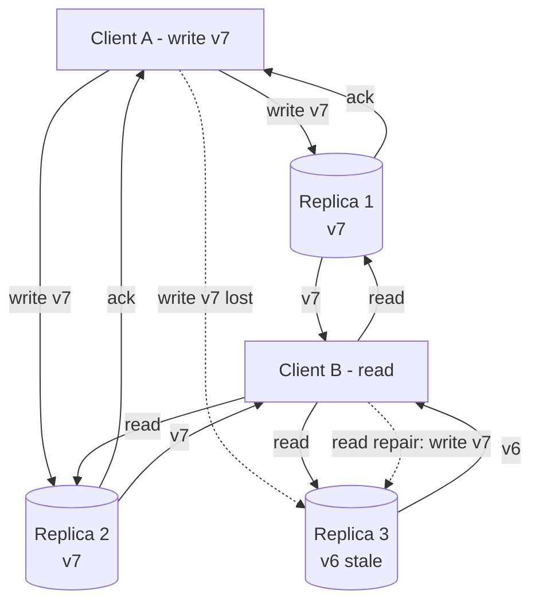

# Leaderless (Dynamo-Style) Replication and Quorums

> **One-sentence summary.** Leaderless systems drop the leader entirely — clients fan writes and reads out to several replicas in parallel, relying on the quorum overlap `w + r > n` so at least one responder always holds the latest value, with read repair, hinted handoff, and anti-entropy mopping up stragglers.

## How It Works

In the leaderless (Dynamo-style) model, every replica is equal. There is no leader to sequence writes and no failover to orchestrate. A client — or a **coordinator node** acting on its behalf — sends each write to all `n` replicas that own the key in parallel and considers it successful once `w` of them acknowledge. Reads fan out to the same `n` replicas and accept the first `r` responses; the client picks the one with the highest attached version number or timestamp, since older replicas may not yet have received the write. The **quorum condition** `w + r > n` guarantees the write set and read set overlap in at least one node, so any read that completes must observe the most recent successful write.

Because writes are not ordered through a leader, the system needs three different catch-up mechanisms to converge:

- **Read repair**: when a client sees mismatched versions across responders, it writes the freshest value back to the stale replicas. Hot keys heal themselves almost for free.
- **Hinted handoff**: if a target replica is unreachable at write time, another replica stores a *hint* on its behalf and forwards it when the intended owner returns. This covers writes to keys that are rarely read.
- **Anti-entropy**: a background job walks Merkle-tree digests of replica contents and copies any missing records, catching long-tail drift that neither reads nor hints ever touched.

With `n = 3, w = 2, r = 2`, Client A's write succeeds after two acks even though Replica 3 missed it. Client B reads three responses, picks `v7`, and writes the newer value back to Replica 3. A simultaneous hinted-handoff stream would do the same job for keys that are never read.

## Quorum Math Examples

| `n` | `w` | `r` | Tolerates | Profile |
|-----|-----|-----|-----------|---------|
| 3   | 2   | 2   | 1 failure | Standard majority quorum |
| 5   | 3   | 3   | 2 failures | Higher durability, more replicas to wait on |
| 3   | 3   | 1   | 0 write failures | Fast reads, any down node blocks writes |
| 3   | 1   | 3   | 0 read failures | Fast writes, any down node blocks reads |
| 3   | 1   | 1   | All | No overlap, no freshness guarantee, maximum availability |

An odd `n` with `w = r = (n + 1) / 2` is the usual default.

## When to Use

- **High-availability workloads where bounded staleness is acceptable** — shopping carts, activity feeds, session caches, telemetry.
- **Gray-failure-prone fleets** where any given moment several nodes run slow or degraded. Leaderless treats slow and failed the same way, so one sick node barely moves tail latency.
- **Geo-distributed deployments** that want to pick their own freshness/latency knob per request: a global quorum spans regions for strong reads, while a local-region quorum returns quickly at the cost of possibly stale data.
- **Hyperscale clusters** where leader-based failover storms (detect → elect → drain → warm up) would themselves be the main source of downtime.

## Trade-offs

| Aspect | Single-leader | Multi-leader | Leaderless |
|--------|---------------|--------------|------------|
| Write path | Through one leader | Through any leader | Parallel to `n` replicas |
| Failover | Required; risky and user-visible | Not needed | Not a concept |
| Consistency | Strong on leader, eventual on followers | Eventual across leaders | Tunable via `w`, `r` |
| Conflict resolution | Rare | Always required | Always required |
| Tail-latency resilience | Sensitive to a slow leader | One slow leader hurts its local users | Hedging across `n` replicas masks slow nodes |
| Multi-region fit | Writes cross regions to leader | Natural, local writes | Natural; choose local vs global quorum |
| Operability | Simple replication-lag metric | Complex conflict metrics | No lag metric — only outstanding hints |

## Quorum Consistency Edge Cases

Even with `w + r > n`, leaderless reads can still return stale values:

- **Sloppy quorum + hinted handoff**: when the "home" replicas are unreachable, writes are accepted by any `w` reachable nodes. A later read from the home nodes may not see the write until hints are delivered.
- **Concurrent read/write**: a read racing a write may see either value, and a subsequent read may even revert to the old one.
- **Partial failed write**: if fewer than `w` replicas ack, the write is reported as failed, but the replicas that did accept it do *not* roll back — later reads may or may not see it.
- **Restoring a stale replica from backup**: temporarily shrinks the count of replicas holding the latest value below `w`, breaking overlap.
- **Rebalancing in progress**: different clients disagree on which `n` nodes own a key, so the read and write quorums may not overlap.
- **LWW with wall-clock timestamps**: a node with a faster clock can silently overwrite a newer write, losing data under clock skew.

Treat `w + r > n` as *probabilistic* freshness, not linearizability.

## Real-World Examples

- **Amazon Dynamo (2007 paper)** — the original in-house design that defined the pattern.
- **Riak, Cassandra, ScyllaDB, Voldemort** — open-source Dynamo-style datastores still in wide use.
- **AWS DynamoDB (the product)** — despite the name, it is *not* Dynamo-style today; it is a single-leader system built on Multi-Paxos. The label is historical.
- **Request hedging** — the "send to many, use the fastest" idiom that leaderless systems get for free. Google, Cassandra drivers, and many latency-sensitive services use it to cut p99 dramatically.

## Common Pitfalls

- **Treating `w + r > n` as linearizability.** It is not. Six edge cases above all produce stale or lost reads. Use quorums for tolerable-staleness workloads, not for strict invariants like "never oversell the last seat."
- **LWW + real-time clocks + leaderless = silent write loss.** Clock skew across regions will quietly drop writes. Reach for version vectors or CRDTs when the data matters.
- **No replication-lag dial.** Leader-based systems expose lag in writes-applied units. Leaderless systems expose only "outstanding hints" — useful but hard to translate into "how stale can my reads be?" Applications have to instrument freshness themselves (e.g., write-then-read probes).
- **Bigger quorums are not better.** Past roughly 4-of-7 or 5-of-9, each extra replica adds tail latency faster than it adds durability, because every extra responder gives you one more slow node to wait on.
- **Sloppy quorum looks available but is not durable.** Writes accepted by random reachable nodes may never make it home if those nodes crash before handoff. Model it as "higher probability of accepting the write, lower probability that subsequent reads see it."

## See Also

- [[01-single-leader-replication-and-logs]] — the leader-based baseline this design rejects in favor of symmetry.
- [[03-multi-leader-replication-and-topologies]] — the in-between design: multiple leaders still sequence writes locally, but replicate asynchronously and need conflict resolution too.
- [[05-conflict-resolution-lww-crdts-ot]] — leaderless systems inherit every conflict-resolution problem from multi-leader; LWW, CRDTs, and OT are the toolbox.
- [[07-detecting-concurrent-writes-version-vectors]] — version vectors are how replicas decide which of two writes happened-before the other (or neither), the foundation for correct merging in this model.
