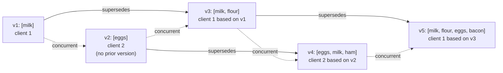

# Detecting Concurrent Writes with Version Vectors

> **One-sentence summary.** Per-key version numbers (single replica) and per-(key, replica) version vectors (leaderless cluster) let a database decide whether a new write *happened after* what the client last saw or is *concurrent* with some other write, so causally superseded values can be overwritten while concurrent values are preserved as siblings for the application to merge.

## How It Works

When two clients write the same key to different nodes in different orders, the cluster diverges unless the server can tell, for any pair of writes A and B, whether A *happened before* B, B happened before A, or neither — i.e. they are *concurrent*. **Happens-before** means B knew about, depended on, or was built on top of A; a client that reads `[milk]` and then writes `[milk, flour]` has caused the second write to happen after the first. Crucially, **concurrent does not mean "at the same time"**: two writes separated by hours can still be concurrent if neither client had seen the other's update. Clock overlap is irrelevant; awareness is the only thing that defines the relation.

**Single-replica algorithm.** Capture causality with a version number per key:

1. The server keeps a version counter per key, bumps it on every write, and stores the new version alongside the value.
2. On read, the server returns *all* siblings (values that have not been overwritten) plus the latest version number.
3. On write, the client must echo the version it last read *and* merge every sibling it saw into the new value.
4. On receiving a write at version `V`, the server overwrites values with version `<= V` (causally superseded) and keeps values with version `> V` (concurrent — they become siblings of the incoming write).

A write without a version number is "concurrent with everything," so it supersedes nothing and just piles on a new sibling. Walk through the five-write shopping-cart example from the chapter: Client 1 writes `milk` (v1); Client 2, unaware, writes `eggs` (v2) — since v2's base is empty, `milk` stays as a sibling. Client 1 sends `[milk, flour]` based on v1 (overwrites v1, concurrent with v2 → v3). Client 2, having seen `[milk, eggs]`, sends `[eggs, milk, ham]` based on v2 (overwrites v2, concurrent with v3 → v4). Client 1, having seen v3's siblings, sends `[milk, flour, eggs, bacon]` based on v3 (overwrites v3, concurrent with v4 → v5). No write is lost; two siblings remain for the next client to merge.

**Multi-replica: version vectors.** One counter is not enough when several leaderless replicas each accept writes — two replicas might both pick "version 4" for unrelated writes. The fix is a *vector*: each replica maintains its own counter, and every stored value is tagged with the full map `{replica -> counter}` the writer had seen. A vector `V1` happens-before `V2` iff `V1[i] <= V2[i]` for every replica `i` and strictly less for at least one. If neither is `<=`, the writes are concurrent and both are kept as siblings. The vector is shipped to the client on read (Riak calls it the **causal context** string) and must be echoed on write, just like the single version number. **Dotted version vectors**, used in Riak 2.0, refine this so the metadata grows with the number of *replicas* rather than the number of distinct concurrent writes, fixing a sibling-explosion pathology of naive vector clocks.

**Version vectors vs vector clocks.** The two terms are often conflated; the book notes they differ subtly and points out that *version vectors* are the right tool when the thing being compared is replica state (as opposed to an event history).

## When to Use

- Any leaderless store that surfaces siblings — Riak classic mode is the canonical example.
- Multi-leader stores that need to detect causality across regions instead of silently applying last-write-wins.
- Application state where ordering matters: shopping carts, collaborative todo lists, offline-first clients, CRDT metadata — anywhere you need to know "is this update a follow-up to what I saw, or did something else happen in parallel?"
- Skip it if you are happy with [[05-conflict-resolution-lww-crdts-ot]]-style LWW, or if you have arranged conflict *avoidance* (single-leader per key, sticky routing).

## Trade-offs

| Mechanism | Detects happens-before | Detects concurrency | Works across replicas | Metadata size | Complexity |
|-----------|------------------------|---------------------|-----------------------|---------------|------------|
| Wall-clock timestamp (LWW) | No (clock skew lies) | No | Yes | 8 bytes | Trivial |
| Lamport clock | Yes | No (total order forced) | Yes | 8-16 bytes | Low |
| Version number per key | Yes | Yes | No (single writer) | 8 bytes | Low |
| Version vector | Yes | Yes | Yes | O(replicas) | Medium |
| Dotted version vector | Yes | Yes | Yes | O(replicas), compressed | High |

## Real-World Examples

- **Riak** ships version vectors as an opaque *causal context* string; every read returns it and every write must send it back.
- **Dynamo (2007 paper)** introduced classic per-key version vectors, popularizing the pattern for leaderless stores.
- **CRDTs** use version vectors internally to decide which operations a replica has already observed and can therefore safely merge or skip.
- **Git** is not a version vector but solves an analogous problem: a DAG of commits with parent pointers encodes happens-before, and a missing edge means concurrent branches that must be merged.

## Common Pitfalls

- **Using wall-clock timestamps as version numbers.** Clock skew between nodes reorders or silently drops writes — the whole reason LWW loses data. Use per-replica counters or Lamport clocks.
- **Skipping the version on write.** A write with no prior version is concurrent with everything, so it overwrites nothing. Buggy clients that forget the echo cause the sibling list to grow without bound.
- **Not merging siblings before writing back.** Every partial write adds another sibling. Convergence depends on clients reading all siblings, computing their union (or a CRDT merge), and writing that back; clients that drop siblings lose data permanently.
- **Unbounded vector growth.** Track replica IDs (a bounded set), not client IDs — otherwise every new device adds a dimension to the vector. Dotted version vectors help when the replica set itself churns.
- **Equating "no conflict detected now" with "no conflict ever."** Anti-entropy and hinted handoff (see [[06-leaderless-replication-and-quorums]]) can surface a concurrent sibling long after the write returned. The API shape must always accept siblings on read.

## See Also

- [[05-conflict-resolution-lww-crdts-ot]] — version vectors are the metadata layer that lets those resolution strategies know *what* is actually in conflict.
- [[06-leaderless-replication-and-quorums]] — quorum reads only meaningfully converge when a causality mechanism like this decides which copies supersede which.
- [[02-replication-lag-and-consistency-guarantees]] — the consistent-prefix and causal-consistency anomalies are exactly the happens-before violations that version vectors are designed to catch.
