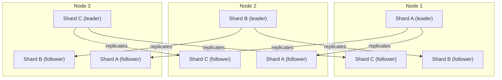

# Sharding Fundamentals and Multitenancy

> **One-sentence summary.** Sharding splits a dataset across nodes so that writes, storage, and tenants scale horizontally — and it is usually layered on top of replication for fault tolerance.

## How It Works

A distributed database can spread data across machines in two orthogonal ways. *Replication* stores the same record on several nodes for fault tolerance and read scaling. *Sharding* (also called *partitioning*) cuts the dataset into disjoint pieces so that each record lives on exactly one shard, and different shards live on different nodes. Sharding is the answer when a single node can no longer hold the data volume or absorb the write throughput — read load alone is usually better solved by adding replica followers.

In practice, the two techniques are combined. Each shard behaves like a small database with its own leader and followers, and a single physical node typically hosts several shards: it may be the leader for some and a follower for others. The sharding scheme is largely independent of the replication scheme, which lets you reason about them separately.

To locate a record, the system applies a sharding function to a chosen *partition key*. All rows with the same partition key land on the same shard, so reads and writes of that key hit a single node — fast when you know the key, but painful when you don't, since a blind query fans out across every shard. Changing the sharding scheme later is expensive, which is why the choice of partition key is one of the highest-leverage decisions in a sharded system.

## When to Use

- **Write throughput exceeds a single machine.** Modern servers can handle a lot, so prefer a single node until you have real evidence you've outgrown it — sharding adds real complexity.
- **Data volume exceeds a single machine.** When the working set no longer fits on one node's disks or memory, sharding is the standard path to horizontal scale.
- **Parallelism on a single machine.** Redis, VoltDB, and FoundationDB shard *inside* one box, running one single-threaded process per CPU core to exploit parallelism and NUMA locality.
- **Multitenant SaaS.** Give each customer (or each group of small customers) their own shard to isolate resources, permissions, and backups.

## Trade-offs

| Aspect | Single-node database | Sharded database |
|---|---|---|
| Operational complexity | Low — one config, one backup | High — routing, rebalancing, metadata |
| Transactions | Cheap, single-node ACID | Cross-shard writes need distributed transactions (slow) |
| Secondary indexes / joins | Straightforward | Hard; may require scatter-gather |
| Scaling ceiling | Bounded by biggest machine | Add nodes to grow capacity |

| Multitenancy strategy | Strengths | Weaknesses |
|---|---|---|
| One tenant per shard | Strong resource + permission isolation; easy per-tenant backup, export, deletion; data-residency pinning | Overhead per tenant; cross-tenant queries hard; assumes tenant fits on one node |
| Multiple small tenants grouped into a shard | Low overhead for the long tail of small customers | Need to move tenants between shards as they grow; weaker isolation |
| Sharding *inside* a large tenant | Lets one tenant exceed a single node | Reintroduces every scalability challenge — you're back to general sharding |

## Real-World Examples

- **Redis, VoltDB, FoundationDB**: Shard across CPU cores on one machine, running a single-threaded process per core to maximize parallelism and stay cache-friendly on NUMA hardware.
- **Citus (Postgres)**: Offers *schema-based sharding* — each tenant gets its own Postgres schema, which Citus distributes across nodes. Good fit for multitenant SaaS on a relational stack.
- **Vitess (MySQL)**: Adds a sharding layer over MySQL; Slack famously scaled its core datastore this way.
- **Cell-based architectures (e.g., Slack, AWS)**: Shard not just storage but the whole service stack into self-contained *cells* so that a fault — a bad deploy, a poisonous query — is contained to one cell's tenants.

## Common Pitfalls

- **Picking the wrong partition key.** If the key doesn't match your access patterns, common queries turn into scatter-gather across every shard, and the sharding scheme is painful to change later.
- **Assuming every tenant fits on one node.** A single viral customer can outgrow their shard; plan for intra-tenant sharding before you need it.
- **Ignoring cross-shard writes.** Any operation that must update related records in multiple shards now needs a distributed transaction — usually much slower than single-node ACID and often a system-wide bottleneck.
- **Over-sharding too early.** Sharding is a heavyweight solution. If one machine can handle the workload, adding shards just adds operational surface area (routing, rebalancing, metadata).
- **Rolling out a schema change globally.** With tenant-per-shard you can roll migrations out one tenant at a time to catch regressions — but only if your tooling supports it; doing it transactionally across shards is hard.

## See Also

- [[02-key-range-sharding]] — assigning contiguous ranges of keys to shards
- [[03-hash-based-sharding]] — using a hash function to spread load uniformly
- [[04-skewed-workloads-and-hot-spots]] — what happens when uniform sharding still isn't enough
- [[05-rebalancing-strategies]] — moving shards as nodes and data volumes change
- [[06-request-routing]] — how clients find the node that owns a given key
- [[07-sharding-and-secondary-indexes]] — why non-primary-key access is the hard part
