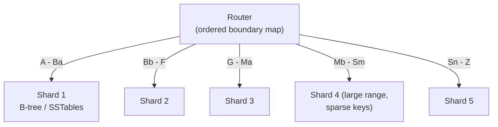

# Sharding by Key Range

> **One-sentence summary.** Assign each shard a contiguous range of partition keys so that lookups and range scans are cheap, accepting the risk of hot spots when writes cluster at the end of the key space.

## How It Works

Picture a printed encyclopedia. Volume 1 holds _A–B_, volume 12 holds _T–Z_. The ranges are not evenly spaced — there are far fewer English words starting with _X_ than with _S_ — so the editor draws boundaries that balance the volumes. Key-range sharding does the same thing: each shard owns a contiguous `[min, max)` slice of the key space, and the boundaries adapt to the actual data distribution rather than chopping the alphabet into equal pieces.

A router component keeps an ordered map of boundaries to shards. To find a key, you binary-search the boundaries, land on one shard, and go. Within each shard, keys are stored in sorted order — typically a B-tree (see [[02-b-trees-and-page-oriented-storage]]) or a set of SSTables (see [[01-log-structured-storage-lsm-trees]]) — which is what makes _range scans_ efficient: a query like "all sensor readings in March 2024" translates into a single sequential read on one shard.

Boundaries can be picked manually by an administrator (Vitess for MySQL) or chosen automatically by the database (Bigtable, HBase, CockroachDB, FoundationDB, the range option in MongoDB). YugabyteDB supports both.

## When to Use

- **Time-series and log data** where you frequently ask "give me everything between T1 and T2."
- **Composite keys that act as hierarchical indexes** — e.g., `(user_id, timestamp)` to fetch one user's activity window in a single scan.
- **Workloads that benefit from ordered iteration**, such as pagination by primary key, or batch ETL that walks the table in order.

If your access pattern is purely point lookups by an unordered identifier (tenant ID, UUID), you probably want [[03-hash-based-sharding]] instead.

## Trade-offs

| Aspect | Advantage | Disadvantage |
|--------|-----------|--------------|
| Locality | Nearby keys live on the same shard — range scans are one-shard reads | Nearby writes also land on the same shard — invites hot spots |
| Shard count | Adaptive; splits grow count as data grows | Not fixed in advance, so capacity planning is looser |
| Rebalancing | Splits only touch the shard being split | A split is an expensive rewrite of all the shard's files |
| Boundaries | Adapt to data skew automatically (or manually tuned) | Requires either good pre-split guesses or automatic splitting machinery |

## Real-World Examples

- **HBase / Bigtable**: automatic range splits; HBase's default split threshold is a region of 10 GB.
- **CockroachDB / FoundationDB**: range-based by default; splits triggered by size or write throughput.
- **MongoDB**: offers range sharding as one option, with pre-splitting supported on empty collections.
- **YugabyteDB**: supports both manual and automatic tablet splitting.
- **Vitess**: manual key-range sharding over MySQL — admins define the boundaries.

## Rebalancing by Splitting

Key-range systems rebalance by _splitting_ shards, not by shuffling a fixed shard set:

1. **Pre-splitting** (HBase, MongoDB): on an empty database, seed an initial set of boundaries based on expected key distribution — useful only when you already know the distribution.
2. **Automatic splits**: when a shard exceeds a size threshold (HBase: 10 GB) or sustains write throughput above a watermark, the database splits it into two contiguous sub-ranges and migrates one half to another node. A hot shard can be split even if it is small, purely to spread the write load.
3. **Merges**: if large deletions shrink adjacent shards, they can be merged back — mirroring B-tree rebalancing.

## Common Pitfalls

- **Monotonic keys create a hot shard.** If the partition key is a timestamp (or any ever-increasing ID), every new write lands on the shard that owns the high end of the range while all others sit idle. The classic fix is to prefix the key with a higher-cardinality attribute — e.g., `(sensor_id, timestamp)` — so writes fan out across many shards. The cost: a query for "all sensors in a time window" now fans into one range scan per sensor.
- **Splits are expensive and arrive exactly when you can't afford them.** A shard needs splitting because it is overloaded; the split itself rewrites all of its data (compaction-style). The extra I/O can push an already-hot shard past its breaking point. Provision headroom, or let the system split on throughput _before_ the size threshold is hit.
- **Bad boundary choices outlive their usefulness.** Manual boundaries that matched yesterday's data can concentrate tomorrow's workload on one shard. If you're picking boundaries by hand, budget time to revisit them, or pick a database that adjusts them automatically.

## See Also

- [[01-sharding-fundamentals-and-multitenancy]] — why we shard at all and what a shard actually is
- [[03-hash-based-sharding]] — the alternative when locality doesn't matter and you want uniform write distribution
- [[04-skewed-workloads-and-hot-spots]] — general techniques for the hot-spot problem introduced here
- [[07-sharding-and-secondary-indexes]] — how non-primary-key lookups work on top of either scheme
- [[02-b-trees-and-page-oriented-storage]] — the in-shard engine behind ordered key access
- [[01-log-structured-storage-lsm-trees]] — the SSTable-based alternative that also preserves key ordering
