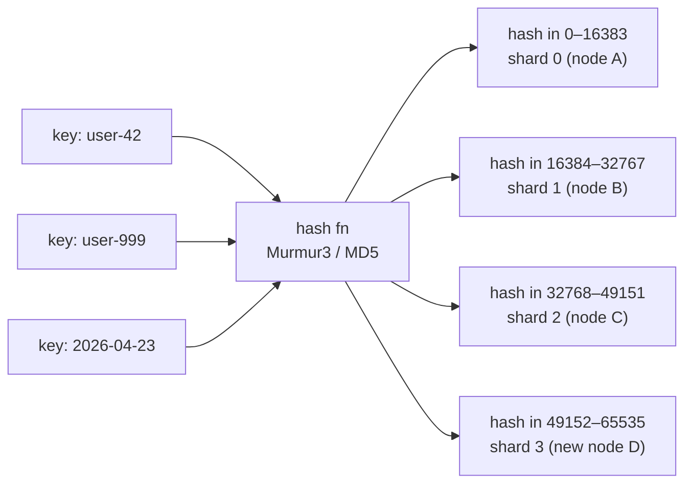

# Sharding by Hash of Key

> **One-sentence summary.** Hashing the partition key spreads load uniformly across shards; fixed-shard, hash-range, and consistent-hashing schemes differ in how gracefully they adapt when nodes are added or removed.

## How It Works

If you don't need records with nearby partition keys grouped together (e.g., the keys are opaque tenant IDs or user IDs), you can hash the key before choosing a shard. A good hash function takes skewed input — consecutive timestamps, sequential IDs, or heavily clustered strings — and projects it uniformly over a large integer range (say, 0 to 2^32 − 1). Identical inputs always produce the same hash, but similar inputs land at effectively random positions, which spreads writes evenly.

Cryptographic strength is not required; speed and distribution matter more. MongoDB uses MD5, while Cassandra and ScyllaDB use Murmur3. What you must **not** use is a language's built-in `hashCode`: `java.lang.Object.hashCode()` and Ruby's `Object#hash` can return different values for the same key in different processes, so keys would be routed inconsistently across the cluster.

Once the hash is computed, there are four common strategies for mapping it to a node.

### 1. Hash modulo N

The naive approach: `shard = hash(key) % N`, where `N` is the number of nodes. It's trivial to implement, but when `N` changes almost every key moves. Going from 3 to 4 nodes reshuffles roughly 3/4 of the dataset — an unacceptable amount of I/O for a simple scale-out. This scheme is mostly a teaching example, not production practice.

### 2. Fixed number of shards

Create many more shards than nodes up front — e.g., 1,000 shards across 10 nodes, 100 shards per node — and route by `hash(key) % 1000`. A separate metadata map records which node currently owns which shard. When a node joins, the cluster reassigns some shards to it; when a node leaves, its shards are redistributed. Data inside a shard never moves unless the shard itself moves.

Used by **Citus, Riak, Elasticsearch, and Couchbase**. The catch: the shard count is baked in at cluster creation. You can't scale past the shard count, and picking a number that's too low limits future growth while a number that's too high wastes overhead per shard.

### 3. Hash range (range of hash values per shard)

Instead of `% N`, assign each shard a **contiguous range** of hash values — e.g., shard 0 owns hashes 0–16,383, shard 1 owns 16,384–32,767, and so on. This is structurally the same as [[02-key-range-sharding]], but applied to the hash space. Because the hash is uniform, ranges stay balanced even when the input keys are skewed.

Crucially, shards can **split dynamically** when they grow too large or too hot, exactly like key-range shards. You don't need to pick a shard count in advance. Used by **YugabyteDB, DynamoDB**, and as an option in **MongoDB**.

### 4. Consistent hashing

Karger et al. introduced consistent hashing in 1997 for web caches. It maps keys to shards such that (a) keys are spread roughly evenly and (b) adding or removing a shard only moves a `1/N` fraction of keys, not all of them. Cassandra and ScyllaDB use a variant: the hash ring is cut into many small contiguous ranges (typically 16+ "vnodes" per physical node) with random boundaries. Other algorithms in the family include **rendezvous hashing** (highest random weight) and **jump consistent hashing** — they assign individual keys to the newly added node rather than splitting existing shard ranges.

## Comparing the Four Schemes

| Scheme | Rebalancing cost | Adaptability | Range queries on partition key | Used by |
|---|---|---|---|---|
| Hash mod N | Very high (~(N−1)/N of keys move) | Poor | No | Teaching examples only |
| Fixed shard count | Low (move whole shards) | Capped at initial shard count | No | Citus, Riak, Elasticsearch, Couchbase |
| Hash range | Low (split shards as needed) | Excellent (splits on demand) | No (scattered across shards) | YugabyteDB, DynamoDB, MongoDB (option) |
| Consistent hashing | Low (~1/N of keys move) | Excellent | No | Cassandra, ScyllaDB |

## When to Use

- **Multitenant systems keyed by tenant/user ID** where you want uniform load and don't care about scan ordering on that key.
- **Write-heavy workloads with monotonic keys** (timestamps, auto-increment IDs) that would create hot spots under [[02-key-range-sharding]].
- **Clusters expected to grow** — pick hash-range or consistent hashing so node additions move only a fraction of the data.

## Trade-offs

| Aspect | Advantage | Disadvantage |
|---|---|---|
| Load distribution | Hashing absorbs input skew; each shard gets a roughly equal slice | Pathological hot keys (celebrity users) still overload one shard — see [[04-skewed-workloads-and-hot-spots]] |
| Range queries | N/A | Scans on the partition key must fan out to every shard |
| Rebalancing | Fixed-shard, hash-range, and consistent hashing all move only a fraction of data | Hash-mod-N moves almost everything |
| Flexibility | Hash-range and consistent hashing adapt as data grows | Fixed-shard caps max cluster size at the preset shard count |

**Compound key escape hatch.** If you design the primary key as `(partition_key, clustering_key)`, only the first part is hashed. Records that share a partition key land on the same shard, so range queries on the clustering columns (e.g., "all events for user 42 between two timestamps") stay efficient. Cassandra and DynamoDB both lean on this pattern.

## Real-World Examples

- **Cassandra / ScyllaDB**: Murmur3 hash, consistent hashing with ~16 vnodes per physical node. Compound keys enable intra-partition range scans.
- **DynamoDB**: Hash-range over the partition key; shards split automatically as they cross size or throughput thresholds.
- **Citus (Postgres)**: Fixed shard count (default 32) chosen at distribution time; shards are first-class Postgres tables reassigned between workers.
- **MongoDB**: Offers both hashed sharding (fixed-shard flavor with MD5) and ranged sharding; hashed mode is preferred for write-heavy collections with monotonic IDs.

## Common Pitfalls

- **Using `Object.hashCode()` or equivalents for sharding.** JVM, Ruby, and Python hashes can vary across processes or runs; pick an explicit stable hash (Murmur3, MD5, xxHash).
- **Choosing a fixed shard count without headroom.** If you start with 32 shards and scale to 64 nodes, half your nodes sit idle. Pick 10–100× your expected node count, or use a scheme that splits shards on demand.
- **Expecting range queries on the partition key to work.** Hashing destroys ordering. If you need scans on that column, either use [[02-key-range-sharding]] or push the range predicate onto a clustering column within a compound key.
- **Assuming uniform hashing fixes all skew.** Hashing balances *keys*, not *load*. A single very hot key still pins one shard — see [[04-skewed-workloads-and-hot-spots]].

## See Also

- [[02-key-range-sharding]] — contrast: ordered ranges, good for scans, prone to hot spots on monotonic keys
- [[04-skewed-workloads-and-hot-spots]] — why hashing alone doesn't save you from celebrity keys
- [[05-rebalancing-strategies]] — how fixed-shard, dynamic, and consistent-hashing clusters physically move data
- [[07-sharding-and-secondary-indexes]] — interaction between partition key hashing and local/global indexes
