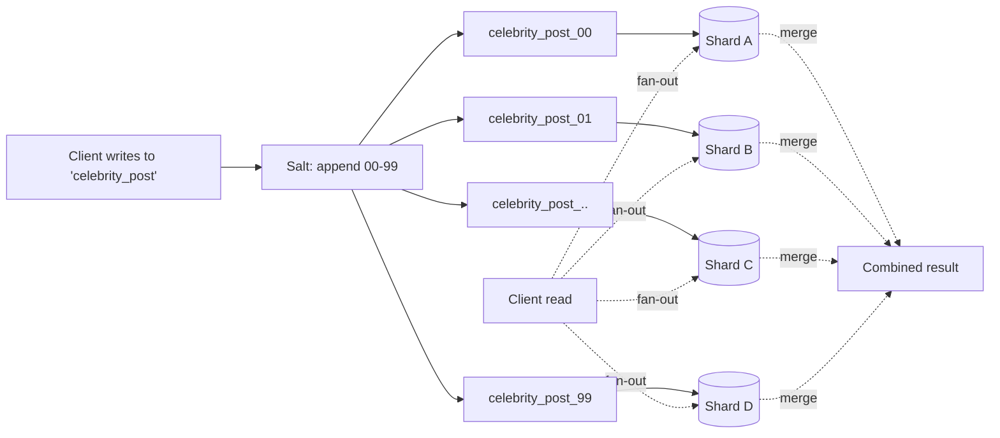

# Skewed Workloads and Hot Spots

> **One-sentence summary.** Hashing distributes *keys* evenly across shards, but it cannot distribute *load* evenly when a single key (a celebrity, a viral post) attracts a disproportionate share of traffic — the shard that owns that key becomes a hot spot regardless of how clever the hash function is.

## How It Works

Hash-based sharding assumes a reasonable request distribution across keys: if keys are uniformly busy, assigning them uniformly to shards gives uniform load. Real workloads break that assumption. On social platforms, the partition key is often a user ID or post ID, and a celebrity posting to millions of followers triggers a storm of reads and writes against one key. No hash function can split a single key — so one shard saturates while the rest sit idle. Twitter famously had to dedicate a disproportionate slice of infrastructure to its most-followed accounts.

Three mitigation patterns are commonly combined:

1. **Isolate the hot key.** Range-based sharding (or a range-of-hashes scheme) can place a single key in its own shard, potentially on a dedicated machine. The rest of the keyspace is undisturbed.
2. **Application-level key salting.** Append 2 random digits to the hot key on write, producing `hot_key_00` through `hot_key_99`. Writes now spread across 100 synthetic keys, which hash to different shards. Reads must fan out to all 100 and merge results.
3. **Automated heat management.** Cloud databases track per-key and per-shard load, then split or migrate hot shards automatically — DynamoDB calls this *adaptive capacity*.

Load changes over time: a viral post runs hot for 48 hours then cools. Some keys are write-hot (comment counters), others are read-hot (trending article bodies). Static mitigations become liabilities once the traffic moves on, so any serious solution needs a promotion/demotion process for hot keys.

## When to Use

- **One key dominates writes.** A counter on a trending post, or event logs tagged by a single device ID — salt the key to parallelize writes.
- **One key dominates reads.** Cache the value aggressively or replicate the shard; salting does not help reads and may hurt them.
- **Predictable surge events.** Black Friday, ticket drops, live-streamed finals — pre-split shards or pre-salt keys before traffic arrives rather than discovering the skew under fire.

## Trade-offs

| Aspect | Advantage | Disadvantage |
|--------|-----------|--------------|
| Dedicated shard for hot key | Clean isolation, no app changes | Requires range-aware sharding; manual identification of hot keys |
| App-level salting (e.g., 2 digits) | Scales writes linearly across 100 shards | Reads become fan-out+merge; only helps writes; bookkeeping to know which keys are salted |
| Automated heat management | Self-healing, no app changes | Opaque, cloud-lock-in, can react too slowly for flash crowds |
| Salt everything prophylactically | Simple mental model | Massive read amplification for keys that were never hot |

## Real-World Examples

- **DynamoDB adaptive capacity / heat management**: Continuously monitors per-partition throughput and silently re-splits or re-homes hot partitions so tenants do not hit throttling on a single hot key.
- **Twitter's celebrity handling**: Dedicates extra fan-out and caching paths for accounts with very large follower counts — treating them as a distinct class rather than generic users.
- **Facebook Shard Manager**: Automates placement and rebalancing of shards across millions of machines, incorporating load signals, not just data size.
- **Cassandra / ScyllaDB applications**: Practitioners manually salt known hot rows (e.g., time-series ingestion for a single popular sensor) to avoid single-partition hotspots.

## Common Pitfalls

- **Salting indiscriminately**: Adding random suffixes to every key turns every read into a 100-way fan-out. Reserve salting for the small tail of keys that actually need it.
- **Ignoring read-skew**: Salting solves write concentration. If the problem is a million reads per second on one key, you need replication or caching in front of the shard, not more write keys.
- **Static shard assignments for dynamic workloads**: Yesterday's celebrity may not be today's. Without a process to demote cold keys and promote newly hot ones, isolation decisions rot quickly.
- **Reacting, not predicting**: Automated heat management has minutes of lag. For known events (product launches, sports finals) pre-warm and pre-split instead of waiting for alarms.
- **Confusing data skew with load skew**: Even perfectly balanced data volumes can produce wildly imbalanced CPU and network load. Measure request rates per key, not just bytes per shard.

## See Also

- [[03-hash-based-sharding]] — the uniformity that fails here
- [[02-key-range-sharding]] — enables isolating a single hot key
- [[05-rebalancing-strategies]] — the mechanism that moves hot shards to cooler nodes
