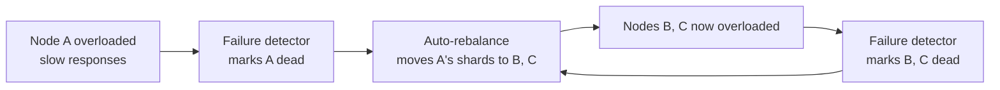

# Automatic vs. Manual Rebalancing

> **One-sentence summary.** Choosing when to move shards between nodes trades operational convenience against the risk of cascading failures when automation reacts to transient overload.

## How It Works

Rebalancing is the act of splitting a shard, moving it to a different node, or reassigning leadership — triggered when nodes are added, removed, fail, or become hot. The design question is *who pulls the trigger*: the cluster itself, or a human operator. Three modes exist along a spectrum:

1. **Fully automatic.** The cluster detects load or failure and moves shards with no human input. DynamoDB auto-adds and removes shards within minutes as workload shifts.
2. **Suggested-but-confirmed.** The cluster proposes a new shard assignment; an administrator reviews and commits it. Couchbase and Riak work this way.
3. **Fully manual.** An operator decides which shards move where and issues the commands. Many older Vitess-style and on-prem deployments run this way.

The central hazard is the feedback loop between **automatic failure detection** and **automatic rebalancing**. A transiently slow node gets marked dead, the cluster reshuffles its load onto neighbors, the neighbors slow down under the extra pressure, they get marked dead too, and so on.

Rebalancing itself is expensive: large data volumes move over the network, request routing tables must update, and the system must keep serving writes the whole time. Near peak write throughput, the shard split may not even keep up with the incoming write rate.

## When to Use

- **Fully automatic**: cloud-managed databases where operators aren't on call, workloads are elastic, and SLAs demand minute-scale autoscaling (DynamoDB, BigTable-style services).
- **Suggested-but-confirmed**: self-hosted clusters where the team wants planning help but not surprise midnight reshuffles (Couchbase, Riak).
- **Fully manual**: latency-sensitive systems, or when operators know an event is coming — Cyber Monday, ticket drops, World Cup kickoff — and want to **preemptively** rebalance before the surge arrives.

## Trade-offs

| Aspect | Fully automatic | Suggested-but-confirmed | Fully manual |
|--------|-----------------|-------------------------|--------------|
| Operational convenience | High — no human needed | Medium — human approves | Low — human plans every move |
| Responsiveness to load shifts | Minutes | Hours (approval latency) | Hours to days |
| Risk of cascading failure | High if combined with auto-failure-detection | Low — human sanity-checks | Very low |
| Handles unexpected spikes | Yes | Partial | Poorly |
| Predictability for operators | Low — moves at surprising times | High | Highest |
| Preemptive rebalancing for known events | Awkward (fights autoscaler) | Easy | Easy |

## Real-World Examples

- **DynamoDB**: fully automatic. Adds and removes shards within minutes to adapt to big load changes — possible because AWS controls the entire stack and invests heavily in safe automation.
- **Couchbase and Riak**: generate a proposed shard map automatically, but require an admin to commit it. Catches bad moves before they happen.
- **Older Vitess deployments and bare-metal clusters**: fully manual reshards, often scripted but explicitly triggered. Slower, but no 3 a.m. cascading rebalance.
- **HBase / SolrCloud**: use ZooKeeper to track assignments; the *mechanism* is automatic but the *decision* to split regions can be policy-driven or admin-triggered.

## Common Pitfalls

- **Combining automatic failure detection with automatic rebalancing without rate-limits.** One slow node triggers a reshuffle, which overloads neighbors, which triggers more reshuffles. Add cooldowns, concurrent-move caps, and hysteresis on "node dead" decisions.
- **Rebalancing during peak traffic.** Data migration steals network bandwidth and CPU from user requests. If you must auto-rebalance, throttle the move rate; prefer to rebalance in off-peak windows.
- **Assuming the shard split can keep up.** Near max write throughput, the source shard keeps accepting writes faster than the migration can copy them. Plan capacity with headroom — don't rely on rebalancing to save you from being already-saturated.
- **No preemptive option.** Pure autoscalers react *after* load arrives; for known events (ticket drops, sale launches), provision shards ahead of time rather than letting the autoscaler chase the spike.
- **Invisible reshuffles.** Fully automatic systems that don't emit clear observability make post-incident analysis hard — operators can't tell whether a latency spike was the workload or a rebalance.

## See Also

- [[03-hash-based-sharding]] — hash sharding determines what gets moved during a rebalance
- [[02-key-range-sharding]] — range sharding makes splits cheap but concentrates hot ranges
- [[04-skewed-workloads-and-hot-spots]] — the hot shard problem that often triggers rebalancing in the first place
- [[06-request-routing]] — how clients find shards after they move
