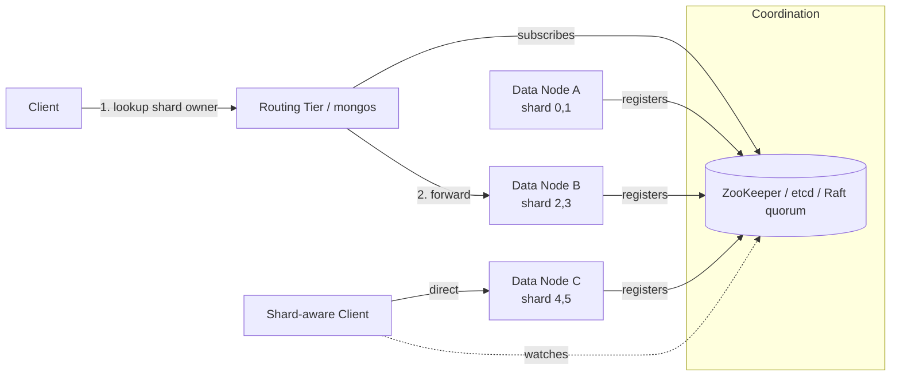

# Request Routing and Coordination Services

> **One-sentence summary.** Once data is split across shards, every client request must be steered to a node that replicates the shard owning the key, and doing that reliably requires an authoritative, constantly-updated shard-to-node map — usually held in a consensus-based coordination service.

## How It Works

Request routing is a specialised form of service discovery. A stateless app server can take traffic from any load balancer because any instance is interchangeable; a sharded database cannot, because a request for key `K` can only be served by a node that holds a replica of the shard owning `K`. The routing layer therefore needs two pieces of knowledge: the function `key → shard` (fixed by the sharding scheme) and the mapping `shard → nodes` (which changes as rebalancing, failures, and scaling events happen).

There are three canonical topologies for doing this:

1. **Any-node forwarding.** A client (often via a round-robin DNS or L4 LB) connects to an arbitrary node. If that node owns the shard, it handles the request; otherwise it proxies to the correct owner and relays the reply. Cassandra and Riak operate this way.
2. **Routing tier.** A dedicated, shard-aware proxy sits between clients and data nodes. It stores no data; it only looks up the shard, picks a replica, and forwards. MongoDB's `mongos` is the textbook example.
3. **Shard-aware client.** The client library holds the shard map directly and connects straight to the owning node — no extra hop. Kafka producers and many Raft-backed drivers (TiDB, YugabyteDB, ScyllaDB) work like this.

Regardless of topology, *somebody* has to be the authoritative source of the shard map, and everyone else has to subscribe to its changes. That role is typically played by a coordination service using a consensus protocol so that a single, agreed-upon mapping survives coordinator failover without split-brain.

The coordinator answers three sub-problems baked into routing:

- **Who decides shard placement?** A single coordinator is simplest, but it must fail over without two contradictory coordinators writing assignments simultaneously — exactly what consensus prevents.
- **How do routers learn of changes?** Routers, clients, or any-node peers *subscribe* (ZooKeeper watches, etcd watches, Raft followers) and receive notifications when ownership moves.
- **How are cutover requests handled?** While a shard is migrating, requests may still hit the old owner. The old node typically forwards, rejects with a redirect (`MOVED` in Redis Cluster), or waits until the new owner's view is confirmed committed in the coordinator.

DNS is usually still involved, but only for the slower-changing step of translating node IDs to IP addresses — it is not the authority on shard ownership.

## When to Use

- **Shared coordination service (ZooKeeper/etcd):** You run many independent services that all need a strongly-consistent metadata store and are willing to pay the operational cost of a separate quorum.
- **Built-in Raft:** You want to ship a single binary without the extra dependency, and the database already embeds Raft for other reasons (log replication, config changes).
- **Gossip:** You run a leaderless, AP-leaning store where temporary disagreement about ownership is tolerable and lower operational complexity matters more than strict consistency.

## Trade-offs

| Aspect | Consensus coordinator (ZK/etcd/Raft) | Gossip (Riak) |
|---|---|---|
| Consistency of map | Linearizable — single truth | Eventually consistent — split-brain possible |
| Failure handling | Majority quorum required to write | Keeps working under partitions |
| Operational cost | Extra cluster to run and tune | No extra service |
| Fit | CP stores, strict leaders | AP, leaderless stores |

| Topology | Latency | Client complexity | Network hops |
|---|---|---|---|
| Any-node forwarding | Extra hop on miss | Trivial client | 1–2 |
| Routing tier | Always one extra hop | Trivial client | Always 2 |
| Shard-aware client | Best (direct) | Fat client; map caching logic | 1 |

## Real-World Examples

- **HBase, SolrCloud:** use ZooKeeper as the shard registry.
- **Kubernetes:** uses etcd to track which service instance runs where — the same pattern applied to stateless pods.
- **MongoDB:** runs a dedicated *config server* replica set plus `mongos` daemons as the routing tier.
- **Kafka, YugabyteDB, TiDB, ScyllaDB:** embed Raft directly so no separate ZooKeeper/etcd is needed (Kafka's KRaft replaced its earlier ZooKeeper dependency for exactly this reason).
- **Riak:** uses gossip among nodes; accepts possible split-brain because its leaderless replication model already offers only weak consistency.

## Common Pitfalls

- **Split-brain on coordinator failover.** Using a single coordinator without consensus (or with a sloppy lease protocol) lets two coordinators issue conflicting shard assignments — clients end up writing to the wrong owner.
- **Stale routing cache during cutover.** Shard-aware clients cache the map for performance; if they don't refresh on redirect/reject signals, they keep hammering the old owner after a move.
- **In-flight requests at the boundary.** Without an explicit handoff protocol, writes mid-migration can be applied on the old node, lost, or double-applied on the new node.
- **Treating DNS as the routing layer.** DNS TTLs are seconds-to-minutes; shard ownership can change faster. DNS is only safe for node-address lookup, not shard placement.
- **Gossip on a CP store.** Adopting Riak-style gossip in a system that advertises strong consistency leaks split-brain bugs up to the application.

## See Also

- [[05-rebalancing-strategies]] — changes the very map that routing must propagate.
- [[03-hash-based-sharding]] — determines the `key → shard` half of the lookup.
- [[01-sharding-fundamentals-and-multitenancy]] — why routing exists at all.
