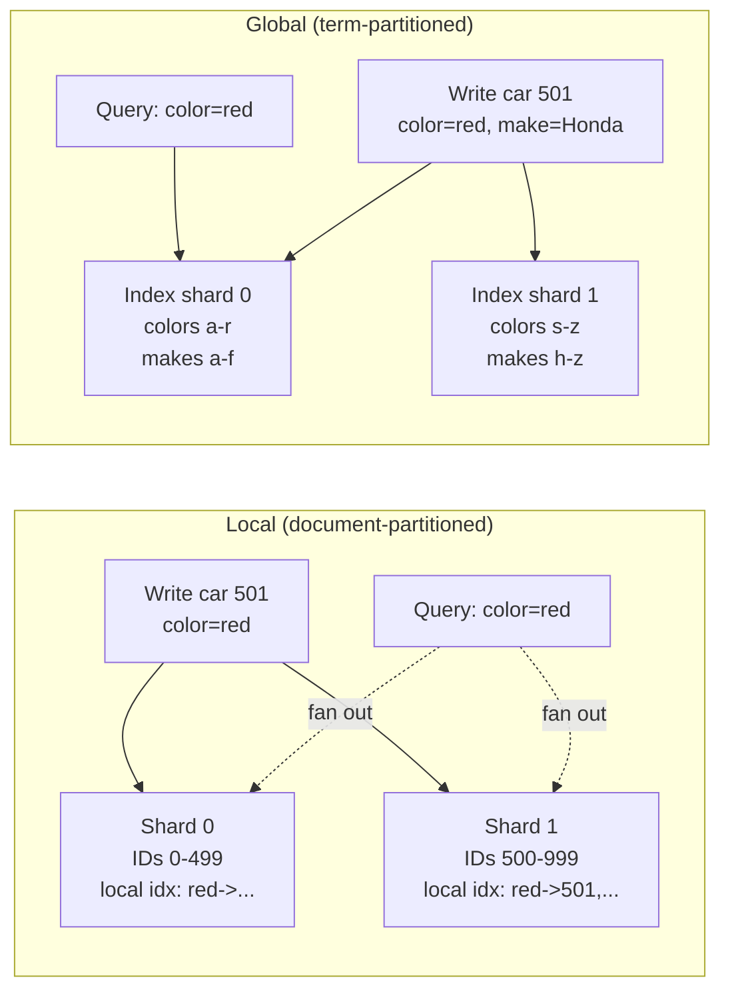

# Sharding and Secondary Indexes

> **One-sentence summary.** Secondary indexes don't align with primary-key shards: *local* (document-partitioned) indexes make writes cheap but force reads to fan out to every shard, while *global* (term-partitioned) indexes make reads cheap but force writes to fan out across many shards.

## How It Works

Key-based sharding assumes the client already knows the partition key. Given a user ID, the router computes its shard and sends the request to one node. But many real queries start with a *value*, not a key: "find all red cars," "find all articles containing `hogwash`." That is what a **secondary index** is for, and a secondary index does not naturally align with the primary-key shards. There are two ways to resolve this mismatch.

A **local secondary index** (also called *document-partitioned*) lives inside each shard and only indexes the records stored there. Writing one row touches one shard — that shard updates its own index entries. Reads, on the other hand, must be *scattered* to every shard and the results *gathered*, because matching records could be anywhere.

A **global secondary index** (also called *term-partitioned*) is itself a sharded data structure, but partitioned by the **indexed term** rather than the primary key. All postings for `color=red` live on one index shard, regardless of which primary shard holds the underlying rows. A single-term read is now a one-shard lookup, but a single row write can dirty many index shards at once.

## When to Use

- **Local indexes** fit write-heavy workloads where queries usually include the partition key (so the scatter is avoided) or where approximate / top-k answers are acceptable and you can stop after a few shards respond.
- **Global indexes** fit read-heavy workloads with selective single-term filters, especially when read latency matters more than write latency and the system can tolerate asynchronous (eventually consistent) index updates.
- **Manual app-level indexes** (hand-rolled value → ID maps on top of a key-value store) are a last resort — they only make sense if the underlying store truly has no secondary-index support and you are prepared to handle consistency yourself.

## Trade-offs

| Aspect            | Local (document-partitioned)                                    | Global (term-partitioned)                                                    |
|-------------------|-----------------------------------------------------------------|------------------------------------------------------------------------------|
| Write cost        | 1 shard (cheap)                                                 | N shards (one per distinct term touched)                                     |
| Read cost         | Scatter to **all** shards, gather + merge                       | 1 shard for the postings list (+ N more to fetch full records)               |
| Read throughput   | Does **not** scale with shard count — every shard sees every query | Scales with shard count for single-term queries                           |
| Tail latency      | High: slowest shard dominates (tail-latency amplification)      | Low for single-term reads; worse for AND across shards                       |
| Consistency       | Easy to keep index in sync — single-shard write                 | Needs distributed transaction *or* async replication (→ stale reads)         |
| Multi-condition AND | Each shard evaluates locally, then results merged             | Postings lists live on different shards → network intersection cost          |

## Real-World Examples

- **MongoDB, Riak, Cassandra, Elasticsearch, SolrCloud, VoltDB**: local (document-partitioned) secondary indexes. Good fit for ingest-heavy workloads and full-text search where scatter-gather is already the query model.
- **CockroachDB, TiDB, YugabyteDB**: global (term-partitioned) secondary indexes, kept consistent with the primary data via distributed transactions.
- **DynamoDB**: offers **both**. Local secondary indexes share a partition with the base table; global secondary indexes are sharded independently and updated **asynchronously**, so a write that just succeeded on the base table may not yet be visible in the global index.

## Common Pitfalls

- **Assuming adding shards scales query throughput with a local index.** It doesn't if every query still has to touch every shard — you have only scaled storage, not read QPS.
- **Ignoring tail latency in scatter-gather.** With 20 shards and p99 = 100 ms per shard, the query's p99 is closer to the 99.95th percentile of one shard. Outliers compound.
- **Silently stale global indexes.** DynamoDB-style async index updates mean read-your-own-writes does *not* hold through a global secondary index; plan for it in your consistency contract.
- **Unbounded postings lists for multi-term AND.** `color=red AND make=Honda` on a global index forces the system to ship two potentially huge lists to one node and intersect them. Selective first-term filtering, bloom filters, or bitmap intersections mitigate this — otherwise the network cost dominates.
- **Hand-rolled secondary indexes in application code.** Race conditions and partial failures easily desync the index from the data. If you must do it, wrap it in a multi-object transaction; better, pick a database that supports it natively.
- **Treating index writes as free.** Every global-index term added to a row is an extra cross-shard write. A document with 10 indexed fields can fan out a single logical write into 10+ physical ones.

## See Also

- [[02-key-range-sharding]] — how primary-key shards are laid out in ranges
- [[03-hash-based-sharding]] — the alternative primary-key partitioning scheme; both leave secondary indexes as an open question
- [[06-request-routing]] — the routing tier is what turns a scatter-gather query into parallel per-shard requests
