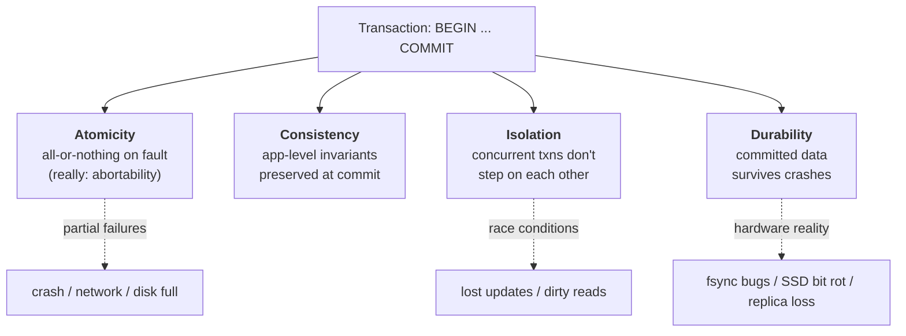

# ACID Properties and the Meaning of a Transaction

> **One-sentence summary.** ACID — atomicity, consistency, isolation, durability — is the classic vocabulary for transactional safety, but each letter is subtle enough that "ACID compliant" tells you almost nothing until you pin down *which* guarantees the implementation actually makes.

## How It Works

A transaction is a group of reads and writes that the database treats as a single unit: either the whole thing takes effect, or none of it does. The ACID acronym (Härder & Reuter, 1983) packages four guarantees that a transactional system is expected to provide. The trap is that each letter hides a very different problem, and different databases enforce them to wildly different degrees.

- **Atomicity** is *not* about concurrency — that's isolation. It is about what happens when a sequence of writes is interrupted halfway through (crash, constraint violation, network drop). The transaction is aborted and every write it made is discarded. *Abortability* would have been a more honest name: the useful property is that a failed transaction leaves no trace, so the client can safely retry.
- **Consistency** is the odd one out. It refers to application-specific invariants — credits equal debits, a username is unique, foreign keys resolve. The database can *help* enforce these via constraints, triggers, or materialised views, but most real invariants are the application's responsibility. Consistency is a property of how the application uses the database, not of the database alone. The "C" arguably doesn't belong in ACID.
- **Isolation** is formally *serializability*: concurrent transactions must produce a result equivalent to some serial order. In practice serializability is expensive, so almost every production database offers weaker levels — read committed, snapshot isolation, repeatable read — that permit specific race conditions. Oracle's "serializable" is actually snapshot isolation.
- **Durability** once meant writing to tape, then to disk via `fsync`, and today often means replication to N nodes. None of these is absolute. `fsync` was misused by PostgreSQL for two decades; SSDs can violate flush semantics under power loss; disk firmware bricks drives after 32,768 hours; correlated failures take out all replicas; bit rot silently corrupts bytes at rest. Durability is a stack of risk-reduction techniques, not a guarantee.

Atomicity and isolation also apply to *single-object* writes: a 20 kB JSON blob should never be left half-written, and a concurrent reader should never observe a torn value. Multi-object transactions extend those guarantees across rows, tables, and indexes — usually scoped to a TCP connection between `BEGIN` and `COMMIT`.

## When to Use

- **Financial ledgers and inventory**: any domain where an invariant spans rows (debits = credits, stock ≥ 0, one-seat-per-ticket). Without atomicity + isolation, partial failures produce money that appears or disappears.
- **Denormalised multi-object writes**: an email counter kept in sync with an emails table, a secondary index kept in sync with its base table, a graph edge with its endpoints. The moment two physical writes must logically happen together, you want a transaction.
- **Constraints enforced across rows**: uniqueness of a username, foreign keys that must resolve, cycle checks in a graph.

You can often skip transactions for single-object writes (the storage engine already guarantees atomicity + isolation per key), append-only logs, best-effort analytics ingestion, or caches where staleness is acceptable.

## Trade-offs

| Aspect | Advantage | Disadvantage |
|---|---|---|
| ACID vs BASE | Strong invariants, safe retries, simpler app code | Higher latency, coordination cost, harder to scale naively |
| Serializable isolation | No concurrency anomalies | Significant throughput penalty; most DBs default to weaker levels |
| Single-object atomic ops (CAS, atomic increment) | Cheap, scale well in NoSQL/leaderless systems | Can't span rows — easy to corrupt denormalised data |
| Multi-object transactions | Keep related data in sync | Require connection-scoped or 2PC-style coordination |
| Replication as durability | Survives single-node loss, stays available | Async replication loses recent writes on failover |
| `fsync`-based durability | Survives OS crashes | One machine failure = unavailability until recovery; fsync itself is buggy |

## Real-World Examples

- **PostgreSQL / MySQL (InnoDB) / Oracle / SQL Server**: classic ACID with multi-object transactions, though each ships a different default isolation level — PostgreSQL and Oracle default to read committed; Oracle's "serializable" is really snapshot isolation.
- **Cassandra / ScyllaDB / DynamoDB**: primarily "best effort" writes plus single-object lightweight transactions or conditional writes (compare-and-set). No multi-object atomicity — applications must compensate.
- **Spanner / CockroachDB / FoundationDB / TiDB / YugabyteDB**: NewSQL systems that deliver ACID at scale by layering transactions over sharding + consensus (Paxos/Raft), disproving the 2010s belief that transactions don't scale.

## Common Pitfalls

- **"ACID compliant" as a checkbox.** Always ask *which* isolation level is the default, and what `SERIALIZABLE` actually means in that product. Two ACID databases can allow different race conditions.
- **Treating consistency as the database's job.** Unless an invariant is expressed as a constraint, trigger, or materialised view, the database will happily let you violate it. Schema design is part of correctness.
- **ORMs that don't retry aborts.** Rails ActiveRecord and Django let aborted transactions bubble up as exceptions, discarding user input. The whole point of abortability is *safe retry* — you have to wire it up, ideally with bounded retries and exponential backoff, and only for transient errors.
- **Assuming `fsync` means "on disk".** It often doesn't on consumer SSDs under power loss, and even server-grade stacks have had bugs for years.
- **Forgetting side effects.** Retrying an aborted transaction that already sent an email sends it twice. External effects need idempotency keys or two-phase commit, not just a retry loop.

## See Also

- [[02-read-committed-isolation]] — the weakest isolation level most production databases actually ship, and what "no dirty reads / no dirty writes" really buys you.
- [[03-snapshot-isolation-mvcc]] — the next step up, using multi-version concurrency control; Oracle's real "serializable" and PostgreSQL's `REPEATABLE READ`.
