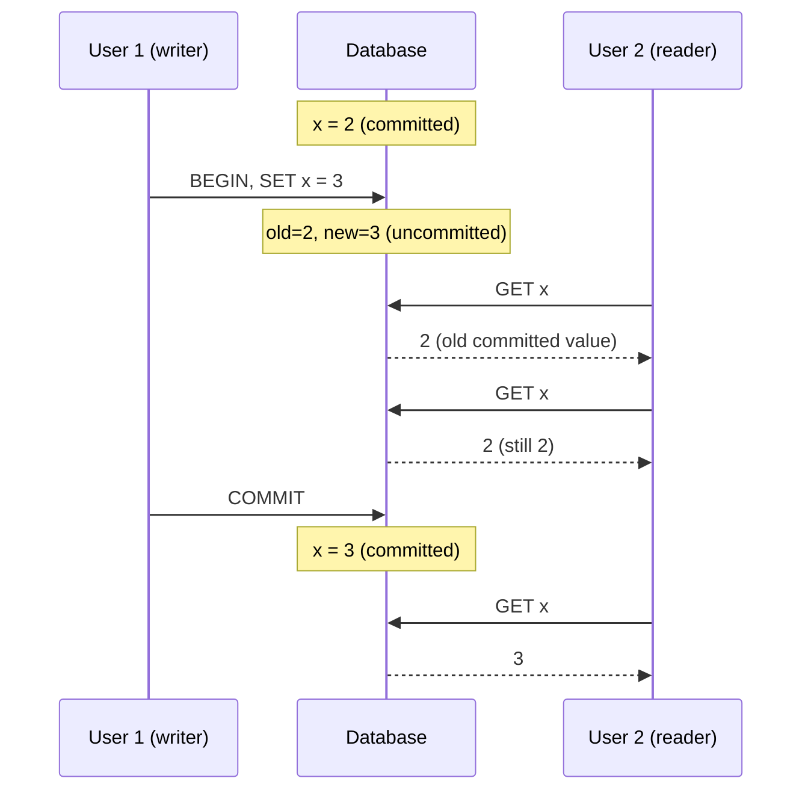

# Read Committed Isolation

> **One-sentence summary.** The most basic practical isolation level: readers never see uncommitted writes (no dirty reads) and writers never stomp on uncommitted writes (no dirty writes).

## How It Works

Read committed makes two promises. First, a transaction only sees data that has already been committed by other transactions — never a half-written value from a peer still in flight. Second, a transaction can only overwrite values that have already been committed — concurrent writers to the same row are serialized.

The **no dirty writes** guarantee is almost always implemented with **row-level exclusive locks**. When transaction T1 wants to modify row R, it grabs R's write lock and holds it until commit or abort. Any other transaction that tries to write R must queue behind T1. This prevents the "used car sale" class of bug where two transactions interleave updates to different rows (listing vs. invoice) and produce a mutually inconsistent result.

The **no dirty reads** guarantee has two common implementations:

1. **Read locks** — require readers to briefly acquire the row's lock, blocking them while a writer holds it. Simple, but a single long-running write transaction stalls every reader touching that row. Rarely used today; IBM Db2 and SQL Server with `read_committed_snapshot=off` still do this.
2. **Two-version bookkeeping** — for every row under active write, the database keeps both the old committed value and the new pending value side-by-side. Readers get the old value until the writer commits, at which point everyone flips to the new one. Readers never block, writers never block readers. This is the dominant approach.

## When to Use

- **Default OLTP workloads** where occasional read skew is tolerable — dashboards, CRUD apps, the unread-email counter where a brief inconsistency is cosmetic.
- **High-concurrency read-heavy systems** on databases whose default is read committed (Postgres, Oracle, SQL Server) — you already get it for free and rarely need to think about it.
- **Not appropriate** for queries that depend on cross-row invariants — sum of account balances, referential checks, anything where reading two rows at slightly different points in time can mislead the application. Reach for [[03-snapshot-isolation-mvcc]] there.

## Trade-offs

| Aspect | Advantage | Disadvantage |
|---|---|---|
| Dirty reads | Prevented — no cascading aborts, no observing rolled-back data | — |
| Dirty writes | Prevented — conflicting multi-row updates can't be mixed up (the car-sale case) | Write locks can delay concurrent writers to hot rows |
| Read skew (nonrepeatable reads) | — | **Not prevented** — reading the same row twice can return different values mid-transaction |
| Lost updates | — | **Not prevented** — concurrent read-modify-write (e.g., counter increments) can silently lose one update |
| Write skew & phantoms | — | **Not prevented** — needs serializable isolation |
| Performance | Cheap; two-version storage is lightweight | Long writes still delay same-row writers |

## Real-World Examples

- **PostgreSQL**: default isolation level; uses multi-version storage so readers never block.
- **Oracle**: default isolation level; also multi-version.
- **SQL Server**: default is read committed; uses read locks unless `READ_COMMITTED_SNAPSHOT=ON`, which switches to versioned reads.
- **IBM Db2**: uses read locks to prevent dirty reads, making it simpler but vulnerable to reader/writer blocking under long-running writes.
- **Read uncommitted** (even weaker — allows dirty reads): supported by some engines as a performance mode, but rarely worth the footgun.

## Common Pitfalls

- **Assuming it protects financial invariants.** A balance-transfer read run at read committed can see the "before" value of one account and the "after" value of another, making the totals appear wrong. Use snapshot isolation.
- **Assuming it prevents lost updates.** Two transactions running `counter = counter + 1` both read the committed value, both increment, both write. Neither is a dirty write (each waits for the other's commit), but one increment vanishes. Needs atomic increments, explicit locks (`SELECT ... FOR UPDATE`), or compare-and-set.
- **Conflating "read committed" with "consistent snapshot."** Each individual statement in a read-committed transaction sees a fresh view; different statements in the same transaction can see different states.
- **Reaching for read uncommitted to "improve performance."** It trades dirty reads and cascading aborts for a marginal speedup that versioned read committed already delivers. Almost never the right call.

## See Also

- [[01-acid-properties]] — read committed is one concrete setting of the "I" in ACID.
- [[03-snapshot-isolation-mvcc]] — the next stronger level, which generalizes the two-version trick to give each transaction a consistent snapshot and fixes read skew.
