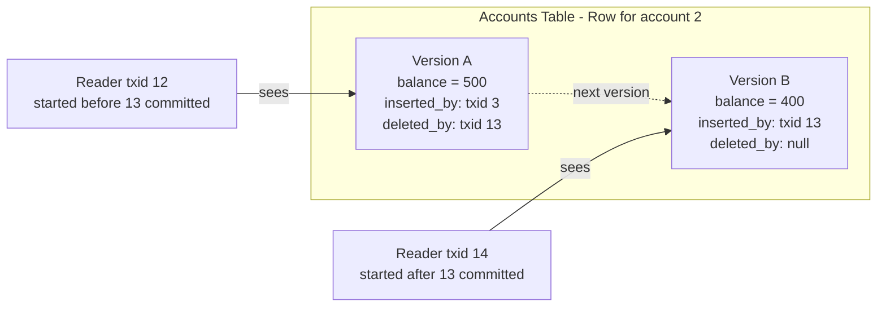

# Snapshot Isolation and Multiversion Concurrency Control

> **One-sentence summary.** Each transaction reads from a frozen point-in-time view of the database, implemented by keeping multiple row versions tagged with transaction IDs so that readers never block writers and writers never block readers.

## How It Works

Read-committed isolation still admits a subtle bug called *read skew*. Imagine Aaliyah has $1,000 split across two savings accounts ($500 each). A concurrent transfer moves $100 from account 1 to account 2. If Aaliyah's balance-listing transaction reads account 1 *before* the transfer commits and account 2 *after* it commits, she sees $500 + $400 = $900. One hundred dollars appears to have vanished. The read is not technically inconsistent under read committed — both values were committed when read — but the combined view is incoherent. This is intolerable for backups, analytical scans, and integrity checks that span many rows.

Snapshot isolation fixes this by giving each transaction a *consistent snapshot* of the database as it existed the moment the transaction started. Subsequent commits by other transactions are invisible to it, no matter how long the reading transaction runs.

The standard implementation is **multiversion concurrency control (MVCC)**. Each row keeps not just one value but a chain of versions, each tagged with an `inserted_by` transaction ID and (once deleted or overwritten) a `deleted_by` transaction ID. An update is internally a delete + insert, so the old version survives alongside the new one. Write locks still serialize concurrent writers to the same row, but **reads take no locks** — they simply walk the version chain and apply visibility rules.

A row version is visible to a reader iff:

1. The writer that inserted it committed **before** the reader's transaction started.
2. The writer is **not** in the reader's list of in-progress transactions (captured at start).
3. Either the row is not marked deleted, or the deleter had not yet committed when the reader started.
4. The writer did not later abort.

Transaction 12 sees the old $500 row because txid 13 had not yet committed when txid 12 started; it ignores both the deletion and the insertion made by txid 13. Transaction 14 started after 13 committed, so it sees only the $400 row. Neither reader blocks the writer, and the writer does not block either reader.

Indexes point at one version of the row and the version chain is walked to find the visible one. Some engines, like CouchDB and LMDB, side-step version chains entirely by using **immutable B-trees**: every write produces a new root, and each root *is* a snapshot automatically.

## When to Use

- **Long-running read-only queries** — backups, analytical scans, integrity checks, and reporting queries that must see a coherent point-in-time view.
- **Read-heavy OLTP workloads** — any application where you want readers to see consistent state without stalling behind writers.
- **Default for most relational engines** — PostgreSQL, Oracle, SQL Server, MySQL/InnoDB all run most transactions under an MVCC-backed snapshot by default; turning it off is rarely the right answer.

## Trade-offs

| Aspect | Advantage | Disadvantage |
|---|---|---|
| vs [[02-read-committed-isolation]] | Eliminates read skew and nonrepeatable reads; coherent multi-row views | More storage and bookkeeping for version chains |
| vs [[06-serializability-techniques]] | Non-blocking, much better throughput for read-heavy loads | Still permits lost updates and write skew anomalies |
| Concurrency | Readers and writers never block each other | Concurrent writers to the same row still serialize on write locks |
| Storage | Old versions double as an undo log for aborts | Dead versions accumulate until GC/vacuum runs |
| Index cost | Indexes share structure across versions | Queries may walk a chain before finding a visible version |

## Real-World Examples

- **PostgreSQL**: Canonical MVCC implementation; confusingly labels snapshot isolation as "repeatable read."
- **Oracle**: Labels snapshot isolation as "serializable" even though it does not prevent write skew.
- **MySQL (InnoDB)**: Calls it "repeatable read" as well, but the guarantees are weaker than true snapshot isolation.
- **SQL Server**: Offers an explicit `SNAPSHOT` isolation level alongside its lock-based defaults.
- **TiDB, Aurora DSQL**: Choose snapshot isolation as their *highest* offered level.
- **BigQuery** and other cloud warehouses: Use snapshot isolation so analytical scans see a stable point-in-time view.
- **CouchDB, Datomic, LMDB**: Use copy-on-write immutable B-trees — every root is implicitly a snapshot, no visibility rules needed.

## Common Pitfalls

- **Naming confusion.** "Repeatable read" means snapshot isolation in PostgreSQL, weaker MVCC in MySQL, and full serializability in IBM Db2. The SQL standard predates snapshot isolation and doesn't define it, so vendors pick whichever label lets them claim standards compliance. Always read the manual rather than trusting the label.
- **Assuming snapshot isolation prevents all anomalies.** It does *not* stop lost updates or write skew — see [[04-preventing-lost-updates]] and the phantom/write-skew discussion in the chapter. If you need those, you need serializability.
- **Long-running read transactions bloating storage.** Garbage collection cannot remove a row version as long as *any* open transaction might still need to see it. A forgotten idle-in-transaction session can pin dead tuples and blow up table and index size — PostgreSQL's infamous bloat problem.
- **Index-only queries still walking chains.** Even with covering indexes, the engine typically must consult row version metadata to decide visibility, which erodes the speed-up.

## See Also

- [[02-read-committed-isolation]] — the weaker level snapshot isolation is built on; explains why read skew is possible there.
- [[04-preventing-lost-updates]] — race conditions that snapshot isolation alone does *not* fix.
- [[06-serializability-techniques]] — the next level up; Serializable Snapshot Isolation (SSI) layers conflict detection on top of the machinery described here.
