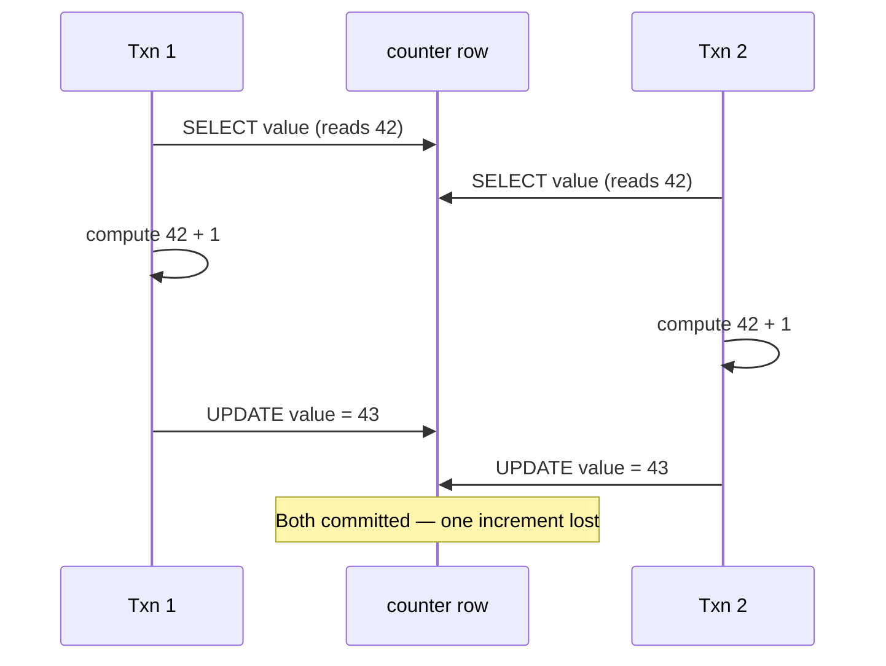

# Preventing Lost Updates

> **One-sentence summary.** When two transactions run overlapping read-modify-write cycles on the same object, one write can silently clobber the other; databases and applications use atomic operations, explicit locks, automatic detection, or compare-and-set to avoid this.

## How It Works

The lost update problem is the write-write race that hides behind every "read something, compute a new value, write it back" pattern: increment a counter, add an element to a JSON array, save an edited wiki page. If two transactions interleave their read-modify-write (RMW) cycles, the second write is based on a stale read and overwrites — *clobbers* — the first write's effect.

Four techniques defuse this race:

1. **Atomic write operations.** Push the whole RMW into the database so it cannot interleave: `UPDATE counters SET value = value + 1 WHERE key = 'foo';`. MongoDB's `$inc`/`$push` and Redis' `INCR`/`LPUSH` do the same for documents and data structures. Implemented either via an exclusive lock on the row during the operation or by serializing all atomic ops on one thread. Best choice whenever the update can be expressed this way.

2. **Explicit locking** — `SELECT ... FOR UPDATE`. Needed when the decision requires application logic that cannot live inside a SQL expression. The canonical example is a multiplayer game: before moving a piece you must validate the move against game rules, which is code, not SQL. The `FOR UPDATE` clause locks the selected rows until the transaction commits, so concurrent movers queue up.

3. **Automatic detection and abort.** Let RMW cycles run in parallel, but have the database track each transaction's read set and abort any transaction whose writes would overwrite data another transaction modified in the meantime. PostgreSQL's *repeatable read*, Oracle's *serializable*, and SQL Server's *snapshot* isolation levels do this for free on top of MVCC. **MySQL/InnoDB repeatable read does not** — a notorious footgun.

4. **Compare-and-set (conditional write).** The optimistic-locking flavor: the update only applies if the row still matches the value (or version number) you read. `UPDATE wiki_pages SET content = 'new' WHERE id = 1234 AND content = 'old';` — if someone else already changed `content`, the affected-row count is zero and the client retries. A monotonically increasing `version` column is the robust form. The database equivalent of a CPU CAS instruction.

## When to Use

| Scenario | Best fit |
|---|---|
| Counter / balance increment | Atomic op (`UPDATE … SET value = value + 1`) |
| JSON sub-document mutation | Atomic op (`$set`, `$push`) or CAS on version |
| Wiki page / document with arbitrary edits | CAS with version column (plus OT/CRDT merge for text) |
| Multiplayer move with rule-checking logic | `SELECT FOR UPDATE` |
| Mostly-reads with rare collisions | Auto-detect on snapshot isolation |

## Trade-offs

| Technique | Advantage | Disadvantage |
|---|---|---|
| Atomic operations | Fast, no retries, hard to misuse | Limited expressiveness; only what the database offers |
| Explicit locks (`FOR UPDATE`) | General; works with any app logic | Deadlock risk, blocks readers/writers, easy to forget a lock |
| Auto-detect + abort | No special code paths; transparent correctness | Requires retry loop in the app; not offered by every DB |
| Compare-and-set | Works without transactions; replica-friendly | App must retry; MVCC visibility gotchas |

## Real-World Examples

- **Redis `INCR`, `LPUSH`; MongoDB `$inc`, `$push`** — atomic operators built for exactly this race.
- **PostgreSQL `SELECT … FOR UPDATE`** — row-level locking for the RMW-with-logic case.
- **PostgreSQL repeatable read, Oracle serializable, SQL Server snapshot** — auto-detect and abort.
- **DynamoDB conditional writes, etcd/Zookeeper `compare-and-swap`, Cassandra LWT** — CAS in distributed KV stores.
- **Git** — a push is rejected unless it is a fast-forward from the ref you last saw: CAS at the protocol level.
- **Cassandra / Dynamo LWW conflict resolution** — the default "last write wins" rule *is prone to lost updates*; concurrent writes are silently discarded. Use CRDTs, conditional writes, or explicit merging instead.

## Common Pitfalls

- **ORM-generated RMW.** ActiveRecord-style code like `counter.value += 1; counter.save` loads, increments in Ruby/Python, and writes back — unsafe. Swap for the database's atomic op.
- **Trusting MySQL/InnoDB repeatable read.** It does not detect lost updates. Use `SELECT FOR UPDATE` or a version-column CAS explicitly.
- **CAS on multi-leader / leaderless replication.** Locks and conditional writes assume a single up-to-date copy; with async replication they do not apply. Use CRDTs or sibling-merge resolution — see [[03-snapshot-isolation-mvcc]] for why MVCC visibility rules add further surprises (UPDATE's WHERE clause sees concurrently-written values that snapshot reads do not).
- **Deadlocks from coarse locking.** Locking many rows in inconsistent orders yields cycles; keep lock order canonical and handle the DB's deadlock-abort by retrying.
- **Forgetting the retry loop.** Both auto-detect and CAS push the retry to the application. No retry, no correctness.

## See Also

- [[03-snapshot-isolation-mvcc]] — the MVCC machinery that powers automatic lost-update detection and shapes the CAS visibility rules.
- [[05-write-skew-and-phantoms]] — the generalized write-write anomaly where two transactions touch *different* rows; auto-detect does not help here.
- [[06-serializability-techniques]] — 2PL, SSI, and serial execution: the strongest guarantees that subsume lost-update prevention.
