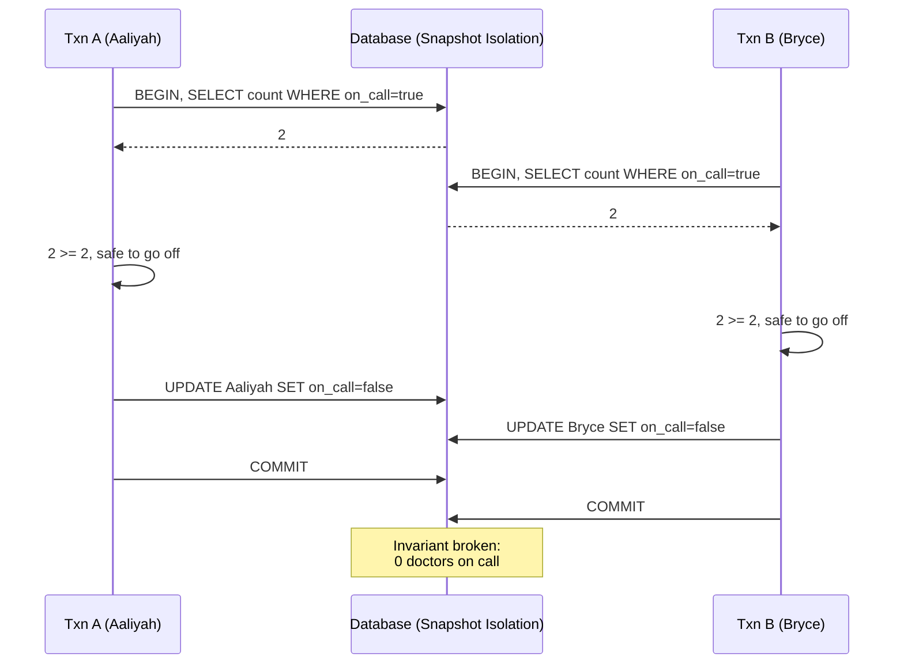

# Write Skew and Phantoms

> **One-sentence summary.** Write skew is a race condition where two concurrent transactions each read an overlapping set of rows, decide an action is safe based on that read, and then write to *different* objects — silently breaking an invariant that depended on the read staying true.

## How It Works

The canonical example is an on-call doctor schedule. A hospital requires at least one doctor on call at all times. Aaliyah and Bryce are both on call, both feel ill, and both click "go off call" at nearly the same instant. Each transaction runs the same three steps:

1. `SELECT COUNT(*) FROM doctors WHERE on_call = true AND shift_id = 1234` — returns 2 in both snapshots.
2. Code decides: "2 ≥ 2, safe to go off."
3. `UPDATE doctors SET on_call = false WHERE name = '...'` — each updates a *different* row.

Both commit. Zero doctors are now on call. The invariant is violated even though each transaction, run alone, would have been correct.

Write skew is a generalisation of the lost-update problem. Lost update is two transactions fighting over the *same* object; write skew is two transactions writing *different* objects whose combined effect breaks a cross-row invariant. A closely related concept is the **phantom**: a write in one transaction that changes the result set of a search query in another. Snapshot isolation hides phantoms from read-only queries, but in read-then-write transactions phantoms are exactly the mechanism by which write skew sneaks in.

## When to Use (i.e., when is this a risk?)

Any read-then-write flow whose correctness depends on a search predicate staying stable between the `SELECT` and the `COMMIT`. Common shapes:

- **Meeting room booking** — check for overlapping bookings, then `INSERT` if none found. Two users booking the same slot concurrently each see "no overlap" and both insert.
- **Multiplayer game moves** — enforce rules like "no two figures on the same square." The lock that prevents moving the *same* figure twice doesn't prevent moving two *different* figures to the same square.
- **Claiming a username** — check for existence, then insert. Two signups for the same name both see "free" and both succeed. A single-column uniqueness constraint is the cleanest fix here.
- **Preventing double-spending** — insert a tentative charge, sum the account, roll back if negative. Two concurrent charges each see a positive balance and commit, leaving the account overdrawn.

## Trade-offs

| Mitigation | Works when | Cost / limitation |
|---|---|---|
| `SELECT ... FOR UPDATE` | The rows to lock already exist (doctor case) | Cannot lock rows that don't exist yet — useless against phantoms |
| Uniqueness / DB constraints | Invariant is single-column (username) | No multi-row invariants; triggers / materialised views get ugly fast |
| Materialising conflicts | Any phantom case, as a last resort | Pre-populate a lock table (e.g. rooms × 15-min slots); leaks concurrency control into the data model |
| Serializable isolation | Always | The cleanest fix, but has throughput / latency cost (see [[06-serializability-techniques]]) |
| Automatic lost-update detection | Same-object conflicts only | Doesn't fire for write skew — different objects are written |

## Real-World Examples

- **PostgreSQL** — Serializable Snapshot Isolation (SSI) detects read-write dependencies and aborts one transaction to prevent write skew. Its "repeatable read" level is really snapshot isolation and does *not* prevent write skew.
- **MySQL / InnoDB** — At serializable isolation, uses next-key locking (gap locks plus row locks) to block phantom inserts that would match a prior range scan.
- **CockroachDB, FoundationDB, YugabyteDB** — Ship SSI as the default, catching write skew without the lock contention of 2PL.
- **Meeting-room booking** — A classic system-design interview prompt precisely because the naive check-then-insert is a textbook write skew under snapshot isolation.

## Common Pitfalls

- **"SELECT FOR UPDATE will save us"** — It only locks rows the query returns. If your check is "is the username free?" and the answer is "yes" (zero rows), there is nothing to lock, so `FOR UPDATE` does nothing.
- **"Snapshot isolation prevents write skew"** — It does not. This trips many teams because PostgreSQL markets snapshot isolation under the name "repeatable read," which sounds strong. SI stops dirty reads, non-repeatable reads, and read phantoms, but leaves write skew wide open.
- **"Automatic lost-update detection will catch it"** — That mechanism compares writes to the *same* object. Write skew writes different objects, so detection never triggers.
- **"A constraint will cover it"** — True for uniqueness on a single column, but most real invariants ("at least one doctor on call," "no overlapping bookings") span multiple rows and have no built-in constraint support.
- **Materialising conflicts without knowing it's a smell** — If you find yourself inventing lock tables in schema, reach for serializable isolation first.

## See Also

- [[03-snapshot-isolation-mvcc]] — explains *why* snapshot isolation alone isn't enough: the snapshot hides concurrent writes, which is exactly what makes the premise go stale.
- [[04-preventing-lost-updates]] — the simpler same-object cousin; techniques like atomic updates and CAS work there but not here.
- [[06-serializability-techniques]] — the real fix: actual serial execution, two-phase locking, or SSI.
