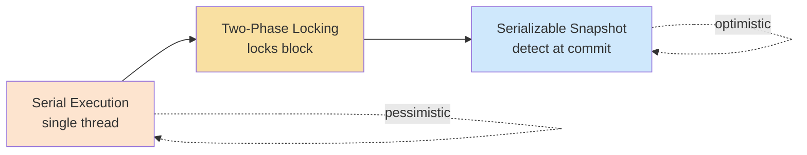

# Serializable Isolation: Serial Execution, 2PL, and SSI

> **One-sentence summary.** Serializable isolation guarantees that concurrent transactions produce a result equivalent to *some* serial ordering, and is implemented in exactly three ways: literal serial execution, pessimistic two-phase locking, and optimistic serializable snapshot isolation.

## How It Works

*Serializable* is the strongest isolation level: the database guarantees that even though transactions run in parallel, the outcome is the same as if they had run one at a time. If each transaction is individually correct, concurrency cannot break the application. Every race condition covered elsewhere in this chapter — lost updates, write skew, phantoms — disappears. Despite decades of research, only three implementation families are used in production.

### Serial Execution

The simplest approach: execute exactly one transaction at a time on a single thread. All conflict detection vanishes because there is no concurrency. Two developments made this viable around 2007: RAM became cheap enough to hold the active dataset in memory, and OLTP workloads are dominated by short transactions. Interactive client/server transactions don't work here — the network round-trips would starve the CPU — so applications submit **stored procedures** that the database runs end-to-end without I/O waits. Used by **VoltDB/H-Store**, **Redis**, and **Datomic**. Throughput is capped at one CPU core per partition, so scaling requires **sharding** such that each transaction touches a single shard. Cross-shard transactions require lockstep coordination and drop to roughly 1,000 TPS in VoltDB — orders of magnitude slower than single-shard writes.

### Two-Phase Locking (2PL)

For 30 years this was the only viable serializable algorithm. Each object has a shared/exclusive lock. Readers acquire shared locks; writers acquire exclusive locks. Unlike snapshot isolation, **readers block writers and writers block readers**. The "two phases" are a *growing* phase (acquire locks as the transaction proceeds) and a *shrinking* phase (release all locks at commit or abort) — once released, no new locks can be acquired. Deadlocks are common and are resolved by automatic detection plus abort-and-retry. To prevent phantoms, 2PL theoretically needs **predicate locks** on query conditions, but those are too slow in practice. Real systems use **index-range locks** (a.k.a. *next-key locks*), which attach a lock to an index entry covering a superset of the matching rows — less precise but vastly cheaper. Used by **MySQL/InnoDB**, **SQL Server** (serializable level), and **Db2** (repeatable-read level).

### Serializable Snapshot Isolation (SSI)

First described in 2008, SSI layers a conflict detector on top of [[03-snapshot-isolation-mvcc]]. Transactions read from their snapshot and write freely; at commit time the database checks whether any serializability violation occurred, and aborts if so. Two detection cases matter:

1. **Stale MVCC reads** — a transaction ignored a concurrent write (MVCC visibility) that later committed. If the reader also writes, its decision was based on an outdated premise, so it aborts.
2. **Writes that affect prior reads** — when a transaction writes, the database checks index entries (the same data structures 2PL uses for range locks) to see which other transactions recently read the affected range. Unlike 2PL, these "locks" are **tripwires**: they don't block, they just record a conflict for the commit check.

Used by **PostgreSQL** (SERIALIZABLE level), **CockroachDB**, **FoundationDB**, **SQL Server Hekaton**, and **BadgerDB**.

## When to Use

- **Serial execution** — when the active dataset fits in RAM, transactions are short, write throughput fits on one core, *and* the workload shards cleanly without cross-shard coordination. VoltDB-style OLTP.
- **2PL** — when correctness is non-negotiable, the application already tolerates lock contention, and you need a mature, well-understood algorithm. Default serializable in most legacy RDBMSs.
- **SSI** — when the workload is read-heavy and write contention is low to moderate. You get snapshot-like read latencies plus full serializability.

## Trade-offs

| Mechanism | Blocks readers? | Blocks writers? | Throughput scaling | Contention sensitivity | Representative systems |
|-----------|-----------------|-----------------|--------------------|-----------------------|------------------------|
| Serial execution | No (one at a time) | No (one at a time) | One core per shard; cross-shard ~1K TPS | Low (no locks) but one slow txn stalls everything | VoltDB, Redis, Datomic |
| Two-phase locking (2PL) | Writers block readers | Readers block writers | Scales with cores, but contention caps it | High — deadlocks, lock waits, tail latency spikes | MySQL/InnoDB, SQL Server, Db2 |
| Serializable Snapshot Isolation (SSI) | No | No (tripwires, not locks) | Can be distributed across machines | Thrashes under high write contention (abort rate climbs) | PostgreSQL, CockroachDB, FoundationDB |

## Real-World Examples

- **VoltDB** — single-threaded serial execution of Java/Groovy stored procedures, sharded per core, deterministic for state-machine replication.
- **MySQL/InnoDB** — classic 2PL with next-key locking; the serializable level is correct but latency-heavy under contention.
- **PostgreSQL** — SSI shipped as the SERIALIZABLE level in 9.1; uses MVCC tracking plus index-based read/write tracking with optimizations to prune unnecessary aborts.
- **FoundationDB** — distributes SSI conflict detection across multiple machines, breaking the single-node throughput ceiling while still providing strict serializability across shards.
- **CockroachDB** — SSI on a distributed KV store, combining MVCC snapshots with per-range conflict tracking.

## Common Pitfalls

- **Confusing 2PL with 2PC.** *Two-phase locking* is a concurrency-control algorithm for **serializability on one node**. *Two-phase commit* ([[07-two-phase-commit-distributed]]) is a protocol for **atomic commit across multiple nodes**. They share only the prefix "two-phase"; they solve different problems and are not interchangeable. Treat them as entirely separate concepts.
- **Expecting SSI to perform well under high write contention.** Optimistic concurrency control thrashes when many transactions race for the same keys — the abort rate climbs, retries pile on, and the system can fall below its nominal throughput. Benchmark at realistic contention before committing.
- **Long-running write transactions in SSI.** A transaction that reads and writes over minutes accumulates conflicts with everything in its window and will almost certainly abort. Keep read-write transactions short; long *read-only* transactions are fine because SSI only aborts readers that also write.
- **Assuming index-range locks match predicate locks exactly.** They lock a *superset* of the predicate — which is why they work (any predicate-matching write hits the index-range lock too) but also why they block more transactions than strictly necessary. Query plans and available indexes affect lock scope; a missing index can force a whole-table lock.
- **Relying on "serializable" across vendors without reading the docs.** Oracle's SERIALIZABLE is actually snapshot isolation (and permits write skew). PostgreSQL's SERIALIZABLE is true SSI. MySQL/InnoDB uses 2PL. The name is not the contract.

## See Also

- [[05-write-skew-and-phantoms]] — the anomalies that serializability exists to prevent
- [[03-snapshot-isolation-mvcc]] — the weaker level SSI builds on and which remains the default in most databases
- [[07-two-phase-commit-distributed]] — the distributed-atomicity complement, **not** the same thing as 2PL despite the similar name
- [[04-preventing-lost-updates]] — the weaker baseline most applications actually run under
