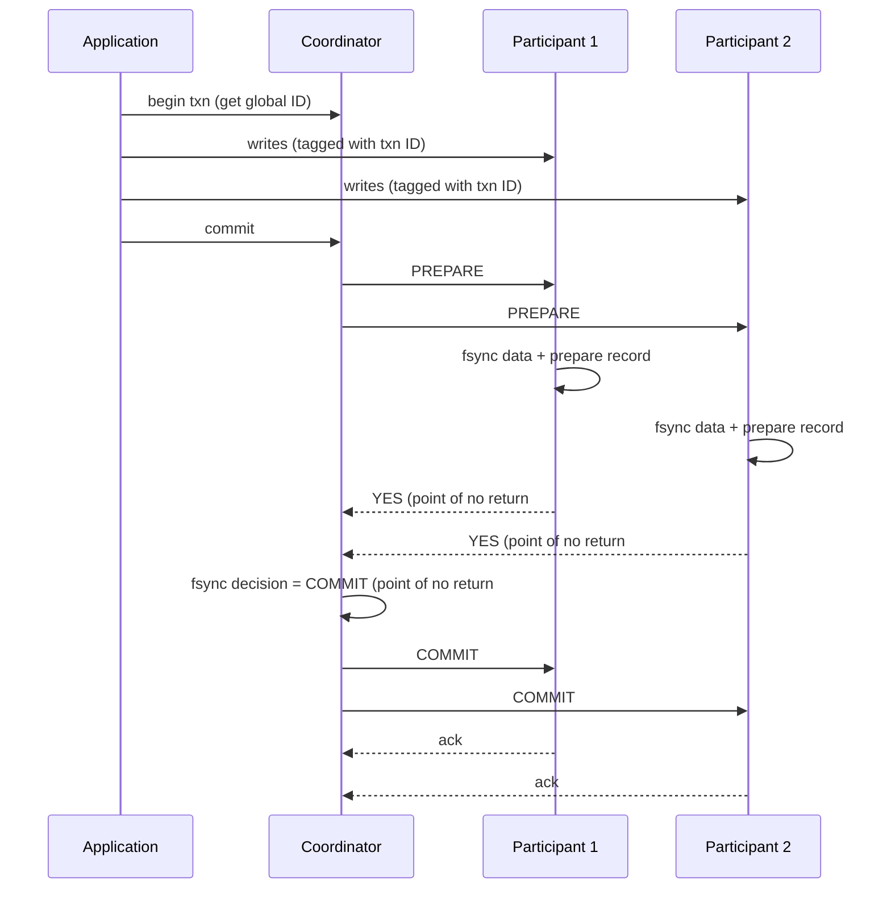

# Two-Phase Commit and Distributed Transactions

> **One-sentence summary.** Two-phase commit (2PC) extends atomicity across multiple nodes by having a coordinator collect "prepare" votes before broadcasting a commit decision — but it blocks on coordinator failure and holds locks while in doubt, which is why heterogeneous XA is largely discouraged while database-internal 2PC (Spanner, CockroachDB, Kafka) thrives.

## How It Works

Atomic commit on a single node reduces to a disk write: the storage engine flushes data, then appends a commit record. The moment the commit record hits disk is the deciding moment — before it, the transaction can still abort; after it, the transaction is durable.

A distributed transaction has no such single moment. Naively sending `COMMIT` to N nodes independently can leave some nodes committed and others aborted. Once a committed write is visible to another transaction (via read-committed or stronger), you cannot retract it — a later abort on a different node would force that reader to unwind too. This is the **atomic commitment problem**: all participants must agree on the same outcome.

2PC introduces a **coordinator** (transaction manager) and splits commit into two phases with two crucial "points of no return":

1. **Prepare phase.** The coordinator sends `PREPARE` to each participant. A participant that votes **yes** must first durably write all transaction data to disk and verify no constraint or conflict will prevent commit. By voting yes, it **surrenders the right to abort** — the first point of no return.
2. **Commit point.** Once all votes are collected, the coordinator writes its decision (commit if unanimous, abort otherwise) to its own transaction log. That disk write is the second point of no return — the decision is irrevocable.
3. **Commit/abort broadcast.** The coordinator sends the outcome to every participant and **retries forever** until each acknowledges. A participant that crashed after voting yes will honor the commit when it recovers, because it already promised.

Those two promises — the participant's yes and the coordinator's durable decision — are what make 2PC atomic. Single-node commit fuses them into one disk write; 2PC separates them, which is both its power and its weakness.

## When to Use

- **Cross-shard writes in a single distributed database.** Spanner, CockroachDB, YugabyteDB, TiDB, FoundationDB, and VoltDB all use 2PC internally for multi-shard transactions.
- **Kafka transactions.** Atomic publish across partitions plus consumer-offset commit, enabling exactly-once stream processing.
- **Heterogeneous XA across a DB and a message broker.** Historically used (Java EE / JTA) for cases like "acknowledge message iff DB write committed" — but widely regarded as operationally painful today.

Cloud services frequently avoid distributed transactions entirely, using idempotent processing instead.

## Trade-offs

| Aspect | Database-Internal 2PC | Heterogeneous XA | No Distributed Txn (Idempotent) |
|--------|----------------------|------------------|----------------------------------|
| Coordinator fault tolerance | Replicated via Raft/Paxos consensus | Single point of failure (often co-located with app) | N/A |
| Cross-system deadlock detection | Yes (unified protocol) | No (lowest common denominator) | N/A |
| Works with SSI | Yes | No | Yes |
| Performance cost | Extra fsyncs + round trips, but optimized | Extra fsyncs + round trips, often severe | Single-node speed + one dedup lookup |
| Lock duration on coordinator crash | Bounded (failover in seconds) | Until admin intervention — possibly forever | No distributed locks held |
| Recovery complexity | Automatic | Manual, sometimes requires heuristic decisions | Trivial (retry is safe) |
| Exactly-once semantics | Native | Native (when all parties support XA) | Via message-ID dedup table |

## Real-World Examples

- **Database-internal 2PC (Spanner, CockroachDB, YugabyteDB, TiDB, FoundationDB, Kafka transactions).** These avoid XA's pathologies by (a) replicating the coordinator with a consensus protocol so failover is automatic, (b) letting coordinators and shards communicate directly instead of through application code, (c) replicating shards so a single fault does not abort transactions, and (d) coupling atomic commit with a distributed concurrency-control protocol that handles deadlocks and consistent reads.
- **XA (heterogeneous).** Java EE / JTA bridging PostgreSQL and ActiveMQ, or MSDTC coordinating SQL Server with MSMQ. The coordinator is often a library inside the application process, whose local disk log becomes part of durable state. When that process dies, locks can be held forever.
- **Idempotent-processing alternative.** Instead of atomically committing a message broker ack and a DB write, record processed message IDs in a table: before handling a message, check the table inside a single-node transaction; if the ID is present, ack and drop. All side effects must be idempotent or also keyed by the message ID. Kafka Streams uses this pattern internally, and it gives exactly-once semantics without any cross-system atomic commit.

## Common Pitfalls

- **2PC is blocking.** A participant that has voted yes but not heard back is **in doubt** — it cannot unilaterally commit (another node might have aborted) and cannot unilaterally abort (another node might have committed). It must wait for the coordinator. If the coordinator's log is lost, it waits forever. This is 2PC's fundamental limitation, not an implementation bug.
- **3PC does not actually fix blocking.** Three-phase commit assumes bounded network delay and bounded process pauses. Real systems have neither, so 3PC cannot guarantee atomicity in practice. The real fix is replacing the coordinator with a fault-tolerant consensus protocol (Chapter 10).
- **Heuristic decisions break atomicity.** XA's "escape hatch" that lets a participant unilaterally commit or abort an in-doubt transaction is literally a euphemism for probably breaking atomicity. Emergency use only — and by then your audit log is already a mess.
- **XA is lowest-common-denominator.** It cannot detect cross-system deadlocks and cannot coexist with [[06-serializability-techniques]] SSI, because both would require a standardized protocol for exchanging lock and conflict metadata across heterogeneous systems.
- **Held locks propagate the outage.** While a transaction is in doubt, its row locks persist. Any other transaction touching those rows blocks too, turning a coordinator crash into an application-wide stall.
- **2PC is not 2PL.** Two-phase locking provides serializable isolation on one node; two-phase commit provides atomic commitment across many nodes. They share only an unfortunate name. Confusing them is a standard interview-failure mode.
- **XA coordinator placement is fragile.** Embedding the coordinator as a library inside the application process makes the application server's local disk part of the durable system state. If you lose that disk, you lose the ability to resolve in-doubt transactions.

## See Also

- [[06-serializability-techniques]] — distributed SSI sits on top of 2PC for cross-shard atomic commit; also the contrast that "2PC ≠ 2PL" resolves.
- [[01-acid-properties]] — 2PC is the mechanism by which the **A** of ACID extends across nodes; without it, "atomic" collapses to "atomic on one node."
