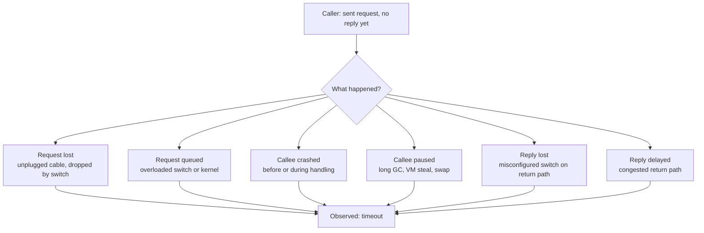

# Unreliable Networks and Fault Detection

> **One-sentence summary.** Asynchronous packet networks give no guarantee that a message arrives or that a reply comes back, so "is that node dead?" is fundamentally unknowable — a timeout is the only practical failure detector, and its value is a trade-off between false positives and false negatives.

## How It Works

A shared-nothing distributed system is a pile of machines that can only talk over a network. Datacenter Ethernet and the internet are both *asynchronous packet networks*: one node hands a packet to the network, and the network makes a best effort to deliver it — there is no upper bound on delivery time, and the packet may simply vanish. When a caller sends a request and gets silence in return, every observable state is identical regardless of which of six underlying events actually happened.

Because the six cases are indistinguishable from the caller's point of view, the only thing you can do is wait a while and give up. This "wait and give up" policy is a *failure detector*. TCP seems to rescue us — it retransmits dropped packets, reorders, checksums, applies flow control — but it does not fix the ambiguity. TCP retransmits at the kernel level; your application only sees the resulting latency bulge. When a TCP connection closes with an error you still cannot tell how much data the remote application actually processed, because an ACK only proves the remote kernel received bytes, not that the remote process acted on them.

The dominant source of delay variability is *queueing*. Switches queue packets when multiple senders target the same link. Receiving kernels queue packets when application threads are busy. Hypervisors queue packets while a VM is descheduled for tens of milliseconds. TCP itself queues at the sender for congestion control. Variable delay is therefore not a law of nature — it is the price of *dynamic resource partitioning*. Circuit-switched networks (ISDN, traditional telephony) reserve a fixed slice of bandwidth per call and thus guarantee bounded delay, but they waste capacity on bursty workloads. Packet switching maximises utilisation of expensive fibre at the cost of unbounded tail latency. That trade-off is why datacenter networks are fast-and-cheap-but-unpredictable rather than slow-and-expensive-but-predictable.

## When to Use

Every distributed component needs *some* failure detector — the question is how aggressive:

- **Load balancer health checks**: a balancer must stop sending traffic to a dead backend, but must not evict a backend that is merely slow under a load spike, which would cascade the load onto its peers.
- **Leader election in replicated databases**: a follower must detect a failed leader quickly enough to minimise write unavailability, but a jittery heartbeat must not trigger a spurious failover that splits writes across two "leaders".
- **Task reassignment in schedulers** (Kubernetes, YARN, Nomad): restarting a container that is alive but unresponsive risks double-executing side effects like sending emails or charging credit cards.

## Trade-offs

| Aspect | Advantage | Disadvantage |
|---|---|---|
| Short timeout | Fast failover, low user-visible downtime | False positives under load; risks cascading failure when a healthy-but-slow node's work is dumped on already-stressed peers |
| Long timeout | Stable under transient slowdowns; fewer spurious failovers | Users wait or see errors for seconds or minutes before the system reacts |
| Fixed constant timeout | Simple to configure and reason about | Wrong for every deployment except the one it was tuned on |
| Adaptive timeout (Phi accrual, TCP RTO) | Tracks actual RTT distribution; works in noisy multi-tenant environments | More code, harder to reason about, can still be fooled by bimodal delay distributions |
| Explicit down signals (RST, ICMP, switch telemetry) | Instant, unambiguous when available | Only covers a subset of failure modes — a paused or partitioned node produces no signal at all |
| Packet switching | High link utilisation, cheap bandwidth | Unbounded queueing delay |
| Circuit switching (ATM, ISDN) | Bounded end-to-end latency | Wasted capacity on idle circuits |

## Real-World Examples

- **Akka and Cassandra** use the *Phi accrual* failure detector, which continuously measures heartbeat inter-arrival times, models their distribution, and emits a continuous "suspicion level" phi instead of a binary alive/dead verdict. Callers choose a phi threshold appropriate to their risk tolerance.
- **TCP retransmit timeout (RTO)** is itself an adaptive failure detector: the kernel samples RTT and jitter per connection and sets RTO roughly to smoothed-RTT plus four times mean deviation. Applications inherit this adaptation for free.
- **Cloud failure studies** report on the order of a dozen network faults per month in a mid-sized datacenter, roughly half of which disconnect a single machine and half a whole rack. Redundant switches help less than intuition suggests because human misconfiguration is a dominant cause, and adding hardware adds more things to misconfigure. Cross-region round-trip times in public clouds have been observed to spike into *minutes* at the tail.
- **Asymmetric partitions** are observed in real datacenters: A can reach B, B can reach C, but A cannot reach C, or a NIC that accepts outbound packets but drops inbound ones. Any failure detector based solely on "can I hear a heartbeat?" misclassifies these.

## Common Pitfalls

- **Treating TCP as end-to-end reliability.** TCP guarantees in-order delivery to the *kernel* of a single connection. An application-level ACK is the only proof that your request was actually processed.
- **Hard-coding a 30-second timeout because it worked in staging.** Noisy neighbours in a multi-tenant cloud routinely push p99 RTT past whatever you tuned on an empty cluster. Measure the RTT distribution in production and re-derive the timeout — better, adapt continuously.
- **Ignoring asymmetric partitions.** A failure detector that only checks "I can reach X" gives a different verdict on X's liveness from every observer. Gossip or quorum-based detection (see [[04-quorums-leases-and-fencing-tokens]]) tolerates this; naive heartbeats do not.
- **Conflating "slow" with "dead".** Declaring an overloaded-but-alive node dead is how cascading failures begin — its work gets redistributed to nodes that are already on the edge, and they tip over next.
- **Retrying without idempotency.** The ambiguity of "no reply" means a retry could double-execute. Anything with external side effects needs an idempotency key or a fencing token, not a bare retry loop.
- **Assuming clocks can help you tell a pause from a crash.** They cannot — see [[02-unreliable-clocks]] and [[03-process-pauses]].

## See Also

- [[02-unreliable-clocks]] — the other half of "things you cannot trust in a distributed system"; timeouts depend on clocks, and clocks lie.
- [[03-process-pauses]] — why a node can look dead from the outside while it is very much alive and about to wake up and step on your toes.
- [[04-quorums-leases-and-fencing-tokens]] — how to make decisions safely when any single failure detector can be wrong.
