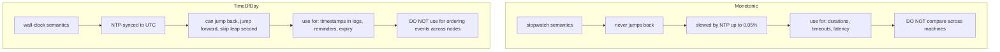
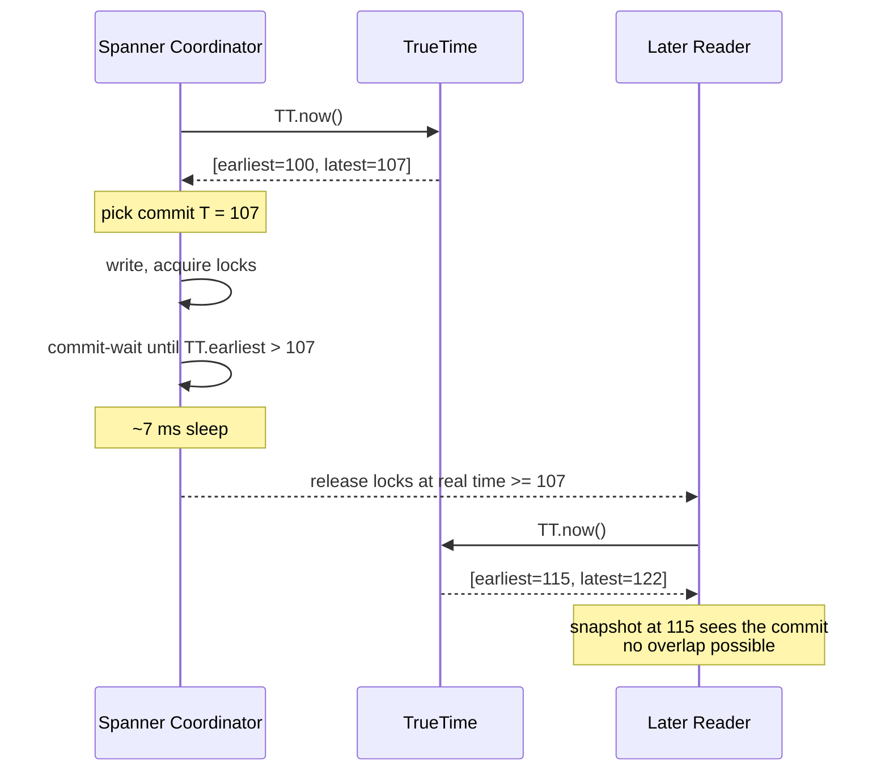

# Unreliable Clocks and TrueTime

> **One-sentence summary.** A clock reading is never a point in time but a range, and distributed systems that ignore that uncertainty lose writes, violate causality, or break snapshot isolation — which is why Google Spanner exposes the interval explicitly via TrueTime and waits it out before committing.

## How It Works

Every modern machine exposes two fundamentally different clocks, and conflating them is the first mistake. A **time-of-day clock** (`clock_gettime(CLOCK_REALTIME)`, `System.currentTimeMillis`) returns wall-clock time since the Unix epoch and is periodically dragged toward truth by NTP. Because NTP can refuse to sync, forcibly reset a wildly wrong clock, smear a leap second, or simply be wrong by seconds when the network is congested, this clock can jump backward, jump forward, or tick at the wrong rate. A **monotonic clock** (`CLOCK_MONOTONIC`, `System.nanoTime`) is guaranteed never to go backward. Its absolute value is meaningless — typically nanoseconds since boot — but the *difference* between two readings on the same machine is trustworthy, which is exactly what you want for timeouts, latency histograms, and rate limiting. Comparing monotonic readings across machines is nonsense.

Even "synchronized" time-of-day clocks are wrong by meaningful amounts. Google budgets 200 ppm of quartz drift, which is 17 seconds per day of accumulated error if a node can't reach NTP. NTP accuracy is bounded by network round-trip time — tens of milliseconds over the public internet, with occasional second-scale spikes. A VM whose hypervisor steals the CPU for 40 ms sees its wall clock appear to jump forward when it resumes. None of these anomalies throw an error; they silently corrupt any algorithm that trusts the timestamp.

The honest representation of a clock reading is therefore an interval `[earliest, latest]`, not a scalar. Google's **TrueTime** API (Spanner) and Amazon's **ClockBound** both return this pair. Because Google deploys GPS receivers and atomic clocks in every datacenter, the interval stays around 7 ms wide; on commodity clouds relying on NTP it's typically tens of milliseconds. If you want global snapshot isolation, you can now reason: if interval A ends before interval B begins, A provably happened before B. If they overlap, you don't know. Spanner turns this into an algorithm called **commit wait**: after deciding a commit timestamp T, the coordinator sleeps until TrueTime is certain the current time is past T, guaranteeing any later transaction receives a strictly greater timestamp. The uncertainty window is not avoided — it is paid for, in latency, on every write.

## When to Use

You need genuinely synchronized clocks (and the uncertainty-aware plumbing to match) only when correctness depends on global ordering. Concrete cases: implementing **external-consistent snapshot isolation** across shards or datacenters (Spanner, CockroachDB, YugabyteDB); meeting regulatory timestamp requirements such as **MiFID II**, which mandates sub-100 µs of UTC for high-frequency trading venues; distributed tracing where causal order across services matters; and **lease-based coordination**, where a node must know whether it still holds a lock. For most other needs — request timeouts, SLO dashboards, cache TTLs, log timestamps — a monotonic clock for durations plus a loosely synced wall clock for display is plenty.

## Trade-offs

| Aspect | Advantage | Disadvantage |
|---|---|---|
| Monotonic clock | Never jumps back; safe for durations | Meaningless across machines; absolute value is garbage |
| Time-of-day clock (NTP) | Common UTC reference; human-readable | Drifts, jumps, leap-second anomalies, silent failure modes |
| LWW with client timestamps | Conflict-free, no coordination | Lagging clocks drop writes; loses causality; ties go to coin flip |
| Logical clocks (Lamport, version vectors) | Capture causality without trusting hardware | Only give ordering, not "how long ago"; no real timestamp |
| TrueTime / ClockBound intervals | Correct ordering with bounded wait | Needs GPS/atomic clocks or tight NTP; adds commit-wait latency |
| GPS-only sync | Cheap, datacenter-scale accuracy | Jammable, especially near military facilities |

## Real-World Examples

- **Google Spanner**: dedicates GPS receivers and atomic clocks per datacenter to keep TrueTime's interval near 7 ms, then pays that interval as commit-wait on every read/write transaction.
- **Amazon ClockBound**: exposes the same `[earliest, latest]` contract on EC2 so customers can build uncertainty-aware systems without owning the hardware.
- **CockroachDB / YugabyteDB**: adopt the Spanner idea. CockroachDB defaults to a conservative `max_offset` (typically 500 ms) and *aborts* transactions when it detects a read within the uncertainty window; YugabyteDB can plug into ClockBound on AWS to narrow the window.
- **Cassandra / ScyllaDB LWW**: resolve conflicts by picking the write with the largest client-supplied wall-clock timestamp, which is precisely the scenario from the book's Figure 9-3 where a 3 ms skew silently drops an increment.
- **MiFID II**: European regulation forcing trading systems to prove event order to within 100 µs — forensic clock accuracy as a legal requirement.

## Common Pitfalls

- **Treating `clock_gettime(CLOCK_REALTIME)` as monotonic.** Rate limiters, exponential backoff, and leader-election timers all break when wall clock jumps back; use `CLOCK_MONOTONIC`.
- **Confusing resolution with accuracy.** Nanosecond return values from a clock that's 100 ms off UTC give you 7 digits of lies followed by meaningful bits.
- **Last-write-wins across timezones or badly synced fleets.** A client with a fast clock can "win" every conflict; a client with a slow clock is invisible until the skew elapses.
- **Trusting clocks inside VMs.** A hypervisor-induced pause looks identical to a forward jump, so NTP cannot even measure the error honestly. See [[03-process-pauses]].
- **Leases computed against time-of-day clocks.** The classic bug behind split-brain writes — the holder thinks the lease is valid, the new leader has already taken over. See [[04-quorums-leases-and-fencing-tokens]].
- **Assuming NTP can guarantee ordering.** Its accuracy is bounded by network delay, so you cannot synchronize clocks to a tolerance smaller than the RTT. See [[01-unreliable-networks-and-fault-detection]].

## See Also

- [[01-unreliable-networks-and-fault-detection]] — NTP's accuracy floor is dictated by the same variable network delay that makes fault detection hard.
- [[03-process-pauses]] — GC pauses and VM freezes make even a correct clock appear to jump, which is why monotonic + interval-aware reasoning matters.
- [[04-quorums-leases-and-fencing-tokens]] — if you cannot trust clocks for leases, you need fencing tokens from a consensus layer instead.
