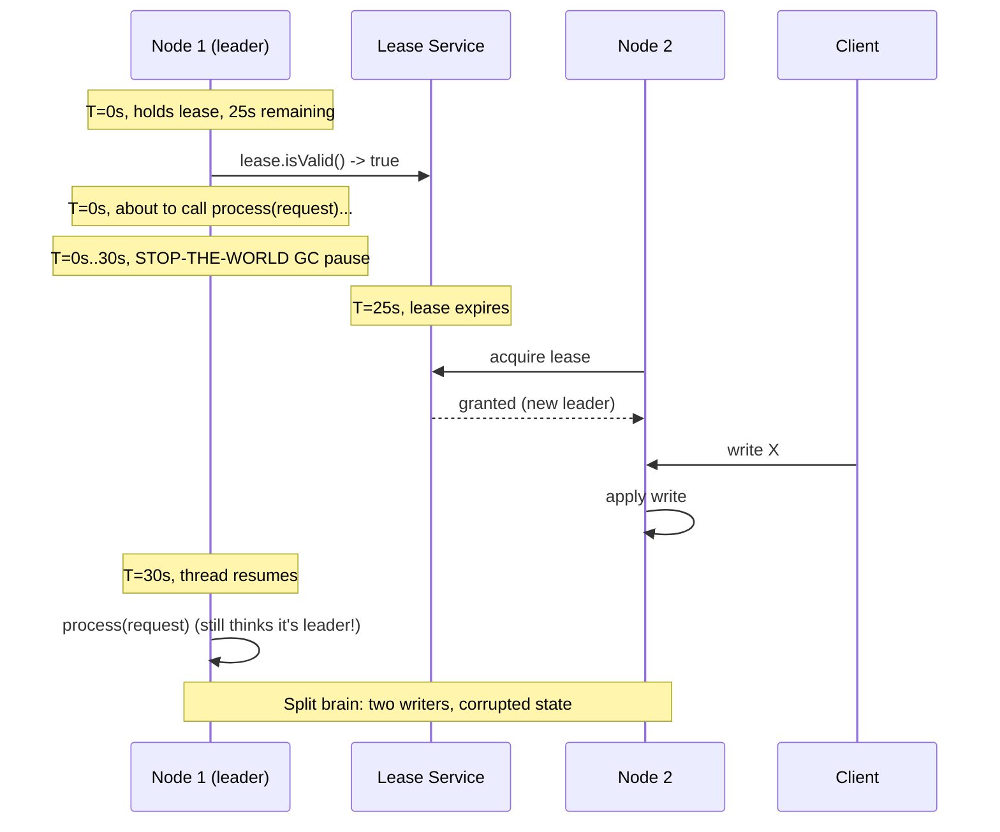

# Process Pauses and Arbitrary Preemption

> **One-sentence summary.** A node in a distributed system can be frozen for seconds or minutes at *any* point in its execution — by GC, VM live-migration, page faults, slow disk I/O, or a stray `SIGSTOP` — so it can never assume that "very little time has passed" between two adjacent lines of code, and its peers may have long since declared it dead.

## How It Works

A single process on a commodity operating system is not a continuously running program. It is a sequence of short CPU bursts interleaved with invisible gaps: the kernel context-switches to another thread, the hypervisor context-switches to another VM, the language runtime stops the world for a garbage-collector cycle, a page fault pulls a page back from swap, or a synchronous `read()` blocks on slow disk I/O. Any one of these can pause the process for tens of milliseconds on a good day, and for tens of seconds — or minutes — on a bad one. Crucially, the paused thread does not know it is paused. When it resumes, its local monotonic clock has jumped forward and the rest of the world has kept moving.

This is fatal to any code that assumes wall-clock continuity between statements. The canonical example from the chapter is a leader that holds a lease and uses it to gate writes:

```text
while(true) {
    request = getIncomingRequest();
    if (lease.expiryTimeMillis - now() < 10_000) {
        lease = lease.renew();
    }
    if (lease.isValid()) {     // <-- T = 0, lease valid for 25s
        process(request);      // <-- thread pauses 30s here; lease has expired
    }
}
```

Between `isValid()` and `process(request)` there is a semicolon, and inside that semicolon the world can stop. If the runtime garbage-collects for thirty seconds, another node will have taken over the lease, but the paused thread has no way to find out until the next loop iteration — by which time it has already written through a stale lease.



The book catalogues where these pauses come from, and the list is uncomfortably long:

- **Stop-the-world garbage collection.** Early JVM collectors could pause for minutes on large heaps. Modern collectors — CMS, G1, ZGC, Shenandoah, Go's concurrent mark-and-sweep — target milliseconds, but never zero.
- **VM suspension and live-migration.** A hypervisor can freeze an entire guest, copy its memory to another host, and resume it. Pause length scales with the rate at which the guest is dirtying memory.
- **Hypervisor and OS context switches.** A thread can be descheduled at any instruction. In a VM, time spent running other tenants' VMs shows up as *steal time*.
- **Synchronous disk I/O you didn't ask for.** A Java class is loaded lazily on first use, triggering a blocking disk read mid-function. If the "disk" is network-attached storage (Amazon EBS, NFS), the latency inherits all the variability of the network.
- **Page faults and swap thrashing.** A single memory access can trigger a disk read, then a disk write to evict another page. Under memory pressure the process spends most of its time paging — hence most servers disable swap outright.
- **`SIGSTOP` / Ctrl-Z.** A Unix signal, possibly sent accidentally by an ops script, freezes a process until `SIGCONT` arrives.
- **Lock contention and run-queue waits.** More cores make this worse, not better, because contention scales with parallelism.
- **Laptop/phone suspension.** Closing the lid stops the world until the machine is reopened.

All of these preempt the thread *at an arbitrary point* — not at safe points you chose — and resume it with no indication that anything happened.

## When This Bites You

- **Leader leases and distributed locks.** Any code that checks a lease and then acts on it has a time-of-check-to-time-of-use window that a pause can stretch arbitrarily.
- **Concurrent-write safety via "I last wrote 1ms ago."** Heartbeats, session timeouts, and mutual-exclusion tokens based on local elapsed time are all suspect.
- **Tight failure-detection timeouts.** If peers declare nodes dead after a few seconds of silence, a GC-paused node will be buried alive (see [[01-unreliable-networks-and-fault-detection]]).
- **Clock-based ordering.** A VM pause looks indistinguishable from a forward time jump, corrupting any logic that assumes clock monotonicity (see [[02-unreliable-clocks]]).

## Trade-offs

| Approach | Advantage | Disadvantage |
|---|---|---|
| Commodity OS + JVM/Go | Cheap, high hardware utilization, rich tooling | Pauses are unbounded; no timing guarantees |
| Real-time OS (RTOS) | Hard deadlines; used for airbags, flight control | Expensive; restrictive language/library choices; lower throughput |
| Disable swap on servers | Eliminates paging pauses | OOM kills replace thrashing — you pick your poison |
| Tuned GC (G1/ZGC/Shenandoah) | Pauses drop to single-digit ms | Still not zero; tuning is workload-specific |
| Off-heap / object pools | Less GC pressure | Manual memory management bugs; language idioms fight you |
| "GC as planned outage" (drain, then collect) | Hides pauses from clients; trims tail latency | Requires orchestration; traffic-shifting infrastructure |
| Rolling restarts of short-lived processes | Avoids full-heap collections entirely | Complex scheduling; incompatible with long-lived in-memory state |
| Fencing tokens on leases | Makes split-brain writes reject-able | Requires storage-layer cooperation (see [[04-quorums-leases-and-fencing-tokens]]) |

## Real-World Examples

- **Pre-CMS Java heaps.** Operators routinely reported stop-the-world pauses of tens of seconds, and minute-long pauses on multi-GB heaps. This single fact shaped a generation of distributed-systems design.
- **VM live-migration across hypervisor hosts.** A VM that's writing memory fast enough to outpace the copy phase can see a multi-second final "stop-and-copy" pause while the last dirty pages are shipped.
- **Amazon EBS hiccups.** A synchronous `write()` to what looks like a local disk is actually a network call; a noisy-neighbor event on the storage side appears in the application as a blocked thread.
- **Steal time on noisy-neighbor VMs.** An application's latency profile on EC2 or similar can be dominated not by its own work but by other tenants sharing the physical CPU.
- **JVM classloader surprises.** A lazily loaded class causing disk I/O on the request-hot path — fine in dev, ruinous under production load where the page cache is cold.
- **Airbag controllers and flight computers.** Where pauses are not acceptable, teams pay the RTOS tax: real-time schedulers, worst-case-execution-time-analyzed libraries, restricted or forbidden dynamic allocation, and exhaustive timing tests.

## Common Pitfalls

- **Assuming "that line can't take 30 seconds."** Any line can. Write code that is correct under arbitrary preemption, not code that is fast on average.
- **Using wall-clock time for lease expiry.** The lease-check bug above gets worse when clocks drift; combine a pause with NTP skew and the logic is doubly broken.
- **Setting heartbeat timeouts too aggressively.** A 2-second failure detector will misclassify every GC pause as a crash, triggering spurious failovers that cost more availability than they save.
- **"Just pin the process to a CPU."** CPU pinning helps with context switches but does nothing for GC, page faults, disk I/O, or the hypervisor stopping the whole VM.
- **Trusting a lock service without fencing.** Even a perfect lock server can hand a lock to node B while node A is paused; without a monotonically increasing fencing token enforced by the storage layer, A's resumed write will overwrite B's.
- **Treating `SIGSTOP` as theoretical.** An ops engineer investigating a hung process with `kill -STOP`, or a misconfigured `strace` / debugger, can freeze a production node for minutes.

## See Also

- [[01-unreliable-networks-and-fault-detection]] — why peers cannot tell a paused node from a crashed one, and why timeouts are always a guess.
- [[02-unreliable-clocks]] — VM pauses manifest as clock jumps; the same mitigations overlap.
- [[04-quorums-leases-and-fencing-tokens]] — fencing tokens are the structural fix for the lease-check-then-use bug: the storage layer rejects any write with a stale token, so a woken-up paused node simply fails closed.
