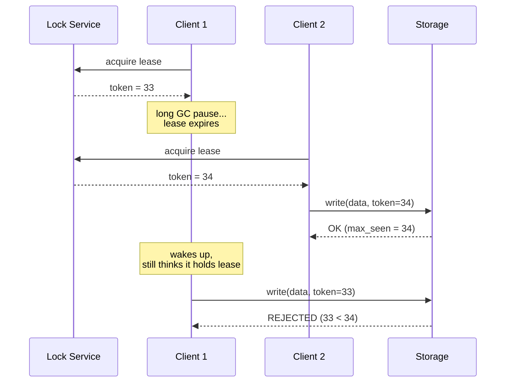

# Majority Quorums, Leases, and Fencing Tokens

> **One-sentence summary.** No single node can be trusted to know whether it is alive or still the leader, so distributed algorithms decide by majority vote and fence off "zombie" ex-leaders using monotonically increasing tokens that the storage layer re-checks on every write.

## How It Works

A distributed node can never be sure of its own status. Its network link may have failed one-way, its GC pauses may have taken it out of the cluster's timeout window, or its clock may have jumped. Because self-reports are unreliable, distributed algorithms refuse to let a node declare itself alive, leader, or correct — instead, such decisions require a **quorum**, a vote among several nodes. The most common quorum is an *absolute majority*: more than half the nodes. With three nodes the system tolerates one failure; with five it tolerates two. Majority is the smallest quorum size with a critical safety property: two majorities of the same cluster must overlap in at least one node, so only one majority can exist at a time, and contradictory decisions cannot both win.

Quorums solve *who decides*, but not *how long a decision stays true*. A leader or lockholder is usually granted a **lease** — a lock with an expiration time, reassignable to a new owner if the old one stops responding. Leases eliminate the need to contact the leader on every operation, but they are only safe if everyone agrees on time. They don't. A process pause (see [[03-process-pauses]]) can stretch past the lease expiry before the holder's own thread resumes; worse, a *delayed packet* sent before a crash can arrive at storage long after the lease has been reassigned. In both cases, a "zombie" ex-leaseholder writes while thinking it is still in charge, and a second client writes while actually being in charge — classic split brain, with corrupted data as the outcome. This was a real HBase bug, not a theoretical one.

The fix is to stop trusting the *identity* of the writer and start trusting a monotonically increasing number. Every time the lock service grants a lease it returns a **fencing token**, incremented on each grant. Every write to storage must carry its token. The storage service remembers the highest token it has ever accepted and rejects any write bearing a smaller one. An ex-leaseholder waking up late holds a token that is now stale; its write is refused even though the lease *seemed* valid at the moment the write was issued.

## When to Use

- **Distributed locks over shared storage** — ensuring only one client writes to a file, blob, or row at a time when clients may pause, crash, or disconnect.
- **Split-brain prevention for leader election** — only the leader whose term is the highest the followers have seen is obeyed; obsolete leaders are ignored on contact.
- **Exclusive resource possession** — one worker processing a given input partition, one cron job running cluster-wide, one migration executor touching a schema.

## Trade-offs

| Aspect | Advantage | Disadvantage |
|--------|-----------|--------------|
| **STONITH** (shoot-the-other-node) | No storage cooperation required — just kill the zombie | Doesn't stop already-in-flight delayed packets; the "shoot" decision itself can be wrong; mutual STONITH can fratricide the cluster |
| **Fencing tokens** | Protect against both pauses *and* delayed packets; rejection is permanent, not retryable | Require the storage layer to check tokens on every write; require a reliable sequence source (usually a consensus-backed lock service) |
| **Separate lock service + token** | One token works across many storage replicas/services | Extra system to operate; adds a network hop on the critical path |
| **Conditional writes on storage** | No separate lock service — use CAS/preconditions directly | Only works if there is exactly one storage service; no cross-service coordination |
| **Majority quorum** | Only one majority exists at a time (safety); tolerates minority failures | Needs `2f+1` nodes to tolerate `f`; cannot make progress if a majority is unreachable (a liveness cost — see [[06-system-models-safety-and-liveness]]) |

## Real-World Examples

- **Google Chubby** — grants *sequencers* alongside lease, and application services verify the sequencer before acting on behalf of the client.
- **Apache Kafka** — uses *epoch numbers* for the controller and for partition leaders, so a deposed leader's append is rejected by followers with a higher epoch.
- **Raft / Paxos** — the *term number* (Raft) and *ballot number* (Paxos) function as fencing tokens for the leader role; any message with a stale term is ignored and triggers a stepdown.
- **ZooKeeper** — the transaction ID `zxid` or a znode's `cversion` doubles as a fencing token for application-level locks.
- **etcd** — the lease ID combined with the key's mod-revision serves as a fencing token; conditional transactions check it atomically.
- **Hazelcast `FencedLock`** — explicitly returns a monotonically increasing fence value from `lock()` for the caller to pass downstream.
- **Object stores with conditional writes** — S3's *conditional writes*, Azure Blob's *conditional headers*, and GCS's *request preconditions* let single-service designs skip an external lock service entirely.
- **Leaderless stores with LWW** — embed the fencing token in the most significant bits of the last-write-wins timestamp so any write by the new leaseholder beats any write by the old one, even out-of-order; divergent replicas are reconciled on read-repair or anti-entropy.

## Common Pitfalls

- **Trusting a lease without a token.** The holder can be paused past expiry or have packets queued in the network. Leases are a *performance* optimization over per-request coordination — they are not a correctness mechanism on their own.
- **Generating tokens on the client.** The point of fencing is that the token comes from the authority granting the lease and increases globally. Client-assigned tokens let zombies forge higher numbers and defeat the scheme.
- **Forgetting to check the token on the storage side.** A token the storage layer doesn't validate is just a comment. Either the storage must track `max_seen_token` per protected resource, or it must support atomic CAS/conditional writes that include the token.
- **Assuming fencing defends against malice.** A dishonest node can simply send a fake high token. Fencing assumes [[05-byzantine-faults]] are absent — nodes may be slow, outdated, or crashed, but if they respond they speak truthfully.
- **STONITH-only designs.** Shooting a suspected zombie does nothing about the write packet it sent *before* you shot it, which is now queued on a switch somewhere and will arrive minutes later. Fencing at the storage layer is the only way to reject that packet.
- **Running with an even number of nodes.** A split into two equal halves has no majority on either side; the cluster stalls. Always use an odd count for majority-based quorums.
- **Treating the lock service as optional for multi-replica writes.** Conditional writes on a single service suffice for one store, but once multiple replicas or services need coordinated exclusion, a shared fencing token (and thus a shared sequencer) is required.

## See Also

- [[03-process-pauses]] — the root cause of lease violations; explains why even a correct program can appear to hold an expired lease
- [[05-byzantine-faults]] — fencing tokens stop honest zombies, not adversaries; BFT is the next rung up
- [[06-system-models-safety-and-liveness]] — "only one token is ever accepted" and "tokens increase monotonically" are safety properties; "a new leaseholder can eventually be elected" is liveness
