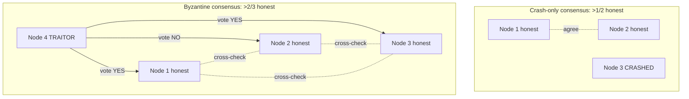

# Byzantine Faults and Weak Forms of Lying

> **One-sentence summary.** A Byzantine fault is a node that actively lies — forging messages or contradicting itself — rather than merely crashing or pausing; tolerating it costs a supermajority of honest nodes and is worth the price only in aerospace, blockchains, and adversarial peer-to-peer systems, but cheap "anti-lying" defenses like application checksums, input sanitization, and multi-server NTP pay for themselves even inside a trusted datacenter.

## How It Works

Most distributed-systems literature assumes the **fail-stop** or **crash-recovery** model: a node is unreliable but honest. It may be slow, unreachable, or holding stale state, but if it does answer, it is speaking truthfully to the best of its knowledge. A **Byzantine fault** breaks this assumption — the node sends arbitrary, faulty, or forged messages. It might cast two contradictory votes in the same election, claim to hold a lock it doesn't, or present a fabricated fencing token. The problem of reaching agreement when an unknown subset of participants may behave this way is the **Byzantine Generals Problem**, formalized by Lamport as a generalization of the classic two-generals problem (where two honest generals try to coordinate an attack over a lossy messenger — itself unsolvable).

The name is not geographic. Lamport picked "Byzantine" in the sense of *excessively devious and bureaucratic*, because naming the hypothetical traitor generals after any real nationality would have been offensive. The underlying question is: can *n* participants agree on one value when up to *f* of them may lie, and at what ratio of *f* to *n*?

The canonical answer is that synchronous Byzantine-fault-tolerant (BFT) consensus requires **more than two-thirds honest nodes** — concretely, `n >= 3f + 1`. Four nodes can tolerate one traitor; seven can tolerate two. A traitor can send contradictory messages to different honest nodes, so those honest nodes must be able to detect the disagreement by cross-checking among themselves, which is why a simple majority (`n >= 2f + 1`, the crash-fault bound) is not enough.

The diagram shows why the threshold doubles: honest nodes must gossip among themselves to unmask contradictions, so you need enough honest nodes to form a supermajority *after* removing the liars.

## When to Use

Full BFT pays for itself in exactly three kinds of environment: (1) **safety-critical hardware** where cosmic radiation can flip bits in memory or CPU registers mid-flight and a crashed plane or colliding spacecraft is unacceptable; (2) **open permissionless networks** where participants have financial incentive to cheat and no central authority exists to kick them out; and (3) **adversarial peer-to-peer** systems (file sharing, Tor-like overlays) where there is no shared administrator to blacklist bad actors. Everywhere else — a datacenter you own, a multitenant cloud with firewalls, a SaaS backend — BFT is overkill. All nodes are controlled by one organization, radiation-induced corruption is rare, and hostile tenants are isolated with virtualization and access control rather than cryptographic consensus.

## Trade-offs

| Dimension | Full BFT (PBFT, Tendermint, Bitcoin) | Crash-only consensus (Raft, Paxos) | Weak anti-lying defenses |
|---|---|---|---|
| Fault model tolerated | Arbitrary malicious behavior | Crashes + message loss only | Random hardware/software corruption |
| Honest-node threshold | `n >= 3f + 1` (>2/3) | `n >= 2f + 1` (>1/2) | N/A — no quorum |
| Message complexity | O(n^2) per round or worse | O(n) per round | O(1) — local check |
| Cryptography required | Signatures on every message | Usually none | Usually none (checksum only) |
| Protects against software bugs | No, unless `n` independent implementations | No | Partially (input validation) |
| Protects against compromised nodes | Only a minority; same binary means same exploit | No | No |
| Typical deployment | Aerospace, blockchain, P2P | Every commercial database | Every well-written service |

## Real-World Examples

- **Aerospace flight control.** Boeing 777 and 787 flight computers, and NASA spacecraft buses, use BFT-style replication with independently developed software stacks specifically because radiation-induced memory corruption is a real failure mode and the cost of a fault is human lives.
- **Bitcoin and blockchains.** Proof-of-work and proof-of-stake protocols are BFT consensus over a network of mutually untrusting participants with no central authority. The economic weight of the honest majority (hashpower or stake) is what makes the `>2/3` threshold hold in practice.
- **Datacenter databases.** Spanner, CockroachDB, etcd, ZooKeeper — all use crash-only consensus (Paxos/Raft), not BFT, because the operator trusts their own nodes. Adding BFT would triple the node count and multiply latency for zero practical benefit.
- **Web applications.** Servers do not trust browsers (end-user-controlled code is effectively Byzantine), but the defense is not BFT consensus — it is making the server the single authority and validating every input.

## Common Pitfalls

- **Thinking BFT protects against software bugs.** If the same buggy binary runs on all nodes, all nodes will hit the same bug at the same inputs, and any supermajority vote will cheerfully agree on the wrong answer. Genuine bug tolerance would require four independently written implementations — a research-grade engineering effort almost no commercial system can afford.
- **Thinking BFT protects against intruders.** If an attacker can root one node, they can almost always root all of them, because they are running the same OS, same patches, same keys. Authentication, encryption, firewalls, and least-privilege are the real perimeter; BFT is not a substitute.
- **Trusting TCP/Ethernet checksums to catch all corruption.** Both use weak CRCs and there are documented cases of corrupted packets slipping through undetected. An application-level checksum (or TLS) on every message is a near-free extra layer that closes this gap.
- **Single-source NTP.** A misconfigured or malicious time server can silently skew every client by hours. Configuring several servers and taking the majority range turns one liar into a detectable outlier — the same "weak BFT" idea, done cheaply.
- **Skipping input validation on internal services.** "It's behind the firewall" is how SSRF and deserialization bugs turn into cluster-wide compromises. Size limits, type checks, and escaping are anti-lying defenses against your own upstream services, not just against the internet.
- **Confusing Byzantine faults with the fencing-token problem.** A [[04-quorums-leases-and-fencing-tokens]] defends against an *inadvertently* misbehaving zombie leaseholder — a node whose clock drifted or whose GC pause stretched too long. The moment that node becomes *malicious* and forges a fencing token, fencing collapses and you are back in Byzantine territory.

## See Also

- [[04-quorums-leases-and-fencing-tokens]] — fencing tokens stop honest-but-confused zombies; they assume nodes don't forge tokens, which is exactly the Byzantine gap.
- [[06-system-models-safety-and-liveness]] — Byzantine is the strongest node-failure model in the standard taxonomy (crash-stop, crash-recovery, Byzantine), and the system model you choose dictates which algorithms you can safely use.
