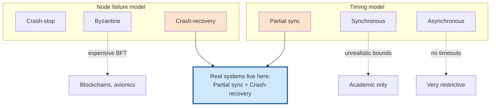

# System Models, Safety, and Liveness

> **One-sentence summary.** A system model fixes what timing and failure behaviours an algorithm is allowed to assume, and its correctness is then split into safety properties that must always hold and liveness properties that only have to hold eventually.

## How It Works

A distributed algorithm cannot be proven correct in a vacuum — correctness only has meaning against a *system model*, an abstraction that enumerates which faults the algorithm must survive and which it is allowed to ignore. The model has two independent axes: what you assume about *timing* (delays, pauses, clocks) and what you assume about *node failure* (how a process can misbehave).

On the timing axis there are three standard choices. The **synchronous** model assumes bounded network delay, bounded process pauses, and bounded clock error — every interval has a known upper limit. It is mathematically friendly but rarely matches reality. The **partially synchronous** model, due to Dwork, Lynch, and Stockmeyer (1988), says the system behaves synchronously *most of the time* but may occasionally exceed any fixed bound by an arbitrary amount; this captures the behaviour of actual data-centre networks that are well-behaved until they aren't. The **asynchronous** model forbids timing assumptions entirely: no timeouts, not even a clock. Very few useful algorithms survive there, so it is mostly a theoretical ceiling of what is possible without any timing help.

On the failure axis there are four commonly used models. **Crash-stop** (also called fail-stop) says a node is either up or permanently gone. **Crash-recovery** admits that crashed nodes may later return, retaining whatever was flushed to stable storage but losing in-memory state. **Fail-slow** (a.k.a. *limping node* or *gray failure*) captures nodes that respond to health checks while performing at a tiny fraction of their capacity — a NIC dropping from Gbit to Kbit, a process GC-thrashing, a worn SSD with erratic latency. **Byzantine** is the worst case: a node may deviate arbitrarily, including lying, and is covered separately in [[05-byzantine-faults]].

An algorithm is said to be *correct in a system model* if it satisfies its stated properties in every run that the model permits. To make that precise we separate properties into two classes. A **safety** property says *nothing bad ever happens* — for example, the uniqueness of fencing tokens in [[04-quorums-leases-and-fencing-tokens]]. A safety violation is pointable and permanent: you can name the exact operation that broke it and you cannot un-break it. A **liveness** property says *something good eventually happens* — for example, availability, or the promise of eventual consistency. The giveaway is the word *eventually*: at any moment the property may not yet hold, but there is still hope it will.

This split matters because distributed algorithms are typically required to satisfy their safety properties in *every* run of the model, including catastrophic ones where every node crashes or the network stays partitioned. Liveness, by contrast, is allowed to be *conditional* — a quorum algorithm may promise "you get a response eventually, provided a majority stays up and the network eventually recovers", which is exactly the escape clause the partially synchronous model encodes.

## When to Use

- **Picking a model for your algorithm.** Start from the weakest timing model in which your algorithm can still make progress. Raft, Paxos, and most leader-election protocols need partial synchrony for liveness (they use timeouts) but remain *safe* even when the network behaves asynchronously — a crucial separation.
- **Choosing a failure model.** Use crash-stop only for simple proofs or for hardware that really does get powered off and replaced. Use crash-recovery for any service with durable state behind it. Only pay for Byzantine fault tolerance when mutual distrust is intrinsic to the problem (open ledgers, avionics, adversarial environments).
- **The sweet spot.** Partially synchronous + crash-recovery matches essentially every production data system: nodes mostly respond on time, occasionally don't, and when they do come back they trust their disk but not their RAM. That is why it is the default target for consensus, replication, and lock services.

## Trade-offs

| Timing model | What it assumes | Match to reality |
|--------------|-----------------|------------------|
| Synchronous | Known upper bound on delay, pauses, clock skew | Almost never true — GC pauses, virtualization, and network congestion all violate it |
| Partially synchronous | Bounds hold *usually*; may be violated for finite periods | Closely matches data centres, cloud VMs, and most WANs |
| Asynchronous | No clock, no timeouts, unbounded delay | Pessimistic but robust; some algorithms (e.g. FLP-safe ones) need it |

| Failure model | What a node may do | When to pick it |
|---------------|--------------------|-----------------|
| Crash-stop | Die once, never return | Stateless workers, ephemeral compute |
| Crash-recovery | Die and come back; disk survives, RAM does not | Databases, brokers, most consensus systems |
| Fail-slow / gray | Respond slowly or partially while "up" | Always a risk in practice; rarely in the formal model |
| Byzantine | Arbitrary, possibly adversarial behaviour | Blockchains, aerospace, zero-trust networks |

## Real-World Examples

- **Raft and multi-Paxos.** Proven safe under asynchrony and live under partial synchrony with crash-recovery faults — the textbook target model.
- **Spanner / CockroachDB.** Operate in partial synchrony plus crash-recovery, with TrueTime or HLCs narrowing the timing bound to something tight enough to linearize.
- **PBFT, HotStuff, Tendermint.** Designed for Byzantine + partial synchrony; pay the 3f+1 replica cost to tolerate f malicious nodes.
- **Bitcoin and Nakamoto consensus.** Byzantine model, but weakens liveness with probabilistic finality rather than deterministic termination.
- **ZooKeeper (Zab) and etcd (Raft).** Crash-recovery with stable on-disk logs — a node that wipes its disk is treated as a new member, not the old one.

## Common Pitfalls

- **Believing stable storage is actually stable.** Crash-recovery proofs assume disk contents survive, but firmware bugs, silent corruption, misconfigured RAID, and a server that fails to recognise its drives on reboot can all make a node forget what it claimed to know — breaking quorum invariants.
- **Treating the model as the truth instead of an approximation.** Reality always leaks through. A real implementation needs explicit `exit(666)` / "Sucks to be you" branches for the edge cases the model declares impossible, even if the response is just logging and paging a human.
- **Ignoring fail-slow failures.** Formal models rarely cover limping nodes, yet they cause the most painful outages — a half-dead leader that still answers heartbeats can stall a whole cluster. Health checks must probe real work, not just liveness pings.
- **Conflating synchronous with partially synchronous.** An algorithm that needs *strict* bounds on delay (e.g. to use timeouts for correctness rather than progress) will be unsafe the first time a GC pause exceeds the bound.
- **Confusing safety with liveness.** Calling a system "available" when you mean "correct", or vice versa, leads to designs that sacrifice the wrong property under partition. The *eventually* test is the quick check: if removing the word "eventually" changes the meaning, it is a liveness property.

## See Also

- [[04-quorums-leases-and-fencing-tokens]] — uniqueness of fencing tokens is a safety property, availability of the lock service is a liveness one
- [[05-byzantine-faults]] — the most adversarial point on the failure axis and the cost of tolerating it
- [[07-formal-methods-and-deterministic-testing]] — how TLA+, model checkers, and deterministic simulation actually verify safety and liveness in the chosen model
