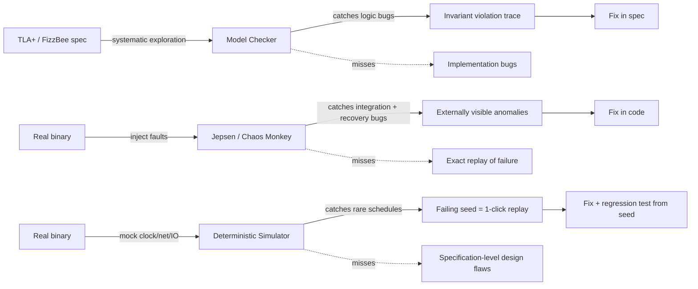

# Formal Methods, Fault Injection, and Deterministic Simulation Testing

> **One-sentence summary.** Partial failures spawn an astronomical state space, so correctness depends on layering three complementary tools — model checkers that verify invariants on an algorithmic spec, Jepsen-style fault injection that tortures the real implementation with crashes and partitions, and deterministic simulation testing that replays the system's full code under mocked clocks and networks so any bug is exactly reproducible.

## How It Works

Concurrency, network delays, and partial failures compose combinatorially: a cluster of N nodes passing M messages under K fault patterns has so many reachable states that ad-hoc unit tests can only sample a vanishing fraction. The industry has converged on three techniques that each bite a different slice of that state space.

**Model checking** operates on a *specification*, not on running code. You describe the algorithm in a purpose-built language — TLA+, Gallina (Coq's tactic language), or the newer FizzBee — stating the invariants that must hold (e.g., "no two clients ever hold the same fencing token") and the set of atomic actions the algorithm can take. The model checker then systematically explores reachable states, looking for any trace that violates an invariant. Because most real algorithms have an infinite state space, you either reduce the model to a decidable approximation or bound the exploration (e.g., "at most six messages in flight"); bugs that manifest only on longer executions will be missed. Famous win: TLA+ found a data-loss bug in viewstamped replication (VR) caused purely by ambiguity in the algorithm's English prose description — the spec disambiguated, the model checker produced the counterexample trace. CockroachDB, TiDB, and Kafka all ship TLA+ specs today.

**Fault injection** attacks the real, compiled binary running in something close to production. Coordinators decide *what* to inject (SIGSTOP a process, umount a disk, iptables-drop a network link, corrupt a file, partition the cluster) and *when*; scripts carry it out on target nodes while you observe whether externally visible invariants still hold. Netflix's Chaos Monkey popularized the production flavor — now called chaos engineering. Jepsen is the de facto framework for the test-cluster flavor and has uncovered serious linearizability and durability bugs in Elasticsearch, etcd, MongoDB, Redis, and many others.

**Deterministic simulation testing (DST)** closes the gap between the two: it runs your *actual* code while controlling every source of nondeterminism — clock, network, disk I/O, thread scheduling — through mocks. Because the simulator picks every branching choice, any failing run can be replayed bit-for-bit from a seed; the same bug reproduces on the first engineer's laptop and the fifteenth. Three implementation strategies exist:

- *Application-level*: the system is built from scratch to be deterministic. FoundationDB's Flow async library injects a deterministic network simulator; TigerBeetle models all state as a single-event-loop state machine driven by mocked clocks.
- *Runtime-level*: you patch the language runtime or swap libraries. FrostDB modifies Go to execute goroutines sequentially. Rust's MadSim provides drop-in deterministic replacements for Tokio, S3, and Kafka client libraries so an existing app becomes reproducible without code changes.
- *Machine-level*: Antithesis runs your unmodified containers inside a custom hypervisor that intercepts every syscall with a nondeterministic answer (gettimeofday, recv, rand) and replaces it with a deterministic one. The whole distributed system becomes a pure function of its seed.

## When to Use

- **Model checking**: before you implement a new consensus, commit, or leader-election protocol. Spec-level bugs caught here cost a weekend; the same bug found after launch costs a postmortem.
- **Fault injection**: before every major release, and continuously in staging. This is how you find integration bugs (a library swallows an error, a retry is not idempotent, a crash window leaves orphaned locks) that a spec cannot model.
- **DST**: when you need regression tests for race conditions and timing-dependent bugs, when you need to fuzz for weeks of wall-clock behavior in an afternoon (mocked clocks run faster than real time), and when you need to reproduce a CI failure without "flaky test" triage.

## Trade-offs

| Aspect | Model Checking (TLA+, FizzBee) | Fault Injection (Jepsen, Chaos Monkey) | Deterministic Simulation (FoundationDB, Antithesis) |
|--------|-------------------------------|----------------------------------------|------------------------------------------------------|
| What it tests | A specification | The real binary | The real binary |
| Coverage | Exhaustive within bounds | Random, limited to scheduled faults | Randomized but fully replayable |
| Replayability | N/A (counterexample is a state trace) | Poor — induced faults aren't perfectly repeatable | Perfect — seed reproduces run |
| Speed | Seconds to days; grows with state space | Minutes to hours per run | Often faster than wall clock (mocked time) |
| Spec/impl drift | Major risk — spec can lie | No drift (tests actual code) | No drift (tests actual code) |
| Build cost | Learn a new language, write a spec | Moderate (write fault plans + invariant checks) | High — requires determinism end-to-end or a hypervisor |
| Best at catching | Algorithmic / logic bugs | Crash-recovery and integration bugs | Rare schedule bugs, flaky test debugging |

## Real-World Examples

- **FoundationDB** is the canonical DST success story: the team built the Flow library specifically so every test run of their full distributed database is deterministic. They claim the simulator reaches bugs a production fleet would need years to hit.
- **TigerBeetle** is engineered as a single event-loop state machine so DST is cheap by construction; simulated clocks let them exercise millisecond-sensitive timeout logic in microseconds of CPU.
- **Antithesis** is the hypervisor-level productization of this idea — you hand it container images and receive replayable failure traces without modifying your code.
- **CockroachDB, TiDB, Kafka** all maintain TLA+ specifications of their replication and transaction protocols; changes to the protocol update the spec first.
- **Jepsen** has produced a body of public reports that, collectively, raised the bar for what "distributed database" means — a system that has not been Jepsen-tested is treated with suspicion.

## Common Pitfalls

- **Spec-implementation drift.** A model checker's promise only covers the spec; if the code diverges (a developer adds a retry loop that the spec does not model), invariants can silently break. The fix is instrumenting the implementation to emit the same transitions as the spec and continuously checking equivalence.
- **Bounded exploration hides long-tail bugs.** Setting "max 6 messages, max 3 crashes" to keep the model checker tractable means any bug needing seven messages is invisible. Make the bounds explicit in the assurance claim.
- **Fault injection without invariant checks.** Killing nodes while watching top is not testing; you must assert externally observable safety properties (e.g., uniqueness of [[04-quorums-leases-and-fencing-tokens]]) after every fault — otherwise you only find crashes, not correctness violations.
- **Non-replayable failures from fault injection.** The same Jepsen run almost never reproduces a specific bug — physical timing differs each time. Teams that lean on fault injection for regression testing end up with "mysterious CI flakes" they cannot fix; DST is the answer.
- **Hidden nondeterminism in DST.** Even after mocking clocks and networks, hash-map iteration order, memory allocator behavior under pressure, and stack-overflow thresholds can still vary. A simulator that is "mostly deterministic" is not replayable; hunt these down or the seed loses meaning.
- **Treating the three tools as substitutes.** Each catches a distinct class of bug. Model checking will never find a buffer overflow; fault injection will never prove absence of livelock; DST will never catch a bug you did not think to simulate (e.g., Byzantine faults). Ship all three if correctness matters.

## See Also

- [[06-system-models-safety-and-liveness]] — the properties a model checker verifies are written in the language of the system model; "safety" is exactly what TLA+ invariants encode, and liveness is what requires fairness assumptions to check.
- [[04-quorums-leases-and-fencing-tokens]] — fencing-token monotonicity and uniqueness are the canonical example of a safety property you would express in TLA+ and stress with Jepsen.
