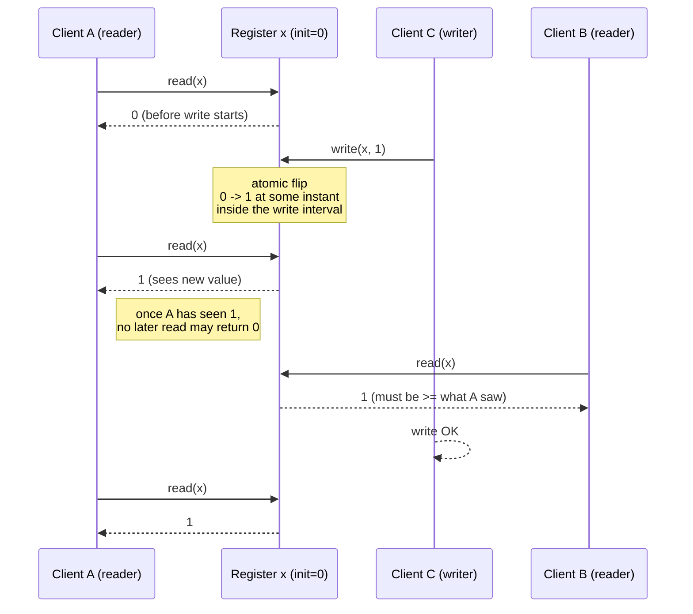

# Linearizability

> **One-sentence summary.** Linearizability is a *recency* guarantee that makes a replicated register behave as if there is a single copy of it: every operation appears to take effect atomically at some point between its invocation and its response, and once a newer value has been observed, no later operation is allowed to see an older one.

## How It Works

Linearizability (also called *atomic consistency*, *strong consistency*, *immediate consistency*, or *external consistency*) is defined on a single *register* — one key in a key-value store, one row in a relational database, one document. The permitted operations are `read(x)`, `write(x, v)`, and `CAS(x, v_old, v_new)`. It is explicitly **not** a transaction guarantee: it says nothing about atomicity across multiple objects, so it does not prevent write skew or phantoms. Its job is narrower and sharper — to make reads and writes on *one* object look like they happen on a single machine, in some real-time order.

The formal rule has two parts. First, every operation appears to take effect *atomically* at some instant between the moment the client sent the request and the moment it received the response. Second, those instants must respect real-time order: if operation A's response arrives before operation B's invocation, then A must be ordered before B in the equivalent sequential history. Operations that overlap in time may be ordered either way, but once a read has observed a new value, every strictly-later read — from any client — must also observe that value or something newer. This is the "once seen, always seen" rule.

Reads that overlap the write may return 0 or 1, but the moment any client observes 1, the register has logically "flipped" and every strictly-later request must see 1 (or whatever even newer value has been written). A CAS operation succeeds only if the observed `v_old` is still the committed value at the atomic-effect instant; otherwise it fails. Testing linearizability post-hoc is possible but NP-hard: you record every request/response interval and search for a sequential history that fits within those intervals.

## Linearizability vs Serializability

The two words sound alike and are constantly confused, but they live on different axes.

| Axis | Linearizability | Serializability |
|---|---|---|
| Scope | Single object (one register) | Multiple objects (a transaction) |
| Property | Real-time recency: later op sees later state | Some equivalent serial order exists |
| Stale reads allowed? | No — once written, it is visible | Yes — serial order need not match wall-clock order |
| Prevents write skew? | No (single object only) | Yes (at SERIALIZABLE level) |
| Typical cost | Cross-replica coordination on every op | Locking, SSI, or 2PL within a transaction |
| Combined name | **Strict serializability** / **strong-1SR** = linearizable *and* serializable | |

Single-node databases are usually linearizable for free. Distributed databases must choose: Spanner and FoundationDB offer strict serializability; CockroachDB offers serializability plus some recency guarantees but not strict serializability, because bolting full real-time order onto SSI requires expensive extra coordination. You can also mix axes — snapshot isolation plus linearizability on individual keys is a common NewSQL configuration.

## When to Use (Relying on Linearizability)

- **Locking and leader election.** A lease-based leader election needs linearizability: if two nodes could both "win" the lease, you have split-brain. ZooKeeper and etcd exist largely to provide a linearizable store on which Apache Curator and similar libraries build locks, leases, and leader election.
- **Uniqueness constraints.** Enforcing a unique username, a unique filename in a directory, a non-negative bank balance, or one-seat-per-ticket requires a single agreed-upon current value — effectively a CAS against the latest state. Without linearizability, two concurrent claims can each succeed on different replicas.
- **Cross-channel timing dependencies.** When two independent channels carry related information — a video uploaded to object storage *plus* a message on a queue telling the transcoder to process it, or a push notification followed by an HTTP fetch — the faster channel can race ahead of the slower one. If the storage is not linearizable, the transcoder may fetch a stale or missing file despite the queue message having "arrived after" the upload.

## Which Replication Methods Can Be Linearizable?

| Replication style | Linearizable? | Why |
|---|---|---|
| Single-leader | Potentially | Only if every read and write hits the real leader; a stale "delusional" leader or async failover breaks it. |
| Consensus (Raft/Paxos/Zab) | Likely | Designed to prevent split-brain; but reads bypassing the quorum can still be stale (ZooKeeper read-from-follower problem). |
| Multi-leader | No | Concurrent writes on multiple nodes with async replication produce conflicts; no single real-time order. |
| Leaderless / Dynamo-style | Probably not | Even with `w + r > n` quorums, variable delays permit non-linearizable histories; LWW with wall-clock timestamps is almost certainly non-linearizable due to clock skew. |

The Dynamo counterexample is subtle and worth remembering. With n=3, w=3, r=2, a writer is updating x from 0 to 1. Client A reads from two nodes and sees {1, 0} — it returns 1. Client B's read *begins after A's finishes* and happens to hit the two replicas that haven't applied the write yet, returning 0. The quorum inequality holds, but B returns an older value than A did — a textbook violation of the "once seen, always seen" rule. You can fix this with synchronous read repair before returning, plus a read-before-write step to pick a monotonic timestamp, but you sacrifice most of the performance that made leaderless attractive in the first place.

## Trade-offs

| Aspect | Advantage | Disadvantage |
|---|---|---|
| Single-copy illusion | Simple mental model for app developers | Every replica must coordinate on the critical path |
| Safety for coordination primitives | Enables correct locks, leases, leader election, unique IDs | Pushes coordination cost into every dependent operation |
| Real-time recency | No stale reads, no lost writes on failover (with consensus) | Higher latency *always*, not just during faults — even RAM on a multi-core CPU drops linearizability for speed |
| CAP positioning | CP systems remain correct under partition | Minority partitions become unavailable (see [[02-cap-theorem-and-cost-of-linearizability]]) |
| Scope is one object | Cheap enough to expose as a primitive (CAS, atomic increment) | Does not prevent write skew, phantom reads, or any multi-object anomaly |

## Real-World Examples

- **Spanner, FoundationDB**: strict serializability — both linearizable (per key) and serializable (across transactions), at the cost of TrueTime commit-wait or tight clock synchronization.
- **ZooKeeper**: writes are linearizable via the Zab consensus protocol; reads are *not* linearizable by default (they can be served by any follower and may be stale). `sync()` before read restores linearizability.
- **etcd v3**: linearizable reads by default — a read request round-trips through the Raft leader to confirm leadership before returning.
- **CockroachDB**: serializable, with some recency guarantees, but deliberately not strict serializable — the team considers the coordination cost not worth it for most workloads.
- **Cassandra, ScyllaDB**: leaderless with LWW based on wall-clock timestamps; almost certainly non-linearizable due to clock skew. Lightweight transactions (Paxos per partition) provide linearizable CAS when you explicitly opt in.
- **Oracle RAC**: linearizable page-level locks over shared storage; needs a dedicated low-latency interconnect precisely because linearization is on the critical path of every transaction.

## Common Pitfalls

- **Assuming "strong consistency" means linearizability.** Dynamo-style quorums are often marketed as strong consistency but do not give you the recency guarantee — the Figure 10-6 race condition is real.
- **Reading from a follower in a consensus system.** ZooKeeper reads, pre-v3 etcd reads, and many Raft-based systems let reads bypass the quorum for speed, silently sacrificing linearizability.
- **Trusting a leader that hasn't renewed its lease.** A partitioned leader that keeps answering requests is the classic source of split-brain writes; fencing tokens are the standard fix.
- **Using wall-clock timestamps as a recency mechanism.** Clock skew across nodes is larger than you think, and LWW will happily "lose" a newer write to an older one with a later timestamp.

## See Also

- [[02-cap-theorem-and-cost-of-linearizability]] — the partition-time and latency-time costs of insisting on this guarantee, and why CAP "pick two" is the wrong framing.
- [[03-logical-clocks]] — how Lamport and vector clocks give you a causal order *without* the real-time recency constraint, at a fraction of the cost.
- [[04-linearizable-id-generators]] — fetch-and-add as a linearizable primitive that almost, but not quite, solves consensus.
- [[05-consensus-and-its-equivalent-forms]] — linearizable CAS, linearizable total-order broadcast, and consensus are all reducible to each other; implementing any one gives you the others.
