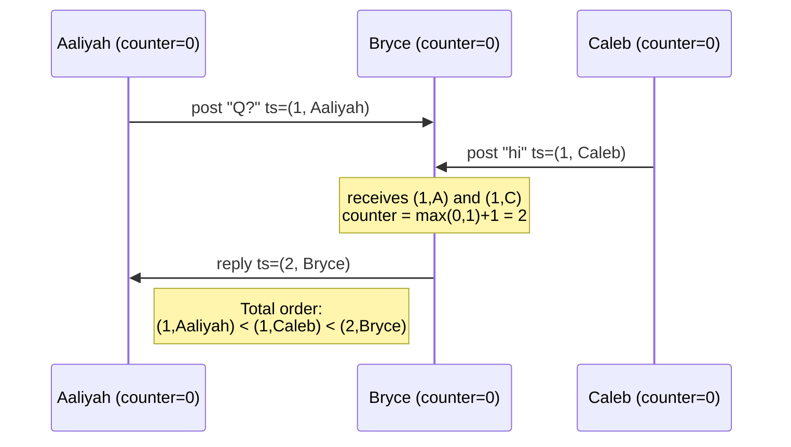

# Logical Clocks and Distributed ID Generation

> **One-sentence summary.** A logical clock is an *algorithm* that counts events and produces a totally ordered, compact timestamp whose ordering is consistent with causality — giving you distributed IDs that respect happens-before without a synchronized hardware clock, though still not linearizability.

## How It Works

Unique IDs are trivial on one node — a 64-bit autoincrementing counter guarded by the CPU's atomic fetch-and-add is linearizable and compact. Across multiple nodes, every obvious alternative breaks either uniqueness, ordering, or fault tolerance:

- **Sharded counters** (even IDs on A, odd on B) stay compact but lose ordering across shards.
- **Preallocated ID blocks** (A gets 1–1,000, B gets 1,001–2,000) also lose ordering: ID 1,500 on B may have been minted *after* 500 on A.
- **Random UUIDv4** is collision-free without coordination but the ordering is meaningless.
- **Wall-clock schemes** — UUIDv7, X's Snowflake, ULID, Flake, MongoDB ObjectID — pack a millisecond timestamp into the high bits and a node/sequence into the low bits. Ordering is only as good as NTP; skew and non-monotonic jumps routinely produce timestamps that disagree with real event order.

A **logical clock** drops physical time altogether. It must satisfy three rules: (1) timestamps are compact and unique, (2) any two are totally ordered, (3) the order is *consistent with causality* — if A happened-before B then `ts(A) < ts(B)`.

**Lamport timestamps** (Lamport, 1978) are the minimal algorithm that achieves this. Each node keeps an integer counter; a timestamp is the pair `(counter, node_id)`.

- **Rule 1** — on every local event, increment the counter and use the new value.
- **Rule 2** — on receiving a message tagged with counter `r`, set local counter to `max(local, r) + 1` before stamping the receive event.
- **Compare** by counter first, break ties lexicographically by `node_id`.

Aaliyah and Caleb never spoke, so their counters both land at 1 — the node-ID tiebreak picks a winner. Bryce saw both, so his reply strictly exceeds both in counter space. Any causal chain produces a strictly increasing sequence.

**Hybrid logical clocks (HLC)** patch Lamport's two biggest annoyances — timestamps don't correlate with wall time, and silent nodes drift apart. An HLC starts from the physical clock (microseconds since epoch) and applies the Lamport max-and-increment rule on top. If NTP slews the wall clock backward, the HLC still advances monotonically because it remembers the last value it emitted. The result reads almost like a normal timestamp — you can query "records from April 23" — but ordering respects happens-before. CockroachDB uses HLCs to assign transaction IDs for MVCC snapshot isolation.

**Vector clocks** keep one counter *per node* in every timestamp. They preserve enough information to detect concurrency: if neither `VC(A) ≤ VC(B)` nor `VC(B) ≤ VC(A)`, the writes were concurrent. The cost is O(N) space per timestamp, which is why Lamport/HLC are preferred when concurrency detection isn't required.

## Comparing the Schemes

| Scheme | Size | Ordering | Causality | Detects concurrency? | Needs hardware clock? |
|---|---|---|---|---|---|
| Wall-clock + shard (Snowflake, UUIDv7, ObjectID) | 64–128 b | Approximate | No (NTP skew breaks it) | No | Yes (NTP) |
| Lamport timestamp | ~16 b | Total | Yes | No | No |
| Hybrid logical clock | ~16 b | Total | Yes | No | Soft (rough NTP) |
| Vector clock | O(N) b | Partial | Yes | **Yes** | No |
| Single-node autoincrement | 8 b | Total + **linearizable** | Yes | No (no concurrency) | No |

## When to Use

- **MVCC transaction IDs** in a distributed SQL engine — assign each transaction an HLC, let readers see only writes with lower timestamps. Snapshots are automatically consistent with causality.
- **Causal broadcast / eventual-consistency replication** where followers need to apply updates in an order that respects happens-before, but strict real-time ordering isn't required.
- **Conflict detection in leaderless stores** (Dynamo, Riak): vector clocks flag writes that truly raced so the application can merge them, instead of blindly picking a winner.

## Trade-offs

| Aspect | Advantage | Disadvantage |
|---|---|---|
| Lamport vs wall-clock | Ordering is always correct w.r.t. causality | No relation to physical time; can't ask "events from yesterday" |
| HLC vs Lamport | Timestamps double as wall times; tolerates NTP backsteps | Still not linearizable; needs rough clock sync |
| Vector clock vs Lamport/HLC | Can detect concurrent writes | O(N) per timestamp; awkward as a primary key |
| Logical clock vs single-node counter | Scales horizontally, fault-tolerant, no bottleneck | Not linearizable — can't order non-communicating events by real time |

## The Critical Limit: Not Linearizable

Lamport and HLC give a total order *consistent* with causality, but they cannot linearize. If user A changes their privacy setting on a laptop (shard 1) and then uploads a photo on a phone (shard 2), and the shards never exchanged a message between those writes, the photo's HLC timestamp can easily be *lower* than the setting change's — the phone's local counter was simply behind. Readers that pick "the latest value" will see the photo under the old, public permissions. That's what "not linearizable" means in practice. Fixing it requires a stronger primitive — see [[04-linearizable-id-generators]].

## Real-World Examples

- **CockroachDB**: HLCs drive MVCC and serializable transactions; a small clock uncertainty window is used to paper over skew.
- **MongoDB ObjectID**: 12 bytes of `timestamp | machine-id | pid | counter` — wall-clock scheme, ordering is approximate.
- **X's Snowflake / ULID / UUIDv7**: 64–128-bit wall-clock-plus-sequence IDs, popular because they're sortable *enough* and cheap to generate.
- **Dynamo / Riak**: vector clocks on every value so siblings from concurrent writes can be surfaced to the application.
- **Cassandra last-write-wins**: uses the wall clock directly. An NTP skew of a few hundred milliseconds silently drops writes — a notorious footgun.
- **Percolator / TiDB timestamp oracle**: a *linearizable* single-node ID generator, not a logical clock — see [[04-linearizable-id-generators]].

## Common Pitfalls

- **Treating a Lamport timestamp as wall time.** It isn't. Use an HLC (or store the physical time alongside) if you need to answer "what happened on Tuesday."
- **Assuming total order implies linearizability.** Two non-communicating events can be ordered arbitrarily by Lamport/HLC regardless of real-time order. Privacy-then-post bugs live here.
- **Cassandra LWW with default NTP.** Clock skew plus last-write-wins means the "last" write is whichever node's clock happened to be ahead. Use client-supplied monotonic timestamps or switch to a consensus-backed store if you care about correctness.
- **Vector clocks as a primary key.** They grow with cluster size and churn; use them for conflict detection, not for indexing.
- **Forgetting the max step on receive.** A Lamport implementation that only increments locally still produces a total order — but not one consistent with causality. The `max(local, received) + 1` rule is load-bearing.

## See Also

- [[01-linearizability]] — the stronger guarantee that logical clocks deliberately trade away.
- [[04-linearizable-id-generators]] — why the privacy-photo scenario forces us back to a single-node counter or consensus.
- [[05-consensus-and-its-equivalent-forms]] — fault-tolerant linearizable IDs sit at the same difficulty tier as atomic broadcast and distributed locks.
